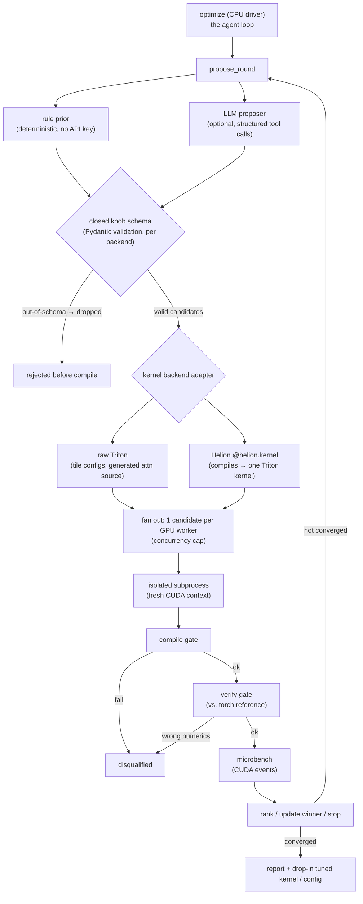

# Supporting resources — AutoKernel optimization with agents and vLLM

> Grounding material for the proposal. **Not part of the Sessionize submission.**
> These diagrams and snippets exist to justify the technical depth of the talk
> and de-risk the live demo. Based on a working implementation (`unikernel-opt`)
> validated end-to-end on NVIDIA L4 GPUs.

## The agent loop (architecture)



The loop is **backend-agnostic**: it takes an `evaluate_batch` callable and a
per-backend closed schema. Triton is the compile target today; Helion is a
higher-level authoring layer whose `helion.Config` knobs the agent can search
instead of hand-written Triton tile code — Helion still lowers to exactly one
Triton kernel per `@helion.kernel`. Locally the fan-out is `asyncio.gather` over
local sandboxes; remotely each candidate lands on its own single-GPU worker.
The agent logic never changes between backends or orchestrators.

## The closed knob schema (the anti-hallucination gate)

This is the load-bearing safety property. The LLM emits configs as tool-call
arguments; a hallucinated knob or value fails validation **before** anything is
compiled or run.

```python
from pydantic import BaseModel, field_validator

ALLOWED_BLOCK_M = (16, 32, 64, 128, 256)
ALLOWED_WARPS = (1, 2, 4, 8)
ALLOWED_STAGES = (1, 2, 3, 4, 5)

class KernelConfig(BaseModel, frozen=True):
    block_m: int
    block_n: int
    block_k: int
    group_m: int
    num_warps: int
    num_stages: int

    @field_validator("block_m")
    @classmethod
    def _check_block_m(cls, v: int) -> int:
        if v not in ALLOWED_BLOCK_M:
            raise ValueError(f"block_m={v} not in allowed set {ALLOWED_BLOCK_M}")
        return v
    # ... analogous validators for the other knobs

# An LLM-proposed config outside the table never compiles:
#   KernelConfig(block_m=48, ...)  ->  ValidationError  (dropped silently)
```

## Helion as a higher-level backend (compiles to Triton)

[Helion](https://github.com/pytorch/helion) is PyTorch's Python-embedded kernel
DSL: you write `@helion.kernel` functions in PyTorch-with-tiles style, and Helion
compiles each kernel to **exactly one Triton kernel**. Helion ships its own
autotuner (differential evolution over hundreds of configs, ~10 min per kernel),
but that search is generic — not tuned for *your* model shapes on *your* GPU.

The agent loop applies unchanged: swap `KernelConfig` for a closed
`HelionConfig` schema and the same compile → verify → microbench gates.

```python
import torch, helion, helion.language as hl

@helion.kernel()  # agent will search helion.Config, not raw Triton source
def matmul(x: torch.Tensor, y: torch.Tensor) -> torch.Tensor:
    m, k = x.size()
    _, n = y.size()
    out = torch.empty([m, n], dtype=x.dtype, device=x.device)
    for tile_m, tile_n in hl.tile([m, n]):
        acc = hl.zeros([tile_m, tile_n], dtype=torch.float32)
        for tile_k in hl.tile(k):
            acc = torch.addmm(acc, x[tile_m, tile_k], y[tile_k, tile_n])
        out[tile_m, tile_n] = acc
    return out

# Helion's autotuner explores knobs like:
#   block_sizes, loop_orders, l2_groupings, num_warps, num_stages,
#   indexing ('pointer' | 'block_ptr' | 'tensor_descriptor'),
#   pid_type ('flat' | 'persistent_blocked' | ...), warp_specialize, ...
# The agent wraps this search space in a closed Pydantic schema instead of
# relying on Helion's built-in ~10 min differential-evolution pass per shape.
```

```python
from typing import Literal
from pydantic import BaseModel, field_validator

ALLOWED_INDEXING = ("pointer", "block_ptr", "tensor_descriptor")
ALLOWED_PID_TYPE = ("flat", "xyz", "persistent_blocked", "persistent_interleaved")

class HelionConfig(BaseModel, frozen=True):
    block_sizes: tuple[int, int, int]   # one entry per hl.tile dimension
    num_warps: int
    num_stages: int
    indexing: Literal["pointer", "block_ptr", "tensor_descriptor"]
    pid_type: Literal["flat", "xyz", "persistent_blocked", "persistent_interleaved"]
    l2_grouping: int

    @field_validator("indexing")
    @classmethod
    def _check_indexing(cls, v: str) -> str:
        if v not in ALLOWED_INDEXING:
            raise ValueError(f"indexing={v!r} not in {ALLOWED_INDEXING}")
        return v

def evaluate_helion(cfg: HelionConfig, shapes) -> EvalResult:
    # 1. COMPILE — apply helion.Config, Helion lowers to Triton, JIT compile.
    try:
        bound = matmul.bind(args).with_config(cfg.to_helion_config())
        kernel_fn = bound.launch
    except Exception as e:
        return EvalResult(ok=False, stage="compile", error=str(e))

    # 2. VERIFY — same PyTorch reference as the raw-Triton path.
    out = kernel_fn(a, b)
    ref = torch.matmul(a, b)
    if not torch.allclose(out, ref, rtol=1e-2, atol=1e-2):
        return EvalResult(ok=False, stage="verify",
                          max_abs_err=(out - ref).abs().max().item())

    # 3. MICROBENCH — CUDA events; backend tag distinguishes Helion→Triton path.
    latency_ms = bench_cuda_events(kernel_fn, shapes, warmup=True)
    return EvalResult(ok=True, latency_ms=latency_ms, backend="helion-triton")
```

**Why both layers?** Raw Triton gives maximum control (hand-written flash-attn,
codegen over a transformation taxonomy). Helion trades some control for less
boilerplate — indexing, masking, grid/PID mapping are autogenerated — while
still compiling to Triton. The agent can search either layer; the verify-and-measure
contract is identical. Helion also has experimental backends (CuTe, TileIR for
Blackwell) that the same adapter pattern could target later.

## The verify-and-measure contract (gated pipeline)

```python
def evaluate(cfg: KernelConfig, shapes) -> EvalResult:
    # 1. COMPILE GATE — a config whose tiles exceed shared memory fails here.
    try:
        kernel = build_triton_matmul(cfg)
    except Exception as e:
        return EvalResult(ok=False, stage="compile", error=str(e))

    # 2. VERIFY GATE — wrong numbers are disqualified, never penalized.
    out = kernel(a, b)
    ref = torch.matmul(a, b)
    if not torch.allclose(out, ref, rtol=1e-2, atol=1e-2):
        return EvalResult(ok=False, stage="verify",
                          max_abs_err=(out - ref).abs().max().item())

    # 3. MICROBENCH — CUDA events are the authoritative wall-time.
    latency_ms = bench_cuda_events(kernel, shapes, warmup=True)
    return EvalResult(ok=True, latency_ms=latency_ms, backend="triton-cuda")
```

A result is **disqualified** (`ok=False`) if it didn't compile, didn't verify, or
hung — so a wrong-but-fast kernel can never win the sweep.

## vLLM as an in-process engine-tuning evaluator

The same propose → evaluate → rank → iterate loop, with vLLM loaded in-process as
the evaluator, applied to *engine-level* knobs instead of kernel tiles:

```python
# Closed schema again — but now over engine knobs.
class EngineConfig(BaseModel, frozen=True):
    quantization: Literal["none", "fp8"]
    kv_cache_dtype: Literal["auto", "fp8"]
    enable_speculative: bool
    cuda_graph_sizes: tuple[int, ...]

def evaluate_engine(cfg: EngineConfig, prompts) -> EvalResult:
    llm = vllm.LLM(model=MODEL, quantization=cfg.quantization or None,
                   kv_cache_dtype=cfg.kv_cache_dtype,
                   ...)  # speculative + cuda-graph knobs applied here
    # verify: outputs must stay within a drift tolerance of the bf16 baseline
    # measure: tokens/sec under a fixed request load
    return EvalResult(ok=verified, throughput=measured_tps)
```

> Measured: composing `fp8` + speculative decoding reached **~3.97×** throughput
> over the bf16 baseline on Qwen-7B / L4 — found by the loop, not hand-picked.

## Honest scope (the "what it does NOT do" slide)

- **Triton today; Helion as a first-class backend path.** Raw Triton: configure
  existing kernels (matmul, flash-attn) and generate flash-attention source over
  a closed transformation taxonomy. Helion: search `helion.Config` over a
  `@helion.kernel` that compiles to Triton — same verify-and-measure contract,
  less hand-authored tile code. Does not rewrite GEMM/CUTLASS source or change
  attention math.
- Single-GPU per candidate; for MoE it tunes the expert-GEMM shape, not routing.
- The offline `cpu-model` roofline is for harness development and CI only — real
  numbers come exclusively from the GPU compile + CUDA-event path.

## Measured results to show (real, on L4)

| What | Result |
|---|---|
| `qwen3-0.6b` matmul sweep, 4 concurrent L4 pods, LLM on | 32/32 candidates compiled + numerically verified (`triton-cuda`) |
| Gemma-3-1b attention codegen (prefill) | 2.3–3.9× over un-transformed kernel |
| Gemma-3-1b flash-attn tiling, prefill | 1.09× @ seq 1024, 1.12× @ seq 2048 (shared-memory ceiling binds at head_dim=256) |
| Qwen-7B engine tuning (fp8 + speculative) | ~3.97× throughput over bf16 baseline |


## Educational Primer: Triton, Helion, and vLLM

### The one-sentence story

Modern PyTorch users can get most of the way to fast inference with
`torch.compile`, Triton, Helion, and vLLM, but the last mile is still empirical:
for the exact tensor shapes and GPU in front of you, you must generate candidate
kernels or configs, compile them, verify they match a PyTorch reference, and
measure them.

### Concepts a new presenter must know

- **Kernel:** the GPU function that performs one operation, such as matmul,
  softmax, layer norm, or attention. Fast LLM inference is largely a game of
  making these kernels do fewer memory trips and keep the GPU busy.
- **Triton:** a Python-like DSL for writing high-performance GPU kernels. It is
  lower-level than PyTorch tensor code, but higher-level than CUDA C++.
- **Helion:** PyTorch's Python-embedded kernel DSL. You write PyTorch-with-tiles
  code (`hl.tile`, `torch.addmm`, etc.); Helion lowers each `@helion.kernel` to a
  single Triton kernel and autotunes implementation choices.
- **vLLM:** an LLM serving engine designed for high throughput. Its performance
  depends heavily on attention, KV-cache, quantization, CUDA graph, and scheduler
  choices.
- **PagedAttention:** the vLLM idea of managing KV cache in pages/blocks, which
  improves memory utilization and enables continuous batching for serving.
- **Autotuning:** empirically trying many implementation configs and keeping the
  fastest correct one. In this talk, the agent is not trusted to be right; it is
  only trusted to propose candidates for the verify-and-measure loop.

### Presentation ladder: teach it in this order

1. Start with `torch.matmul(a, b)` as the reference truth: simple and correct,
   but not necessarily specialized for the shape/GPU.
2. Show that Triton exposes the knobs performance engineers tune manually:
   tile sizes, warps, stages, program-ID mapping, and memory access strategy.
3. Show Helion as the ergonomic middle layer: less boilerplate than Triton, but
   it still lowers to Triton and exposes a rich config search space.
4. Introduce the agent only after the audience understands the search space. The
   agent proposes configs; the system, not the agent, decides via compile,
   numerical verification, and CUDA-event timing.
5. Connect the same pattern to vLLM engine knobs: the object being tuned changes,
   but the contract stays the same.

### What to emphasize when presenting

- The safety story is more important than the LLM story. The talk is not
  "LLMs magically write kernels"; it is "bounded candidate generation plus
  verification makes automation useful."
- Helion makes the thesis stronger, not weaker: the optimization loop is not
  tied to raw Triton syntax. Any kernel DSL with a bounded config schema and a
  measurable compiled artifact can plug in.
- Always distinguish **measured** results from modeled/offline results. The
  performance claims in the proposal should come from GPU compile + CUDA events.

### Common questions and crisp answers

- **Isn't this just autotuning?** Partly. The contribution is wrapping autotuning
  in a safer agentic loop with closed schemas, isolation, report generation, and
  backend adapters for raw Triton, Helion, and engine-level vLLM tuning.
- **Why not trust Helion's autotuner?** You can. The agent can either provide
  candidate configs to Helion or use Helion's search results as seeds. The point
  is that production wants ahead-of-time tuned, verified configs with reports.
- **Why use an LLM at all?** The deterministic rule prior is enough to run. The
  LLM is useful for shape-aware jumps and hypothesis generation, but every output
  is schema-validated before compilation.

### Further deep reading and citations

- [Triton language documentation](https://triton-lang.org/main/index.html) —
  core DSL docs and tutorials.
- [Triton: an intermediate language and compiler for tiled neural network
  computations](https://www.eecs.harvard.edu/~htk/publication/2019-mapl-tillet-kung-cox.pdf)
  — original Triton paper.
- [Helion: A High-Level DSL for Performant and Portable ML Kernels](https://pytorch.org/blog/helion/)
  — PyTorch blog introducing Helion's design and autotuning.
- [Helion GitHub repository](https://github.com/pytorch/helion) — source,
  examples, and `helion.Config` details.
- [Portable Paged Attention in Helion](https://pytorch.org/blog/portable-paged-attention-in-helion/)
  — Helion as an experimental vLLM attention backend.
- [Enabling vLLM V1 on AMD GPUs With Triton](https://pytorch.org/blog/enabling-vllm-v1-on-amd-gpus-with-triton/)
  — practical Triton kernel optimization for vLLM.
- [vLLM paper: Efficient Memory Management for Large Language Model Serving with
  PagedAttention](https://arxiv.org/abs/2309.06180) — the serving systems paper
  behind vLLM's KV-cache design.
- [vLLM documentation](https://docs.vllm.ai/) — serving engine, kernels, and
  runtime tuning reference.
