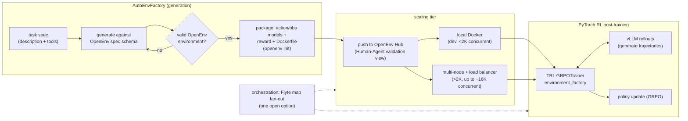

# Supporting resources — Building an AutoEnvFactory with OpenEnv and Flyte

> Grounding material for the proposal. **Not part of the Sessionize submission.**
> Anchored to OpenEnv (meta-pytorch / Hugging Face), TRL's `GRPOTrainer`
> `environment_factory` integration, and the OpenEnv scaling work.

## End-to-end factory architecture



## The OpenEnv contract (what we generate against)

```python
# A generated environment must conform to the OpenEnv Gymnasium-style API.
from openenv import Environment, Action, Observation

class MazeAction(Action):           # typed, validated action space
    select_link: str

class MazeObservation(Observation):  # typed observation
    page_title: str
    available_links: list[str]
    reward: float
    done: bool

class MazeEnv(Environment[MazeAction, MazeObservation]):
    def reset(self) -> MazeObservation: ...
    def step(self, action: MazeAction) -> MazeObservation: ...
    def state(self) -> dict: ...

# Generation is gated by the spec: an environment that doesn't implement
# reset/step/state with typed Action/Observation models fails validation
# BEFORE `openenv push` — the same "closed contract" idea as kernel codegen.
```

## Consuming it in the PyTorch training loop (TRL)

```python
from trl import GRPOConfig, GRPOTrainer
from envs.maze_env import MazeEnv  # pip-installed from the Hub Space

def environment_factory():
    # One env instance per concurrent rollout; the factory is what scales.
    return MazeEnv.from_hub("openenv/maze_env")

trainer = GRPOTrainer(
    model="Qwen/Qwen3-0.6B",
    args=GRPOConfig(num_generations=8, ...),
    environment_factory=environment_factory,   # <- multi-turn loop handled for you
)
trainer.train()
```

`GRPOTrainer` drives the generate → parse-tool-call → `env.step` → feed-back loop
itself; the factory is the seam where concurrency (and thus training throughput)
is won or lost.

## Scaling tiers (from the OpenEnv scaling benchmarks)

| Tier | Tool | Concurrency | Use |
|---|---|---|---|
| Dev | local Docker | up to ~2K | iterate on reward + action space |
| Demo | HF Spaces | ~128 | publish + Human-Agent validation |
| Training | multi-node + Envoy LB | ~16K (measured, 100% success) | full GRPO runs |
| GPU envs | one container per GPU | — | environments that need a model in the loop |

## Honest challenges slide (proves expertise)

- **Reward shaping:** dense intermediate rewards vs. sparse terminal reward —
  dense, shaped rewards (small reward at checkpoints, large at the target) train
  far more reliably for graph-traversal tasks.
- **Action-space sprawl:** an over-flexible action space stalls learning;
  restrict to one action type and grow deliberately.
- **State validation:** parse/verify observations so the agent is only rewarded
  for genuinely correct terminal states (not a target string that merely appears
  in context).
- **Context length / OOM:** chunk large observations into sections; use PEFT
  (LoRA) to keep training memory bounded.
- **The generation boundary:** verifiable-reward tasks (graphs, code, math)
  generate cleanly; genuinely ambiguous tasks still need a human-defined reward.

## A note on the title vs. CFP guidance

Per `AGENTS.md` §3, the PyTorch-ecosystem story (OpenEnv + TRL + vLLM) is the
subject and payoff; **Flyte appears only as one open orchestration option** for
fan-out and lifecycle. If reviewers read the title as vendor-forward, an easy
softening is *"Building an AutoEnvFactory with OpenEnv"* with the orchestration
layer described generically in the body. Flagged for the speaker to decide.


## Educational Primer: RLHF, GRPO, and OpenEnv

### The one-sentence story

The next bottleneck in open RL post-training is no longer just model compute; it
is the supply of high-quality, stateful, scalable environments. OpenEnv gives the
PyTorch ecosystem a common environment contract, and an AutoEnvFactory is a way
to turn task specs into reusable training infrastructure.

### Concepts a new presenter must know

- **RLHF:** the broad family of techniques that fine-tune a language model using
  reward signals rather than next-token labels alone. In classic RLHF, PPO is
  common, but it often requires policy, reference, reward, and value models.
- **RLVR:** reinforcement learning with verifiable rewards. Instead of relying
  only on human preference labels, the reward can be computed by a verifier
  (e.g. answer correctness, unit tests, game state, graph reachability).
- **GRPO:** Group Relative Policy Optimization. It avoids a learned value model
  by sampling multiple completions for the same prompt and comparing their
  rewards relative to the group. This is why it became popular for reasoning
  models and lower-memory RL fine-tuning.
- **Environment vs. tool call:** a stateless tool call returns a result, but an
  environment preserves state across turns. Use environments when the agent's
  action changes what it will observe next: games, browsing, coding sandboxes,
  API workflows, simulations.
- **OpenEnv:** a standard for defining and serving agentic RL environments using
  familiar `reset` / `step` / `state` style APIs, packaged as containers or
  services and usable from training libraries such as TRL.
- **`environment_factory`:** the TRL seam that creates one environment instance
  per rollout and lets `GRPOTrainer` manage the multi-turn generate → act →
  observe → reward loop.

### Presentation ladder: teach it in this order

1. Start from the manual loop: prompt a model, parse an action, run code against
   an environment, score the result, repeat.
2. Explain why static datasets are not enough for agentic tasks. The next
   observation should depend on what the agent did.
3. Introduce OpenEnv as the portability layer: a standard environment contract
   that lets TRL, TorchForge, verl, and similar tools consume the same task.
4. Introduce AutoEnvFactory as a generator of OpenEnv-compatible scaffolds:
   action schema, observation schema, reward, Dockerfile, and validation tests.
5. Scale last: once the environment is valid, the training problem becomes
   throughput engineering: many concurrent episodes, server pools, and rollout
   fan-out.

### A presenter's mental model for `environment_factory`

```python
def environment_factory(example):
    # Create a fresh stateful world for one rollout.
    return MazeEnv(start=example["start"], target=example["target"])

def reward_func(environments, completions, **kwargs):
    # The environment accumulated state while the trainer interacted with it.
    return [env.score for env in environments]

trainer = GRPOTrainer(
    model="Qwen/Qwen3-0.6B",
    args=GRPOConfig(num_generations=8),
    train_dataset=dataset,
    environment_factory=environment_factory,
    reward_funcs=reward_func,
)
```

The important teaching point: `GRPOTrainer` can hide most of the rollout glue.
The presenter's job is to explain what makes a *good environment*: bounded
actions, clear observations, reproducible reset, shaped rewards, and enough
throughput.

### What can go wrong

- **Reward hacking:** the agent exploits an accidental shortcut in the reward.
  Mitigation: add invariant checks and adversarial validation examples.
- **Action space too broad:** the model spends all its probability mass on
  malformed or useless actions. Mitigation: start with one or two typed actions.
- **Slow environments:** model training stalls because environment responses are
  slower than generation. Mitigation: local dev, hosted demo, then multi-node
  service pool with load balancing.
- **Ambiguous terminal condition:** the environment cannot confidently decide
  whether the task is done. Mitigation: choose verifiable tasks first; keep fuzzy
  tasks human-reviewed.

### How to position Flyte without making the talk vendor-forward

Say: "OpenEnv and TRL define the training contract. A workflow engine is useful
only after that, when we need to run many environment servers, rollout workers,
and validation jobs. Flyte is one open-source option for this fan-out."

### Further deep reading and citations

- [OpenEnv Integration for Training LLMs with Environments](https://huggingface.co/docs/trl/en/openenv)
  — TRL's `environment_factory` and OpenEnv integration guide.
- [GRPO Trainer documentation](https://huggingface.co/docs/trl/en/grpo_trainer)
  — TRL's implementation and explanation of the GRPO training loop.
- [Building the Open Agent Ecosystem Together: Introducing OpenEnv](https://huggingface.co/blog/openenv)
  — Meta/Hugging Face announcement and ecosystem motivation.
- [Scaling OpenEnv: From Free Usage to Thousands of Concurrent Environments](https://huggingface.co/blog/burtenshaw/openenv-scaling)
  — practical scaling tiers and concurrency measurements.
- [DeepSeekMath: Pushing the Limits of Mathematical Reasoning in Open Language
  Models](https://arxiv.org/abs/2402.03300) — paper that introduced GRPO.
- [Gymnasium documentation](https://gymnasium.farama.org/) — the API tradition
  OpenEnv builds on.
- [TRL examples for OpenEnv](https://github.com/huggingface/trl/tree/main/examples/scripts/openenv)
  — concrete scripts for Echo, Wordle, BrowserGym, and multi-environment runs.
