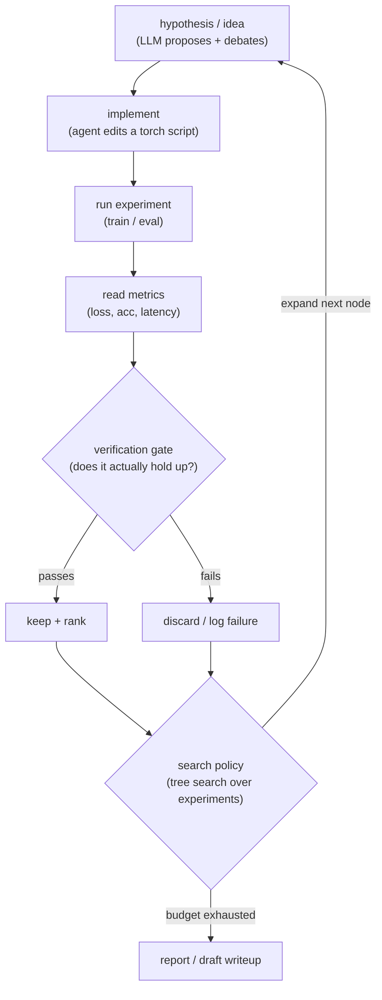
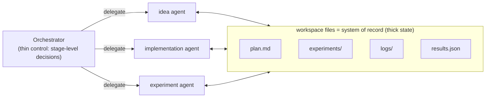

# Supporting resources — AI/ML Autoresearch with agents

> Grounding material for the proposal. **Not part of the Sessionize submission.**
> References the open autoresearch landscape (The AI Scientist / agentic tree
> search; long-horizon "thin control over thick state" / File-as-Bus systems) and
> reuses the two case studies the speaker can demo live.

## The autoresearch loop (build it up on one slide)



This is deliberately the *same* shape as the manual loop a practitioner runs by
hand — the talk's whole point is that automation is incremental, not magical.

## Design principle 1 — closed action space (so the agent can't drift)

```python
# The agent doesn't emit free-form code for the search step; it picks from a
# bounded, validated menu. Invalid moves fail before they ever run.
from pydantic import BaseModel
from typing import Literal

class ExperimentMove(BaseModel, frozen=True):
    action: Literal["change_lr", "change_arch", "add_augmentation", "stop"]
    value: float | str

# A hallucinated action (e.g. action="delete_test_set") fails validation.
```

## Design principle 2 — thin control over thick state (File-as-Bus)



Long-horizon research runs break when state lives only in a conversation.
Externalizing plans/code/logs/results into files lets a freshly-invoked
specialist resume coherently — the key to runs that last hours, not minutes.

## Design principle 3 — the verification gate (the trust anchor)

The two case studies share the *same* verify gate idea — only the action space
differs:

| Case study | Action space | Verification gate |
|---|---|---|
| Auto-tune kernels | Triton tile configs (closed schema) | compile → numerically verify vs. `torch.matmul` → CUDA-event benchmark |
| Auto-generate RL envs | OpenEnv environment specs | conforms to `reset`/`step`/`state` typed contract → Human-Agent Hub check |

```python
# Generic verify gate — a result does not count until it passes.
def keep_if_verified(candidate) -> bool:
    if not candidate.compiles():       return False
    if not candidate.matches_reference(tol=1e-2):  return False
    candidate.metric = candidate.measure()  # only now is it rankable
    return True
```

## Where humans stay in the loop (the honesty slide)

- **Choosing the question** — agents search; they don't decide what's worth asking.
- **Defining the reward / success metric** — garbage metric, garbage search.
- **Ship / no-ship** — the agent proposes; a human owns the consequence.

## Why this is beginner-appropriate

No prior RL/agents knowledge assumed. Every concept is introduced from the
manual loop the audience already runs, then one automation is layered on at a
time. The two case studies are shown as *applications* of the same pattern, not
prerequisites.


## Educational Primer: Autonomous ML Research Agents

### The one-sentence story

Autoresearch agents are not magic scientists. They are systems that automate the
same loop ML practitioners already run: propose a hypothesis, change PyTorch
code, run an experiment, inspect the evidence, and decide what to try next.

### Concepts a new presenter must know

- **Agent:** an LLM-driven program that can choose actions, call tools, inspect
  results, and continue toward a goal.
- **Autoresearch:** automation of the research workflow itself, not just one
  task. A full loop may include literature review, idea generation, experiment
  design, code editing, execution, debugging, plotting, writing, and review.
- **Agentic tree search:** instead of trying one linear path, the system explores
  a tree of experimental branches. Some branches fail; promising branches are
  expanded.
- **Research template:** a bounded starting point such as a nanoGPT experiment,
  diffusion model repo, kernel-tuning harness, or RL environment benchmark. Good
  templates make automated research tractable.
- **File-as-Bus:** a coordination pattern where project state lives in files
  (`plan.md`, `experiments.json`, logs, plots, patches), not only in chat
  context. Agents read and write artifacts as the shared memory.
- **Verification gate:** an objective check that an experiment should count:
  tests pass, training completes, metrics improve, kernel numerics match, plots
  are generated, or a reviewer rubric passes.

### Presentation ladder: teach it in this order

1. Begin with a familiar PyTorch workflow: edit `train.py`, run it, inspect loss,
   update the hypothesis.
2. Automate one step only: have an agent propose a learning-rate sweep or write a
   small patch.
3. Add tools: shell, Python, tests, benchmark scripts, experiment tracker.
4. Add memory: make the agent write down plans, commands, outcomes, and lessons
   into files.
5. Add search: let multiple branches compete under a fixed time/GPU budget.
6. Add reporting: summarize what worked, what failed, and what remains uncertain.

### Minimal autoresearch scaffold for a demo

```text
project/
  task.md                 # human-written research question
  plan.md                 # agent-maintained plan
  train.py                # PyTorch experiment entrypoint
  experiments/
    001-baseline.json
    002-lr-sweep.json
  logs/
    001-baseline.txt
  results.md              # final evidence summary
```

```python
def verification_gate(run):
    assert run.exit_code == 0, "training crashed"
    assert run.metrics["val_loss"] < run.baseline["val_loss"], "no improvement"
    assert run.artifacts["plot.png"].exists(), "missing evidence"
    return True
```

Use this tiny scaffold for the talk. It makes the concept concrete without
claiming the agent can solve open-ended science by itself.

### What to emphasize when presenting

- The value is **search acceleration**, not replacing human scientific judgment.
- The research question, reward/metric, compute budget, and publication decision
  remain human responsibilities.
- Closed action spaces matter. A beginner talk should avoid "the agent can do
  anything" framing; show bounded operations like editing one config, launching
  one run, or choosing from known experiment moves.
- The output should be evidence-first: commands, logs, metrics, plots, tests, and
  failed attempts. A polished writeup without artifacts is not trustworthy.

### Risks and responsible framing

- **Benchmark overfitting:** the agent may optimize the wrong metric. Keep a held
  out evaluation or sanity-check task.
- **False novelty:** literature search and reviewer checks are not guarantees of
  novelty. Present claims conservatively.
- **Compute waste:** tree search can expand quickly. Set hard budgets and stop
  conditions.
- **Paper spam risk:** autonomous drafting can flood review systems. Frame the
  talk as research augmentation and reproducible experimentation, not automatic
  publication.

### Further deep reading and citations

- [Towards end-to-end automation of AI research](https://www.nature.com/articles/s41586-026-10265-5)
  — Nature paper on The AI Scientist.
- [The AI Scientist repository](https://github.com/SakanaAI/AI-Scientist) —
  official code and templates from Sakana AI.
- [AI Scientist-v2](https://github.com/SakanaAI/AI-Scientist-v2) — agentic tree
  search and template-free extensions.
- [Toward Autonomous Long-Horizon Engineering for ML Research](https://arxiv.org/abs/2604.13018)
  — AiScientist / File-as-Bus framing.
- [Sibyl Research System](https://github.com/Sibyl-Research-Team/sibyl-research-system)
  — multi-agent research pipeline example.
- [MLE-bench](https://github.com/openai/mle-bench) — benchmark for measuring AI
  agents on machine-learning engineering tasks.
- [PyTorch tutorials](https://docs.pytorch.org/tutorials/) — useful grounding for
  the beginner audience that needs to connect "agent" back to ordinary training.
