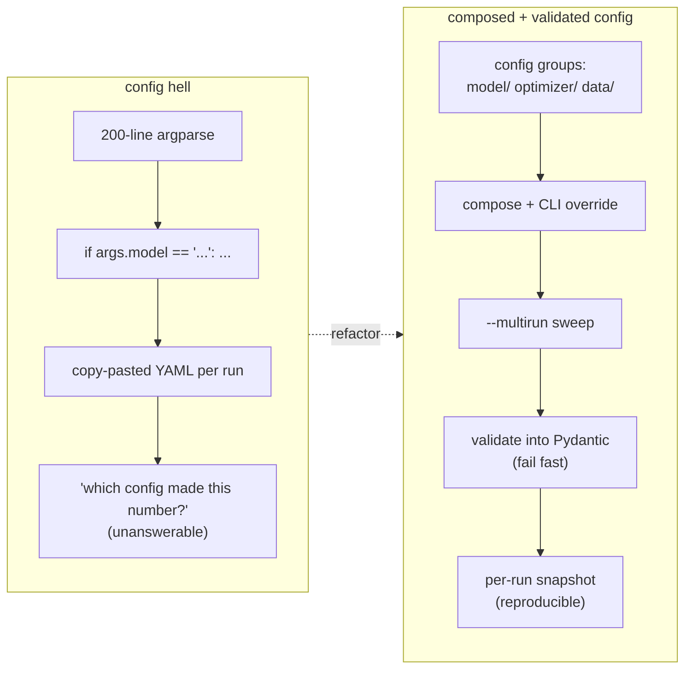
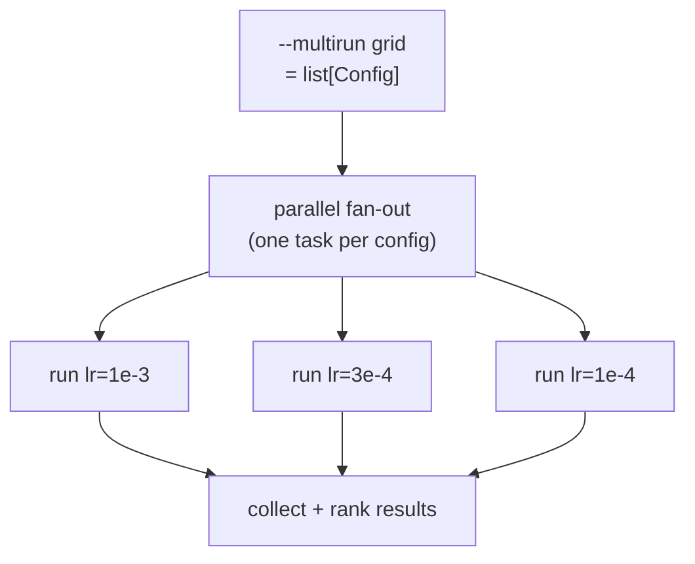

# Supporting resources — Managing experiment configuration hell with Hydra

> Grounding material for the proposal. **Not part of the Sessionize submission.**
> Anchored to Hydra config groups + `--multirun`, OmegaConf structured configs +
> `ConfigStore`, and the well-documented OmegaConf limitations + Pydantic fix.

## The refactor arc (before → after)



## Config groups → composition (the "after" layout)

```
conf/
  config.yaml            # defaults: model, optimizer, data
  model/
    resnet50.yaml
    vit_b16.yaml
  optimizer/
    adamw.yaml
    sgd.yaml
  data/
    imagenet.yaml
    cifar10.yaml
```

```bash
# Swap whole modules + override any leaf, no code change:
python train.py model=vit_b16 optimizer=adamw optimizer.lr=3e-4

# Sweep without bash loops — every run captured + named:
python train.py --multirun \
    model=resnet50,vit_b16 optimizer.lr=1e-3,3e-4,1e-4
```

## Structured configs — type safety, and where it stops

```python
from dataclasses import dataclass
from hydra.core.config_store import ConfigStore

@dataclass
class OptimizerConfig:
    name: str = "adamw"
    lr: float = 3e-4          # runtime + static type checking via dataclass

@dataclass
class TrainConfig:
    optimizer: OptimizerConfig = OptimizerConfig()
    epochs: int = 10

cs = ConfigStore.instance()
cs.store(name="train_config", node=TrainConfig)
```

**The honest limitations slide** (straight from the OmegaConf/Hydra docs):

- `Union` types only *partially* supported.
- User-defined methods on config classes are not supported.
- No `pathlib.Path` (and other canonical Python types) out of the box.
- Type-checking only — **no custom validation** (ranges, cross-field rules).

## Closing the gap with Pydantic (where most tutorials stop)

```python
import hydra
from omegaconf import OmegaConf, DictConfig
from pydantic import BaseModel, field_validator

class Optimizer(BaseModel):
    name: str
    lr: float
    @field_validator("lr")
    @classmethod
    def positive_lr(cls, v: float) -> float:
        if v <= 0:
            raise ValueError("lr must be > 0")   # fail BEFORE a GPU is allocated
        return v

class Config(BaseModel):
    optimizer: Optimizer
    epochs: int

@hydra.main(version_base=None, config_path="conf", config_name="config")
def main(cfg: DictConfig) -> None:
    # Hydra composes + overrides; Pydantic validates with real rules + unions.
    config = Config(**OmegaConf.to_container(cfg, resolve=True))
    train(config)
```

This gives the best of both: Hydra's composition/override/multirun *and*
Pydantic's custom validators, constraints, and proper union handling — bad
config fails fast instead of crashing 40 minutes into a run.

## A multirun sweep maps onto a parallel fan-out



> A workflow engine such as **Flyte** is *one open option* for executing each
> config as an independent, resourced task and caching identical configs — kept
> as supporting infra per `AGENTS.md` §3, not the subject of the talk.

## What this does NOT fix (honesty slide)

- It won't make a poorly-factored *training script* good — config hygiene is
  orthogonal to code hygiene.
- It won't choose good hyperparameters for you — it makes choosing/searching
  cheap and reproducible.


## Educational Primer: Hydra, OmegaConf, and Pydantic

### The one-sentence story

Hydra solves experiment composition and sweeping; Pydantic solves runtime
validation. Together they turn configuration from "loose strings passed through
`argparse`" into a typed artifact that can reproduce, validate, and scale
PyTorch experiments.

### Concepts a new presenter must know

- **Config:** all values that shape an experiment but are not learned weights:
  model name, optimizer, data path, seed, batch size, hardware profile, logging
  settings, checkpoint path.
- **OmegaConf:** the configuration object system under Hydra. It provides
  `DictConfig`, interpolation (`${...}`), merge semantics, and structured config
  support.
- **Hydra:** a framework for composing configs from groups of YAML/dataclass
  fragments, overriding values from the command line, managing output
  directories, and launching single or multi-run jobs.
- **Config group:** a swappable family of configs, such as `model=resnet50`,
  `model=vit_b16`, `optimizer=adamw`, or `data=imagenet`.
- **Defaults list:** the ordered list in `config.yaml` that says which config
  groups compose the experiment by default.
- **Override:** a command-line mutation like `optimizer.lr=3e-4` or
  `model=vit_b16`.
- **Multirun:** Hydra's built-in way to expand a sweep such as
  `optimizer.lr=1e-3,3e-4,1e-4` into multiple runs.
- **Pydantic:** a validation library that turns Python type hints and validators
  into runtime checks. It catches invalid values before a GPU job starts.

### Presentation ladder: teach it in this order

1. Show the bad version: `argparse` with dozens of flags and branching logic.
2. Move the defaults into `conf/config.yaml`.
3. Split independent choices into config groups: `model/`, `optimizer/`, `data/`.
4. Run a single override from the CLI: `model=vit_b16 optimizer.lr=3e-4`.
5. Run a sweep with `--multirun`.
6. Show the bug Hydra alone may not catch: `optimizer.lr=-1`.
7. Add Pydantic validation so invalid config fails before any training starts.
8. Close by mapping the multirun grid to distributed execution.

### Minimal config example for slides

```yaml
# conf/config.yaml
defaults:
  - model: resnet50
  - optimizer: adamw
  - data: cifar10
  - _self_

seed: 7
epochs: 20
run_name: ${model.name}-${optimizer.name}-lr${optimizer.lr}
```

```yaml
# conf/optimizer/adamw.yaml
name: adamw
lr: 0.0003
weight_decay: 0.01
```

```bash
# One run
python train.py model=vit_b16 optimizer.lr=1e-4

# Sweep
python train.py --multirun model=resnet50,vit_b16 optimizer.lr=1e-3,3e-4,1e-4
```

### Pydantic validation pattern to teach

```python
from pathlib import Path
from typing import Literal

from omegaconf import DictConfig, OmegaConf
from pydantic import BaseModel, Field, field_validator

class OptimizerConfig(BaseModel):
    name: Literal["adamw", "sgd"]
    lr: float = Field(gt=0, lt=1)
    weight_decay: float = Field(ge=0)

class DataConfig(BaseModel):
    name: str
    root: Path

class TrainConfig(BaseModel):
    optimizer: OptimizerConfig
    data: DataConfig
    epochs: int = Field(gt=0)

    @field_validator("epochs")
    @classmethod
    def keep_demo_short(cls, v: int) -> int:
        if v > 10_000:
            raise ValueError("epochs is probably misconfigured")
        return v

def validate_config(cfg: DictConfig) -> TrainConfig:
    return TrainConfig(**OmegaConf.to_container(cfg, resolve=True))
```

### What to emphasize when presenting

- Hydra is about **composition** and **run management**, not just YAML.
- Pydantic is about **semantic validation**, not just type hints.
- The pattern should fail as early as possible. A bad config should error in
  milliseconds on the driver process, not after a GPU job has pulled data.
- Config hygiene is a collaboration tool: it lets someone else rerun exactly the
  experiment that produced a result.

### Common pitfalls

- **Over-nesting:** if a value is never swapped independently, it may not need
  its own config group.
- **Silent stringly-typed choices:** `model.name: "resnett50"` should fail fast
  via `Literal`, enum, or a registry check.
- **Unresolved interpolations:** always validate with `resolve=True` when the
  Pydantic model should see final values.
- **Confusing config with code:** don't hide complex Python logic in YAML. Use
  configs to select and parameterize code, not replace it.

### Further deep reading and citations

- [Hydra official documentation](https://hydra.cc/docs/intro/) — core concepts,
  config groups, overrides, launchers, and multirun.
- [Hydra structured config tutorial](https://hydra.cc/docs/tutorials/structured_config/intro/)
  — dataclass-backed schemas and `ConfigStore`.
- [OmegaConf structured configs](https://omegaconf.readthedocs.io/en/latest/structured_config.html)
  — type checking, merging, and limitations.
- [Pydantic documentation](https://docs.pydantic.dev/) — `BaseModel`, field
  constraints, validators, and settings.
- [Configuration management for model training experiments using Pydantic and
  Hydra](https://towardsdatascience.com/configuration-management-for-model-training-experiments-using-pydantic-and-hydra-d14a6ae84c13/)
  — practical Hydra + Pydantic walkthrough.
- [Add Pydantic Type Checking and Parsing to Your Hydra App](https://mit-ll-responsible-ai.github.io/hydra-zen/how_to/pydantic_guide.html)
  — `hydra-zen` integration patterns.
- [PyTorch reproducibility notes](https://docs.pytorch.org/docs/stable/notes/randomness.html)
  — useful reminder that config reproducibility also needs seeds, versions, and
  deterministic settings.
