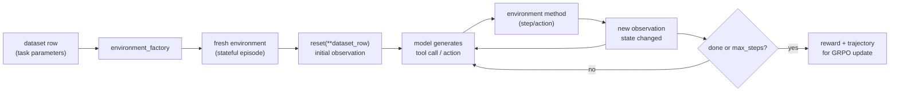

# Supporting resources — Introduction to OpenEnv

> Grounding material for the proposal. **Not part of the Sessionize submission.**
> This is a presenter primer for explaining OpenEnv to an audience that may know
> PyTorch, but not RL environments or agentic training.

## Educational Primer: OpenEnv From Zero to Hero

### The one-sentence story

OpenEnv turns agentic environments into reusable PyTorch ecosystem artifacts:
define a stateful world once, package it in a standard way, and train or evaluate
models against it from TRL, TorchForge, verl, or other RL tooling.

### Core concepts

- **Environment:** a stateful world an agent can act in. The next observation
  depends on the previous action.
- **Static dataset:** examples are fixed before training. Useful for supervised
  fine-tuning, but insufficient when the model must interact with a changing
  world.
- **Tool call:** a one-off function call. Useful for stateless operations, but
  not enough when actions must affect future state.
- **Observation:** what the model sees after reset or after an action.
- **Action/tool method:** what the model can do. In TRL's integration, public
  methods on the environment become model-callable tools.
- **Reward:** the scalar signal used by RL to reinforce good behavior.
- **Episode:** one complete interaction, from reset until the environment is done
  or a maximum step count is reached.
- **`environment_factory`:** the TRL hook that creates one environment instance
  per rollout and lets `GRPOTrainer` run the multi-turn loop.

## The OpenEnv mental model



## Minimal environment sketch

This is intentionally small enough for a first-time presenter to explain on one
slide. The important piece is not the task; it is that `increment` changes state.

```python
class CounterEnv:
    def reset(self, target: int, **kwargs) -> str:
        self.value = 0
        self.target = target
        return f"Start at 0. Reach exactly {target}."

    def increment(self, amount: int) -> str:
        """Increment the counter.

        Args:
            amount: Integer amount to add to the current counter.
        """
        self.value += amount
        if self.value == self.target:
            return "Correct: reached the target."
        if self.value > self.target:
            return "Too high."
        return f"Current value: {self.value}"
```

## Minimal TRL integration sketch

```python
from trl import GRPOConfig, GRPOTrainer

def reward_func(environments, **kwargs):
    return [1.0 if env.value == env.target else 0.0 for env in environments]

trainer = GRPOTrainer(
    model="Qwen/Qwen3-0.6B",
    args=GRPOConfig(num_generations=8, max_completion_length=256),
    train_dataset=dataset,              # contains a target column
    environment_factory=CounterEnv,      # one env per rollout
    reward_funcs=reward_func,
)
trainer.train()
```

Presenter note: explain that TRL uses the environment's public methods and
docstrings to build the tool schema the model can call.

## Design checklist for a good first OpenEnv

- **Small action space:** one or two methods at first.
- **Typed arguments:** avoid free-form strings unless the task requires them.
- **Compact observations:** every token in the observation costs training budget.
- **Deterministic reset:** the same task inputs should produce the same initial
  state during debugging.
- **Clear terminal condition:** the environment should know when an episode is
  done.
- **Simple reward first:** start sparse and correct; add shaping only after
  observing failure modes.
- **Validation examples:** include tests where the correct and incorrect
  behavior are obvious to a human.

## Common pitfalls

- **Tool methods without docstrings:** TRL needs docstrings to build useful tool
  schemas.
- **Ambiguous rewards:** if humans disagree on success, the model will exploit
  the ambiguity.
- **Observation bloat:** long pages, logs, or code files can dominate context and
  slow training.
- **Hidden nondeterminism:** random state or external services can make a reward
  impossible to debug.
- **Scaling too early:** make one local environment reliable before worrying
  about thousands of concurrent episodes.

## Further deep reading and citations

- [OpenEnv documentation](https://meta-pytorch.org/OpenEnv/index.html) — official
  getting-started guides and environment-building docs.
- [OpenEnv GitHub repository](https://github.com/meta-pytorch/OpenEnv) — source
  code, examples, and issues.
- [Building the Open Agent Ecosystem Together: Introducing OpenEnv](https://huggingface.co/blog/openenv)
  — Meta-PyTorch and Hugging Face announcement.
- [OpenEnv Integration for Training LLMs with Environments](https://huggingface.co/docs/trl/en/openenv)
  — TRL guide to `environment_factory` and `rollout_func`.
- [TRL GRPOTrainer documentation](https://huggingface.co/docs/trl/en/grpo_trainer)
  — GRPO training details and API reference.
- [Gymnasium documentation](https://gymnasium.farama.org/) — the environment API
  lineage OpenEnv builds on.
- [BrowserGym repository](https://github.com/ServiceNow/BrowserGym) — example of
  browser-based agent environments.
- [OpenEnv scaling article](https://huggingface.co/blog/burtenshaw/openenv-scaling)
  — useful context on environment throughput and concurrency.

## Positioning relative to the AutoEnvFactory proposal

This intro talk should teach the baseline concept: what OpenEnv is, how to build
one, and how TRL consumes it. The AutoEnvFactory proposal is the advanced sequel:
once a presenter understands OpenEnv manually, can an agent generate valid
OpenEnv environments from task specs?
