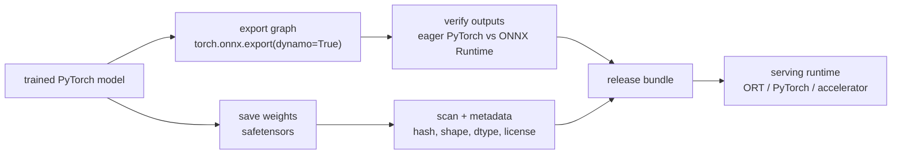

# Supporting resources — Stop pickling your models!

> Grounding material for the proposal. **Not part of the Sessionize submission.**
> This is a presenter primer for explaining PyTorch model artifacts, pickle
> risk, ONNX export, and safetensors in a practical production-inference frame.

## Educational Primer: Model Artifacts From Zero to Hero

### The one-sentence story

Production inference needs artifacts that are explicit about computation,
weights, trust boundaries, runtime compatibility, and numerical equivalence.
Pickle is convenient for local Python development, but it is the wrong default
for release artifacts.

### Core concepts

- **Pickle:** Python's general object serialization mechanism. It can execute
  arbitrary code during deserialization and should not be loaded from untrusted
  sources.
- **`torch.save`:** PyTorch's common serialization helper. It uses Python pickle
  under the hood for many objects, which is why full-object checkpoints are not
  a safe interchange format.
- **`state_dict`:** a mapping from parameter/buffer names to tensors. It is more
  portable than a whole Python object, but the receiving code still needs the
  model architecture.
- **safetensors:** a tensor-only serialization format. It stores tensors and
  metadata, not executable Python objects.
- **ONNX:** an open graph format for representing computation and weights for
  inference across frameworks and runtimes.
- **ONNX Runtime:** a production runtime that executes ONNX graphs on CPUs, GPUs,
  and accelerator backends.
- **`torch.export`:** PyTorch's modern capture path for normalized computation
  graphs. The recommended ONNX exporter path uses this via
  `torch.onnx.export(..., dynamo=True)`.

## Artifact decision matrix

| Goal | Recommended artifact | Why |
|---|---|---|
| Local training resume you fully trust | PyTorch checkpoint | Keeps optimizer/scheduler/training state |
| Share weights for a known PyTorch architecture | `safetensors` | Tensor-only, inspectable, no pickle execution |
| Serve outside Python/PyTorch | ONNX | Portable graph + weights |
| Optimize for ORT/TensorRT/OpenVINO | ONNX as handoff | Downstream compilers consume graph formats |
| Accept unknown internet models | Avoid pickle; scan/convert in sandbox | Treat as untrusted input |

## Production artifact pipeline



## ONNX export skeleton

```python
import torch
import onnxruntime as ort

model.eval()
example = torch.randn(4, 3, 224, 224)

onnx_program = torch.onnx.export(
    model,
    args=(example,),
    f=None,                         # return ONNXProgram for extra control
    input_names=["images"],
    output_names=["logits"],
    dynamo=True,                    # modern torch.export-based path
    dynamic_shapes={"images": {0: "batch"}},
    verify=True,
    report=True,
)
onnx_program.save("model.onnx", external_data=True)

session = ort.InferenceSession("model.onnx")
ort_out = session.run(["logits"], {"images": example.numpy()})[0]
torch_out = model(example).detach().numpy()

assert abs(ort_out - torch_out).max() < 1e-4
```

Presenter note: the exact API evolves across PyTorch versions, but the teaching
contract is stable: export, save, verify against eager PyTorch, and keep the
export report/artifacts.

## safetensors weight handoff skeleton

```python
from safetensors.torch import load_file, save_file

state = model.state_dict()
save_file(state, "model.safetensors", metadata={
    "architecture": "resnet50",
    "pytorch_version": torch.__version__,
})

loaded = load_file("model.safetensors")
model.load_state_dict(loaded)
```

## Release checklist

- **Trust boundary:** did this artifact come from a trusted training job? If not,
  do not unpickle it.
- **Input schema:** names, shapes, dynamic axes, dtypes, normalization, tokenizers
  or preprocessing versions.
- **Output schema:** names, shapes, dtype, logits/probabilities/embeddings.
- **Equivalence tests:** fixed input battery comparing eager PyTorch and exported
  artifact within tolerances.
- **Runtime target:** PyTorch, ONNX Runtime, TensorRT, OpenVINO, mobile/edge.
- **Large weights:** use ONNX external data or sharded safetensors where needed.
- **Metadata:** model version, git SHA, data version, license, training config,
  hashes, supported hardware/runtime versions.
- **Security scan:** scan artifacts before promoting to serving.

## Common pitfalls

- **Saving `torch.save(model)` instead of `state_dict`:** couples the artifact to
  Python class code.
- **Skipping export verification:** graph export can change numerics or fail to
  represent dynamic control flow as expected.
- **Forgetting preprocessing:** production failures often come from transforms,
  tokenization, dtype, or normalization, not only model weights.
- **Assuming safetensors stores computation:** it stores tensors; you still need
  architecture code or a separate graph format.
- **Treating ONNX as magic:** unsupported ops, custom ops, or dynamic shapes may
  require exporter customization or runtime-specific handling.

## Further deep reading and citations

- [PyTorch ONNX documentation](https://docs.pytorch.org/docs/main/onnx.html) —
  current `torch.onnx.export` API.
- [torch.export-based ONNX exporter](https://docs.pytorch.org/docs/stable/onnx_export.md)
  — recommended `dynamo=True` path and `ONNXProgram.save`.
- [ONNX specification](https://onnx.ai/) — open standard for model graphs.
- [ONNX Runtime documentation](https://onnxruntime.ai/docs/) — production runtime
  and execution providers.
- [safetensors documentation](https://huggingface.co/docs/safetensors/index) —
  tensor-only format and PyTorch integration.
- [safetensors GitHub repository](https://github.com/huggingface/safetensors) —
  implementation and format details.
- [Python pickle security warning](https://docs.python.org/3/library/pickle.html)
  — official warning about arbitrary code execution.
- [ModelScan serialization attacks guide](https://github.com/protectai/modelscan/blob/main/docs/model_serialization_attacks.md)
  — practical overview of model serialization attack surfaces.
- [How Do Model Export Formats Impact the Development of ML-Enabled Systems?](https://arxiv.org/abs/2502.00429)
  — case study on integration tradeoffs across export formats.
