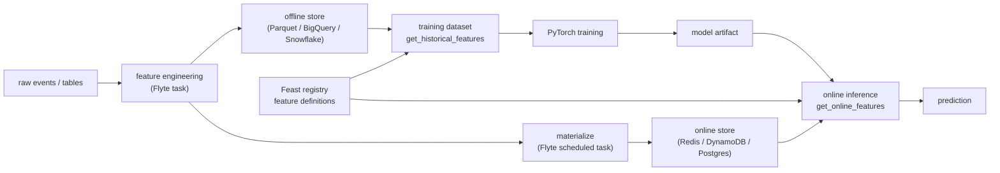

# Supporting resources — Eliminate the training-serving skew with Feast and Flyte

> Grounding material for the proposal. **Not part of the Sessionize submission.**
> This primer is for a presenter who knows PyTorch inference but may be new to
> feature stores, point-in-time joins, Feast, or Flyte.

## Educational Primer: Feature Stores, Skew, Feast, and Flyte

### The one-sentence story

Training-serving skew happens when the model is trained on one definition of a
feature and served with another. Feast gives PyTorch users a shared feature
contract; Flyte makes the feature engineering and training-serving pipeline
repeatable.

### Core concepts

- **Feature:** an input to a model, usually derived from raw data. Example:
  `user_30d_click_count`.
- **Entity:** the key a feature is attached to, such as `user_id`, `driver_id`,
  or `item_id`.
- **Feature view:** the Feast object that defines a group of related features,
  their schema, entity keys, and source data.
- **Offline store:** historical feature data used for training and batch
  scoring.
- **Online store:** low-latency store containing the latest feature values for
  real-time inference.
- **Point-in-time correctness:** historical training data must only include
  feature values that were available at the prediction timestamp.
- **Materialization:** moving computed features into the online store so serving
  can retrieve them quickly.
- **Training-serving skew:** mismatch between feature values or transformations
  used in training and those used in inference.
- **Flyte task/workflow:** reproducible compute units and pipelines with typed
  inputs/outputs, resource requests, caching, secrets, and schedules.

## End-to-end architecture



Presenter note: Feast is the single source of truth for feature definitions and
retrieval semantics. Flyte is the workflow layer that runs the jobs in the right
order with the right resources.

## Feast definition sketch

```python
from datetime import timedelta

from feast import Entity, FeatureView, Field
from feast.types import Float32, Int64
from feast.infra.offline_stores.file_source import FileSource

user = Entity(name="user", join_keys=["user_id"])

user_source = FileSource(
    path="data/user_features.parquet",
    timestamp_field="event_timestamp",
)

user_features = FeatureView(
    name="user_features",
    entities=[user],
    ttl=timedelta(days=7),
    schema=[
        Field(name="age", dtype=Int64),
        Field(name="activity_score", dtype=Float32),
        Field(name="avg_session_minutes", dtype=Float32),
    ],
    source=user_source,
)
```

## Training retrieval sketch

```python
import torch
from feast import FeatureStore

store = FeatureStore(repo_path="feature_repo")

training_df = store.get_historical_features(
    entity_df=examples_with_user_id_and_event_timestamp,
    features=[
        "user_features:age",
        "user_features:activity_score",
        "user_features:avg_session_minutes",
    ],
).to_df()

x = torch.tensor(
    training_df[["age", "activity_score", "avg_session_minutes"]].values,
    dtype=torch.float32,
)
y = torch.tensor(training_df["label"].values, dtype=torch.float32)
```

## Online inference sketch

```python
features = store.get_online_features(
    entity_rows=[{"user_id": 1001}],
    features=[
        "user_features:age",
        "user_features:activity_score",
        "user_features:avg_session_minutes",
    ],
).to_dict()

x = torch.tensor(
    [[
        features["age"][0],
        features["activity_score"][0],
        features["avg_session_minutes"][0],
    ]],
    dtype=torch.float32,
)

with torch.no_grad():
    prediction = model(x)
```

## Flyte workflow sketch

```python
import flyte

env = flyte.TaskEnvironment(
    name="feast-pytorch",
    image=flyte.Image.from_debian_base().with_pip_packages(
        "torch", "feast", "pandas", "pyarrow"
    ),
)

@env.task(cache="auto")
def build_features(raw_path: str) -> str:
    # Produce point-in-time feature rows into the offline store.
    return "data/user_features.parquet"

@env.task
def materialize_features(start: str, end: str) -> None:
    # Run `feast materialize` or call the Feast SDK for the target interval.
    ...

@env.task
def train_model(feature_repo: str) -> str:
    # Use get_historical_features, train PyTorch model, save artifact.
    return "models/recommender.pt"

@env.task
def validate_online_parity(model_path: str) -> dict:
    # Compare historical rows to online retrieval for sampled entities.
    return {"parity_passed": True}
```

## Production checks to include in the talk

- **Point-in-time check:** training rows should never use feature values newer
  than the row's event timestamp.
- **Offline/online parity check:** sample entities after materialization and
  compare offline values to `get_online_features` values.
- **Freshness check:** online features should be recent enough for serving.
- **Missingness check:** track missing online features by feature view and
  entity.
- **Shadow inference:** run the new feature path beside the old path before
  routing production traffic.
- **Schema check:** PyTorch model input tensor order must match Feast feature
  retrieval order.

## How to present Feast and Flyte without confusing responsibilities

| Concern | Feast | Flyte |
|---|---|---|
| Feature definitions | Owns registry, entities, feature views | Runs tasks that create/update data |
| Historical training data | `get_historical_features` with point-in-time joins | Schedules/reproduces training jobs |
| Online serving | Online store + `get_online_features` / feature server | Materialization workflows, validation jobs |
| Lineage and execution | Feature metadata | Task/workflow lineage, caching, resources |
| Low-latency retrieval | Yes | No, not the serving path |

## Common pitfalls

- **Reimplementing transformations in two places:** the exact problem Feast is
  meant to prevent.
- **Ignoring event timestamps:** without timestamps, training can leak future
  feature values.
- **Feature tensor order mismatch:** dictionary outputs must be converted to
  tensors in the same order used during training.
- **Materialization lag:** serving may retrieve stale values if the online store
  is not updated on schedule.
- **Making Flyte the feature store:** Flyte orchestrates jobs; Feast owns feature
  definitions and serving.

## Further deep reading and citations

- [Feast joins the PyTorch ecosystem](https://pytorch.org/blog/feast-joins-the-pytorch-ecosystem/)
  — PyTorch blog on Feast's role in PyTorch workflows.
- [Feast documentation](https://docs.feast.dev/) — concepts, architecture,
  offline stores, online stores, and feature servers.
- [Feast quickstart](https://docs.feast.dev/master/getting-started/quickstart)
  — local feature store, historical retrieval, and online retrieval.
- [Feast GitHub repository](https://github.com/feast-dev/feast) — source code and
  examples.
- [Flyte Feast integration example](https://docs-legacy.flyte.org/en/latest/flytesnacks/examples/feast_integration/index.html)
  — Feast feature engineering and retrieval in a Flyte pipeline.
- [Bring ML Close to Data Using Feast and Flyte](https://medium.com/union-ai/bring-ml-close-to-data-using-feast-and-flyte-bd0cb5608678)
  — practical Feast/Flyte integration writeup.
- [Union/Flyte task environment docs](https://www.union.ai/docs/v2/union/user-guide/core-concepts/task-environment/page.md)
  — configuring images, resources, and reusable execution environments.
- [PyTorch model deployment recipes](https://docs.pytorch.org/tutorials/recipes/recipes_index.html)
  — broader PyTorch production context.

## Title risk note

This title mentions Flyte, but the talk must stay PyTorch/Feast-first. The
abstract and outline should make clear that Feast solves the training-serving
skew, while Flyte is the reproducible workflow layer around feature engineering,
materialization, training, validation, and deployment handoff.
