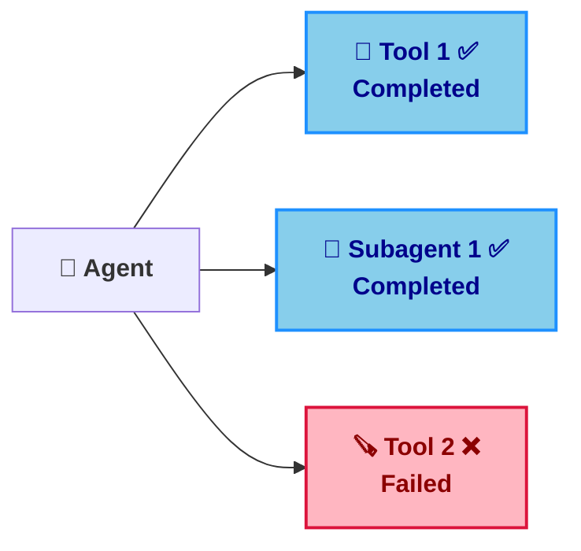
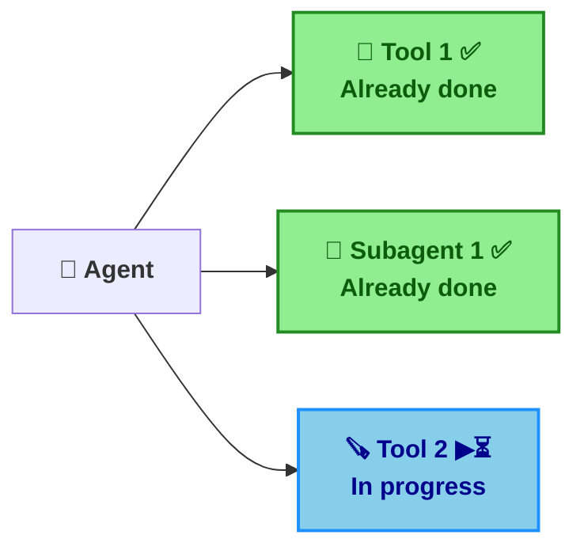
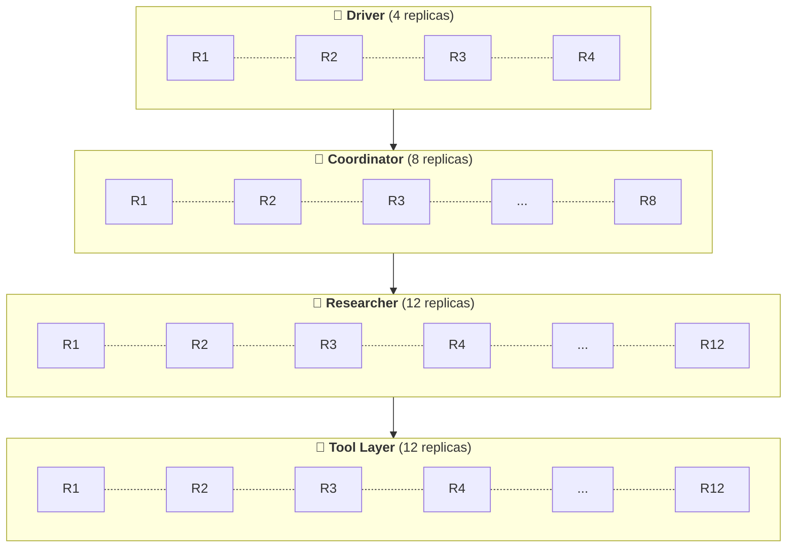

<style>
h1 { color: #FDB51F !important; }

h1, h2, h3, ul, li, p { text-align: left !important; }
  
:global(h1), :global(h2), :global(h3) {
  color: #FDB51F !important;
}
:global(.slidev-layout.cover h1),
:global(.slidev-layout.intro h1) {
  color: #FDB51F !important;
}
:global(.slidev-layout) {
  font-family: 'DM Sans', system-ui, sans-serif !important;
}
:global(.slidev-layout img) {
  display: block;
  margin-left: auto;
  margin-right: auto;
}
:global(.slidev-layout ul),
:global(.slidev-layout li) {
  text-align: left !important;
}

.two-cols-header {
  column-gap: 30px; /* Adjust the gap size as needed */
}
</style>

# The Orchestration Stack for Observable, Debuggable, and Durable Agents

<br />

### Niels Bantilan @ Union.ai

MLOps South Bay 2026

---
layout: center
---

# The hidden infrastructure problem

You built an agent, optimized its prompts, engineered its context, implemented an eval harness, and it works beautifully in development…

... then the infrastructure got in the way

<v-clicks>

- ❌ Tools making API calls or querying databases are rate-limited.
- ⚠️ Parallelized subagents/tool calls leads to resource contention and degraded performance.
- 💥 Containers run out of memory, are killed by the scheduler, are preempted by other jobs.
- 🗑️ Agent memory loss or corruption, wiping out precious context.
- 🔓 Agent components (MCPs, coder subagents) are easy to configure insecurely.

</v-clicks>

---
layout: center
---

# Agents Fail at Multiple Layers of the Orchestration Stack

<!-- The semantic and networking layers of the stack get a lot of attention, but the infrastructure layer is just as critical. -->

The problem isn't that agents fail.

It's that recovering from failure is virtually impossible without the full context of how the infrastructure, networking, logical, and semantic layers interact so that the agent can figure out
how to recover from it.

---
layout: center
---

# What Agents are saying...


Agents can recover from infra-level failures, but only if we give<br>them the right context.

---
layout: default
---

# Design Principles for Self-Healing Agents

1. **Plain Python/TS/JS** — DSLs incur additional cognitive overhead (for both humans and agents)
1. **Durability & observability hooks** — `@flyte.trace`, `@env.task`; works with any framework/stack
1. **Make failures cheap** — global cache, run-level replay log, and state persistence
1. **Infrastructure-level context** — agents see and fix OOM/network; request more resources
1. **Agent self-service utilities** — secure tool building and orchestration
1. **Human-in-the-loop** — debugger and manual feedback when self-service isn't enough

---
layout: default
---

# Chapter 1: Where Agents Break

| **🧱 Layer** | **❌ Example failures** |
|-----------|---------------------|
| Infrastructure | OOM, container killed or preempted, image pull backoff |
| Network | API rate-limiting, network timeouts, ephemeral service outage |
| Logical | Programming bugs, data validation errors |
| Semantic | Hallucinations, incorrect tool calls, context utilization errors |
| Tool execution | Bad arguments, tool timeouts, tool errors |
| Memory | State wiped or corrupted on crash, context erasure |

---
layout: default
---

# The Context and Evaluation Gap

Your evals test **semantic correctness**: *"Does it answer correctly?"*

They often **miss**:

- Does it survive a network timeout?
- Does it recover from OOM?
- Does it preserve state across retries?

<v-clicks>

**💡 Insight:** Agents can recover from errors at all the layers in the agent stack,
even infrastructure-level failures, but only with the right context and tools ✅.

</v-clicks>

---
layout: default
---

# Context engineering is also an infra problem

If a failure **wipes the agent's state**, that hard-earned context is worthless.

<br>

### Durability: what even is it?

<br>

<v-clicks>

- 📋 Replay log
- 🎒 Global caching
- 💾 Automatic state persistence

</v-clicks>


---
layout: two-cols-header
---

# Replay log

A service that records the state of an agent and its subtasks (tools, subagents, etc.)
at each step.

Avoids task re-execution, prevents memory/context loss, and even recovers from crashes
in the root agent process.


::left::

#### ▶️ Normal Execution

<br>



::right::

#### 📋 Replay Log

<br>

| **Step**         | **Component**              | **Status** |
|------------------|---------------------------|------------|
| 1                | 🔧 Tool 1                  | ✅         |
| 2                | 🤖 Subagent 1              | ✅         |
| 3                | 🪚 Tool 2                  | ❌         |

---
layout: two-cols-header
---

# Replay log

A service that records the state of an agent and its subtasks (tools, subagents, etc.)
at each step.

Avoids task re-execution, prevents memory/context loss, and even recovers from crashes
in the root agent process.

::left::

#### 💥🔄 Crash Recovery

<br>



::right::

#### 📋 Replay Log

<br>

| **Step**         | **Component**              | **Status** |
|------------------|---------------------------|------------|
| 1                | 🔧 Tool 1                  | ✅         |
| 2                | 🤖 Subagent 1              | ✅         |
| 3                | 🪚 Tool 2                  | ⏳         |

<style>
.two-cols-header {
  column-gap: 30px; /* Adjust the gap size as needed */
}
</style>


---
layout: two-cols-header
---

# Global Caching


---
layout: two-cols-header
---

# Automatic state persistence


---
layout: default
---

# Chapter 2: Six Design Principles for Self-Healing Agents

1. **Plain Python/TS/JS** — DSLs incur additional cognitive overhead (for both humans and agents)
1. **Durability & observability hooks** — `@flyte.trace`, `@env.task`; works with any framework/stack
1. **Make failures cheap** — global cache, run-level replay log, and state persistence
1. **Infrastructure-level context** — agents see and fix OOM/network; request more resources
1. **Agent self-service utilities** — secure tool building and orchestration
1. **Human-in-the-loop** — debugger and manual feedback when self-service isn't enough

---
layout: two-cols-header
---

# Plain Python/TS/JS

Or, any other general purpose programming language really.

::left::

Loops, fan-out, conditionals, and **try/except** are trivial. No DSL surprises.

Provide **functional hooks** to trace and checkpoint intermediate state — then get
out of the AI engineer's way.

::right::

```python
# src/agent_demo.py (condensed)
@env.task
async def main(simulate_oom: bool = False) -> str:
    data = await fetch_data()
    return await process_step(
        data, simulate_oom=simulate_oom
    )
```

<!-- example: should show for loop, if/else, try/except statement with realistic-looking agent code -->

---
layout: two-cols-header
---

# Durability & observability hooks

::left::

- **Continuous eval:** pipe production traces into your eval framework; catch regressions early
- **Prompt debugging:** see which prompt variant led to which behavior at which step

::right::

```python
# src/agent_demo.py (condensed)
@env.task
async def fetch_data() -> flyte.io.File:
    ...

@env.task
async def process_step(
    data: flyte.io.File, simulate_oom: bool = False
) -> str:
    if simulate_oom:
        raise MemoryError(
            "Simulated OOM: container needs more memory"
        )
    ...
```

<!-- the example should show tasks and traces -->
<!-- show a screenshot or gif of the Union UI -->

---
layout: two-cols-header
---

# Make failures cheap

::left::

- **Run-level replay log** — full reproducibility; rehydrate state when things go wrong
- **Global cache** — reuse completed steps; no redoing work after a crash
- **Automatic state persistence** — retrieved context survives retries; no losing semantic grounding

**Bonus:** Failed runs become *training data* or *additional context* for the agent to learn from.

::right::

```python
# src/cacheable_step.py (condensed)
@env.task
async def fetch_data(source: str) -> flyte.io.File:
    f = flyte.io.File.new_remote()
    with open(f.path, "w") as out:
        out.write(f"context from {source}")
    return f
```

<!-- Example should show cache in task decorator, file object creation, and task retry config -->
<!-- Add mermaid cart diagram of how each component aids in recovery -->

---
layout: two-cols-header
---

# Infrastructure as context

::left::

Give the agent **system-level observability** in context:

- *"This tool is loading 32Gi but the container has 16Gi"*
- Agent can re-write the tool for less memory, or **request a bigger container**

Agents that write ML code can **dynamically adjust** tool resource requests as they scale.

::right::

```python
# src/infrastructure_as_context.py (condensed)
env_low = flyte.TaskEnvironment(
    name="infra-context-low",
    resources=flyte.Resources(cpu=1, memory="128Mi"),
    ...
)
env_high = flyte.TaskEnvironment(
    name="infra-context-high",
    resources=flyte.Resources(cpu=1, memory="512Mi"),
    ...
)

@main_env.task
async def main(payload: str, use_high: bool = False) -> str:
    if use_high:
        return await process_high(payload)
    try:
        return await process_low(payload)
    except MemoryError:
        return await process_high(payload)
```

<!--
example should show catching infra-level errors, parsing the error message, and
agent reacting to it
-->

---
layout: two-cols-header
---

# Agent self-service utilities

::left::

- **Catch and respond to exceptions:** no magic, just write Python to handle exceptions and retry logic
- **Code sandbox:** agents build their own tools safely; optional human review before registration
- **Orchestration sandbox:** compose tools into workflows; catch semantic, logical, network, and system errors and decide what to do next

::right::

```python
# Code sandbox: src/code_sandbox.py
run_generated_code(script_content, a, b)
# ContainerTask or subprocess fallback

# Orchestration sandbox: src/orchestration_sandbox.py
@env.task
def add(x: int, y: int) -> int: ...

@env.sandboxed_task
def leaderboard(
    player_ids: list[int],
) -> dict[str, int]:
    for pid in player_ids:
        score = fetch_score(pid)
        total = add(total, score)
    return {"total": total, ...}

code_pipeline = flyte.sandboxed.code_to_task(
    "partial = add(x,y); result = multiply(partial, scale)",
    ...
)
```

<!-- example of container task sandbox, orchestration sandbox (code mode) -->

---
layout: two-cols-header
---

# Human-in-the-Loop and Debugging

::left::

When self-service isn't enough:

- **Human-in-the-loop gates** — ultimate fallback for course correction or missing context
- **Platform-native debugger** — when the agent can't handle an exception, fail the run but **fully reproduce** the error with a live debugger

::right::

```python
# src/human_in_the_loop.py — PR 657 (flyteplugins-hitl)
task_env = flyte.TaskEnvironment(
    ..., depends_on=[hitl.env]
)

@task_env.task
async def main() -> int:
    x = await task1()
    event = await hitl.new_event.aio(
        "integer_input_event",
        data_type=int,
        scope="run",
        prompt="What should I add to x?",
    )
    y = await event.wait.aio()
    return await task2(x, y)
```

<!-- add a more realistic example of human-in-the-loop being ultimate fallback (after a few try-excepts -->

---
layout: two-cols-header
---

# Chapter 3: What This Looks Like in Practice

::left::

**Demo:** An agent that

1. **Crashes** (e.g. OOM or timeout)
2. **Resumes from cache** — no redoing completed work
3. **Realizes it needs more memory** — infrastructure as context
4. **Provisions more resources** and completes

**Evaluation loop:** Production traces → evals; often **80% of "failures"** are network timeouts or infra, not prompt issues.

::right::

```python
# src/agent_demo.py (condensed)
@env.task
async def fetch_data() -> flyte.io.File:
    ...  # cacheable; reused on retry

@env.task
async def process_step(
    data: flyte.io.File, simulate_oom: bool = False
) -> str:
    if simulate_oom:
        raise MemoryError(
            "Simulated OOM: container needs more memory"
        )
    ...

@env.task
async def main(simulate_oom: bool = False) -> str:
    data = await fetch_data()
    return await process_step(
        data, simulate_oom=simulate_oom
    )
```

<!-- add a gif of run the shows all the elements of the demo -->

---
layout: two-cols-header
---

# Lessons from the Field

**Dragonfly case study** — [How Dragonfly scales agentic research across 250k products](https://www.union.ai/case-study/how-dragonfly-scales-agentic-research-across-250k-products)

::left::

**🤔 Challenge:** Automated solutions architect; living knowledge graph of 250K+ software products. ~190 steps and ~95 LLM calls per product

**✅ Solution:** Tiered task environments on Flyte 2. Cross-run caching (convergence detection), checkpoint-based recovery, full auditability.

**🚀 Results:** 1 hour from local prototype to production-grade remote workflows. 2,000 concurrent workflows; 50% ⬇️ failure recovery time, 30% ⬆️ development velocity; 12 hrs/wk saved on infra.

::right::



<style>
.two-cols-header {
  column-gap: 30px; /* Adjust the gap size as needed */
}
</style>

---
layout: center
class: text-center
---

# Conclusion

**Tomorrow, do your agents a favor:**

- Observability is necessary but not sufficient: a durability layer helps agents recover quickly.
- Don't aim for failure-proof — aim for **cheap failures**, **fast recovery**, and **eval feedback**
- Ask yourself: *"If this crashes at 2 AM, can it recover without me? Will I have the data to improve it?"*

**Help your agents help themselves.**

---
layout: center
class: text-center
---

# Thank You

**Learn more:** [Union.ai](https://union.ai) — come talk at the booth.

Questions?
