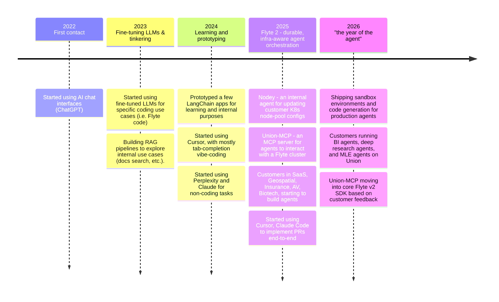
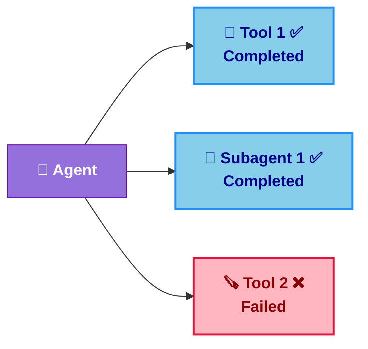
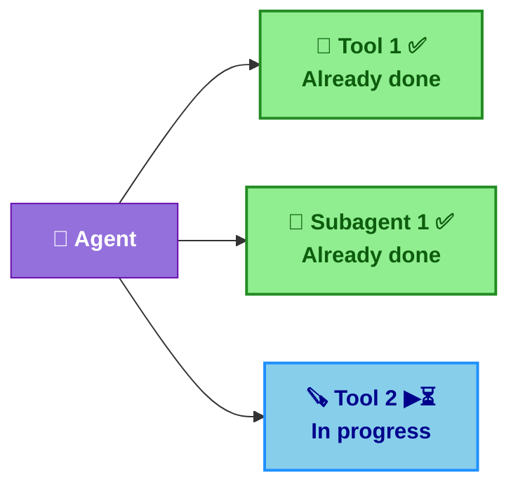
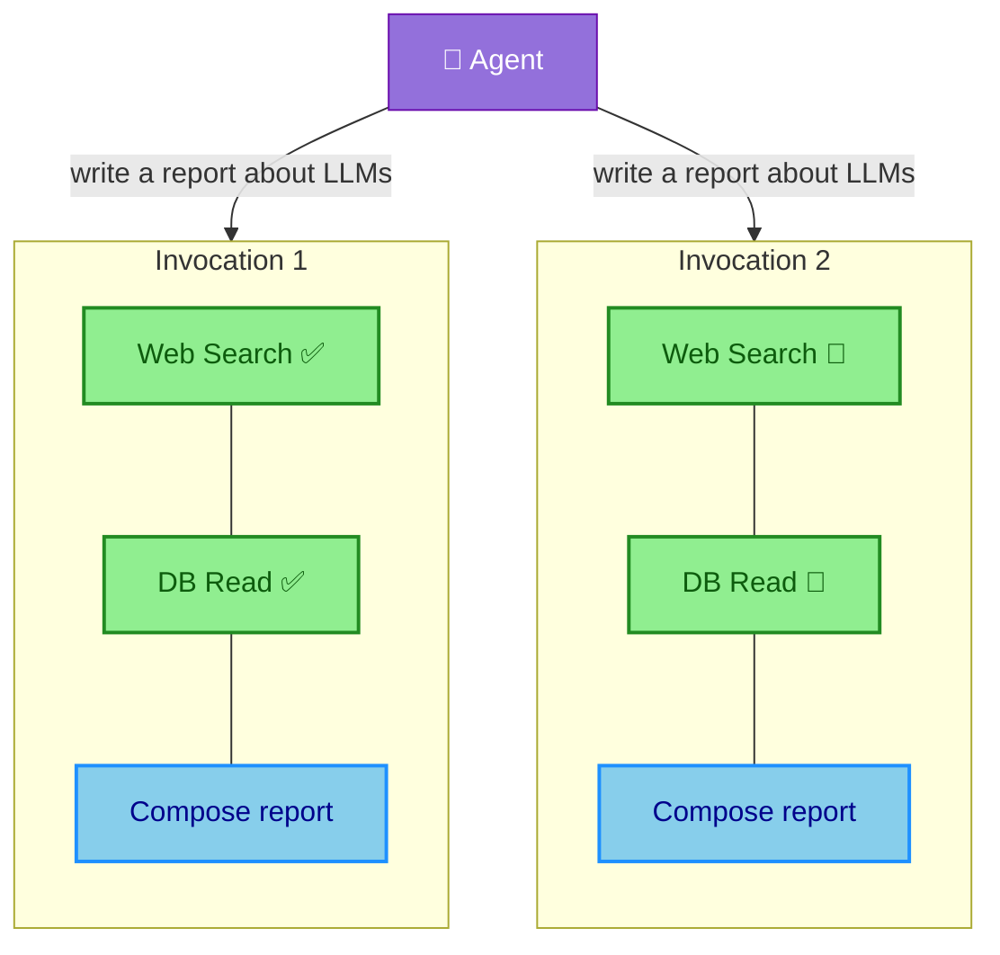
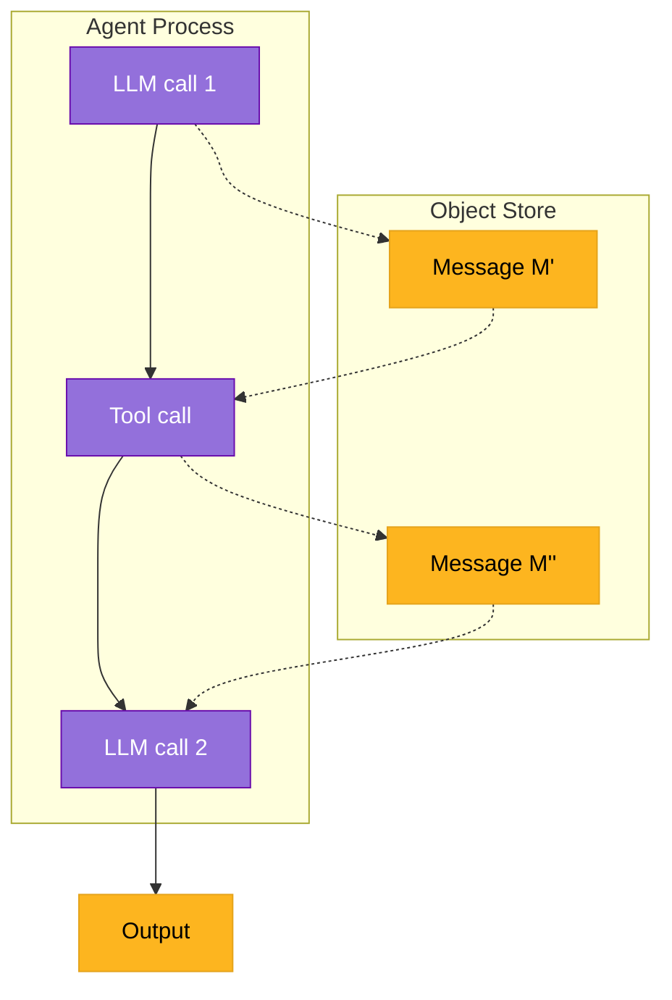
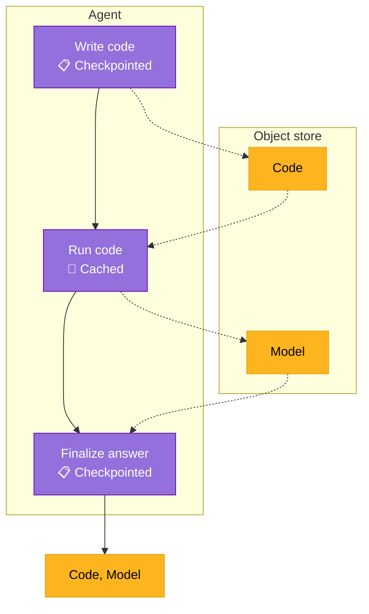
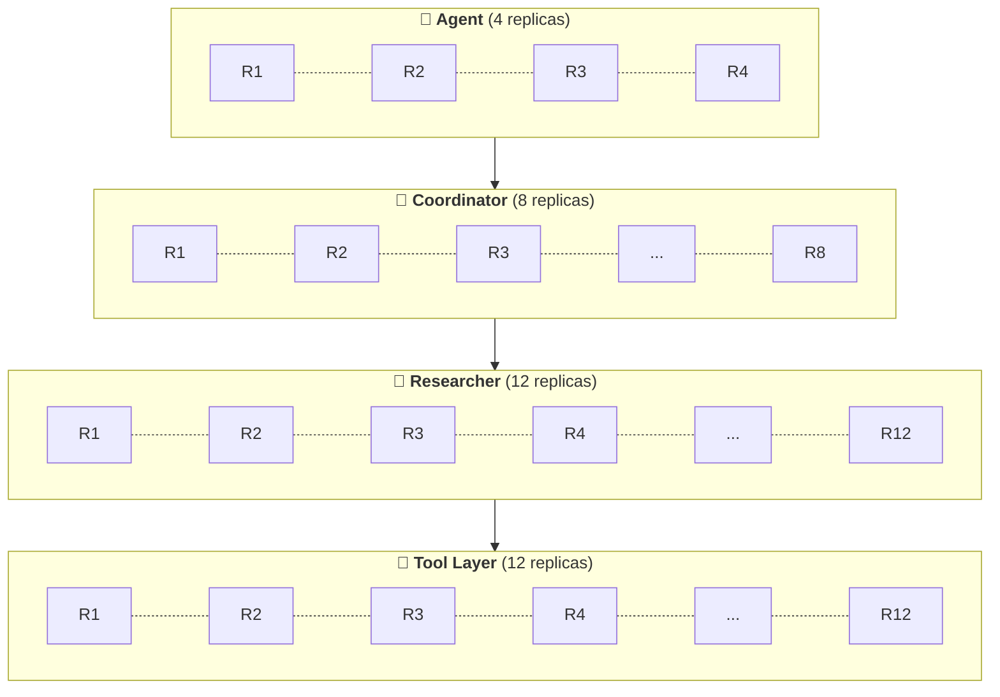

<style>
h1 { color: #FDB51F !important; }

h1, h2, h3, ul, li, p { text-align: left !important; }
  
:global(h1), :global(h2), :global(h3) {
  color: #FDB51F !important;
}
:global(.slidev-layout.cover h1),
:global(.slidev-layout.intro h1) {
  color: #FDB51F !important;
}
:global(.slidev-layout) {
  font-family: 'DM Sans', system-ui, sans-serif !important;
}
:global(.slidev-layout img) {
  display: block;
  margin-left: auto;
  margin-right: auto;
}
:global(.slidev-layout ul),
:global(.slidev-layout li) {
  text-align: left !important;
}

.two-cols-header {
  column-gap: 30px; /* Adjust the gap size as needed */
}
</style>

# The Orchestration Stack for Observable, Debuggable, and Durable Agents

<br />

### Haytham Abuelfutuh @ Union.ai

MLOps South Bay 2026

---
layout: center
---

<h1 style="text-align: center !important;">My agent adoption timeline</h1>



---
layout: center
---

# So you built an agent...

You optimized the prompts, engineered the context, wrote an eval harness, and it works beautifully in development...

... then you tried to run it in production.

<v-clicks>

- ❌ Your tools need to query proprietary data sources with least-privilege access
- 💥 A tool call needs 32GB of RAM but your agent runtime is a single node
- ⚠️ You fan out 20 subagent calls and they're all fighting for the same resources
- 😵 Your container goes OOM, gets killed, and the spot instance vanishes
- 🗑️ All that hard-earned context? Gone. The agent starts from scratch.

</v-clicks>

---
layout: center
---

# The problem isn't that agents fail

It's that they can't figure out _why_ they failed.

An agent that sees "process killed" has no idea what to do. An agent that sees
"OOM: requested 32GB, limit 16GB" can actually fix the problem.

Recovery requires context from **every layer** of the stack — infrastructure, networking,
logical, and semantic — working together.

---
layout: center
---

# But here's the thing...


Agents **can** recover from infra-level failures. We just need to give<br>them the right context and capabilities.

---
layout: default
---

# Where agents actually break

| **🧱 Layer** | **❌ What goes wrong** |
|-----------|---------------------|
| Infrastructure | OOM, container killed or preempted, module not found |
| Network | API rate-limiting, network timeouts, ephemeral service outage |
| Logical | Programming bugs, data validation errors |
| Semantic | Hallucinations, incorrect tool calls, context utilization errors |
| Tool execution | Bad arguments, tool timeouts, tool errors |
| Context | State wiped or corrupted on crash, context erasure, context bloat |

<v-click>

Most eval harnesses test **semantic correctness**: *"Does it answer correctly?"*

But nobody's evaluating: *"Can it survive getting OOM-killed on retry #3?"*

</v-click>

---
layout: default
---

# Six design principles for self-healing agents

1. **Use plain Python/TS/JS/etc** — DSLs incur cognitive overhead for both humans and agents
1. **Provide functional durability hooks** — flexibility whether you're using a framework or building from scratch
1. **Make failures cheap** — global caching, run-level replay log, and state persistence
1. **Unlock infrastructure as context** — agents see and fix OOM/network errors; request more resources
1. **Equip agents with secure sandboxes** — agents safely iterate on the inner loop
1. **Human-in-the-loop as ultimate recourse** — manual feedback when the agent can't help itself

---
layout: default
---

# Context engineering is also an infra problem

If a failure **wipes the agent's state**, all that context engineering was for nothing.

<br>

### What does "durability" actually mean?

<v-clicks>

Three things:

</v-clicks>

<v-clicks>

- 📋 Resume exactly where you left off after a crash: **run-level replay log**
- 🎒 Don't redo work that's already been done: **global caching**
- 💾 Persist state between tasks so retries don't lose context: **intermediate state persistence**

</v-clicks>


---
layout: two-cols-header
---

# Replay log

A service that records the state of an agent and its subtasks (tools, subagents, etc.)
at each step.

Avoids task re-execution, prevents memory/context loss, and even recovers from crashes
in the root agent process.


::left::

#### ▶️ Normal Execution

<br>



::right::

#### 📋 Replay Log

<br>

| **Step**         | **Component**              | **Status** |
|------------------|---------------------------|------------|
| 1                | 🔧 Tool 1                  | ✅         |
| 2                | 🤖 Subagent 1              | ✅         |
| 3                | 🪚 Tool 2                  | ❌         |

---
layout: two-cols-header
---

# Replay log

A service that records the state of an agent and its subtasks (tools, subagents, etc.)
at each step.

Avoids task re-execution, prevents memory/context loss, and even recovers from crashes
in the root agent process.

::left::

#### 💥🔄 Crash Recovery

<br>



::right::

#### 📋 Replay Log

<br>

| **Step**         | **Component**              | **Status** |
|------------------|---------------------------|------------|
| 1                | 🔧 Tool 1                  | ✅         |
| 2                | 🤖 Subagent 1              | ✅         |
| 3                | 🪚 Tool 2                  | ⏳         |

<style>
.two-cols-header {
  column-gap: 30px; /* Adjust the gap size as needed */
}
</style>


---
layout: two-cols-header
---

# Global Caching

Avoid re-executing workloads where the output can be **shared across all agent runs**.

::left::


Control which tools/subagents are cached and which are not.

```python
@env.task(cache="auto")
async def web_search_tool(url: str) -> str:
    ...

@env.task(cache="auto")
async def db_read_tool(query: str) -> str:
    ...

@env.task(cache="disable")
async def composer_subagent(content: str) -> None:
    ...
```

::right::




<!--
- Cache key: inputs + task name + interface hash + (optional) version
- `behavior="auto"`: cache version from source-code hash; invalidates when code changes
- `behavior="override"`: pin a version for stable cache across deploys
- Project/domain isolation so dev/staging/prod caches don’t collide
 -->

---
layout: two-cols-header
---

# Intermediate state persistence

**Abstract away** serializing and deserializing state (memory, data) to object store.

::left::

<!--
- **Materialized**: dataclasses, Pydantic — full content serialized between tasks
- **Offloaded**: `File`, `Dir`, `DataFrame` — stored in blob store; tasks get references, data fetched on use
- Same types work as inputs/outputs; no manual `pickle` or bucket plumbing for agent state
-->


```python {all|5,14|8,16|5,14|13,18}
class AgentState(BaseModel):
    messages: list[Message]

@env.task
async def llm(state: AgentState) -> Message: ...

@env.task
async def tool(state: AgentState) -> Message: ...

@env.task
async def agent() -> str:
    state = AgentState()
    while not await done(state):
        message = await llm(state)
        if is_tool_call(state):
            message = await tool(state)
        state.messages.append(message)
    return await compose_final_answer(state)
```

::right::


<div class="flex justify-center items-center h-full">



</div>

---
layout: default
---

# OK so how do we actually build this?

Let's walk through each principle with real code.

1. **Plain Python** — no DSL surprises
1. **Durability hooks** — trace, checkpoint, persist
1. **Cheap failures** — caching + replay + state persistence
1. **Infra as context** — agents see and fix OOM/network errors
1. **Secure sandboxes** — agents safely iterate on code
1. **Human-in-the-loop** — the ultimate fallback

---
layout: two-cols-header
---

# Use plain Python/TS/JS/etc

Any general purpose programming language, really.

::left::

<v-click at="1">

🔁 Loops, fan-out, conditionals, and *try/except* are trivial. No DSL surprises.

</v-click>

<v-click at="2">

⭐️ Exceptions are a perfect delivery mechanism for critical context about failures
at all layers of the stack.

</v-click>

<v-click at="3">

🪝 Provide **functional hooks** to trace and checkpoint intermediate state — then get
out of the AI engineer's way.

</v-click>

::right::

```python {all|11-19|16-19|5,8}{at:1}
import flyte

env = flyte.TaskEnvironment("agent", image=flyte.Image.from_debian_base())

@flyte.trace
async def tool(x: int, y: int) -> AgentState: ...

@env.task(retries=RetryStrategy(5))
async def mle_agent() -> str:
    state = AgentState()
    while not await done(state):
        message = await llm(state)
        if is_tool_call(state):
            try:
                message = await tool(parse_tool_call(state))
            except ToolArgsError as exc:
                message = await llm(
                    state, prompt=f"Fix the tool args: {str(exc)}"
                )
        state.messages.append(message)
    return await compose_final_answer(state)
```

---
layout: two-cols-header
---

# Provide functional durability hooks

Make tracing, checkpointing, and persisting state trivially easy.

::left::

<v-click at="1">

`TaskEnvironment`: infrastructure-level configuration: container image, resources, etc.

</v-click>

<v-click at="2">

`@env.task`: containerized functions that auto-persist intermediate state

</v-click>

<v-click at="3">

`@flyte.trace`: helper functions inside a task that are tracked by the replay log

</v-click>

<!-- **Continuous eval:** pipe production traces into your eval framework; catch regressions early

**Prompt debugging:** see which prompt variant led to which behavior at which step -->

::right::

```python {all|4-8|13-14,16-22|10-12}{at:1}
import flyte
from flyte.io import File, DataFrame

image = flyte.Image.from_debian_base().with_pip_packages(["pandas"])
agent_env = flyte.TaskEnvironment("agent", image=image)
tool_env = flyte.TaskEnvironment(
    "tools", image=image, resources=flyte.Resources(cpu=4, memory="4Gi")
)

@flyte.trace
async def write_code(prompt: str) -> str: ...

@tool_env.task
async def run_code(code: str, data: DataFrame) -> File: ...

@agent_env.task
async def mle_agent(data: DataFrame) -> File:
    code = await write_code("Write a Python script to train a model on the data")
    return await run_code(code, data)
```

---
layout: two-cols-header
---

# Make failures cheap

Your agent _will_ fail. The question is: how expensive is each failure?

::left::

<!-- - **Run-level replay log** — full reproducibility; rehydrate state when things go wrong
- **Global caching** — reuse completed steps; no redoing work after a crash
- **Intermediate state persistence** — retrieved context survives retries; no losing semantic grounding -->


```python {all|1-2,12|4-5,13|7-8,14}
@flyte.trace
async def write_code(prompt: str) -> str: ...

@tool_env.task(cache="auto")
async def run_code(code: str, data: DataFrame) -> File: ...

@flyte.trace
async def finalize_answer(code: str, model: File) -> str: ...

@agent_env.task(retries=3)
async def mle_agent(prompt: str, data: DataFrame) -> tuple[str, File]:
    code = await write_code("Write a Python script to train a model...")
    model = await run_code(code, data)
    return await finalize_answer(code, model)
```

<v-click>

⭐️ Failed runs become *training data* or *additional context* for the agent to learn from.

</v-click>


::right::

<div class="flex justify-center items-center h-full">



</div>


<!-- Example should show cache in task decorator, file object creation, and task retry config -->
<!-- Add mermaid cart diagram of how each component aids in recovery -->

---
layout: two-cols-header
---

# Unlock infrastructure as context

This is where it gets interesting. What if your agent could _see_ infra errors and react?

::left::

<v-click at="1">

The Flyte SDK exposes system-level errors like `flyte.errors.OOMError` as exceptions.

</v-click>

<v-click at="2">

Agents can catch and respond to system-/infra-level errors and adjust resource requests accordingly.

</v-click>

<v-click at="3">

Adjustments are sent back to the platform imperatively until `max_iter` budget is exhausted.

</v-click>

::right::

```python {all|12|13-14|5,7-10}{at:1}
@agent_env.task(retries=3)
async def mle_agent(data: DataFrame, max_iter: int) -> tuple[str, File]:
    code = await write_code("Write a Python script to train a model...")
    resources = {"memory": "128Mi", "cpu": 4}
    for _ in range(max_iter):
        try:
            resources = flyte.Resources(**resources)
            model = await run_code.override(resources=resources)(
                code, data
            )
            break
        except flyte.errors.OOMError as exc:
            resources = await adjust_resources(
                prompt=f"Encountered error {exc}, adjust the memory"
            )
    ...
```

<!--
example should show catching infra-level errors, parsing the error message, and
agent reacting to it
-->


---
layout: two-cols-header
---

# Equip agents with secure sandboxes

"Code mode" — agents write orchestration code, not just tool calls

::left::

<v-click at="1">

Agents write pipeline code to orchestrate trusted tools.

</v-click>

<v-click at="2">

Orchestration "code-mode" sandbox runs agent-generated pipeline, which
dispatches tool calls to the trusted tasks.

</v-click>

<v-click at="3">

Tight error-iteration loop to fix orchestration code bugs.

</v-click>

::right::

```python {all|3-7,10|11-14|15-22}{at:1}
import flyte.sandbox

@tool_env.task
async def process_data(data: DataFrame) -> File: ...

@tool_env.task
async def train_model(data: DataFrame) -> File: ...

@agent_env(retries=3)
async def mle_agent(data: DataFrame, max_iter: int) -> File:
    tools = [process_data, train_model, ...]
    code = await write_pipeline_code("Write a model training pipeline...", tools)
    pipeline = flyte.sandbox.orchestrator_from_str(
        code, inputs={"data": DataFrame}, outputs={"model": File}, tasks=tools)
    for _ in range(max_iter):
        try:
            best_model = await pipeline(data)
        except flyte.errors.RuntimeUserError as exc:
            code = await write_pipeline_code(
                f"Re-write code\n{code}\nbased on error: {exc}.", tools)
            pipeline = flyte.sandbox.orchestrator_from_str(
              code, inputs={"data": DataFrame}, outputs={"model": File}, tasks=tools)
```

---
layout: two-cols-header
---

# Equip agents with secure sandboxes

Stateless code sandbox — agents build their own tools

::left::

<v-click at="1">

**Code sandbox runtime:** agents build their own tools safely in an isolated,
secure container.

</v-click>

<v-click at="2">

MLE agent can write their own tools to train a model given some data.

</v-click>

<v-click at="3">

Sandbox runs the code securely in a container.

</v-click>

<v-click at="4">

In the case of an error, the agent re-writes the code with unit tests and tries
again.

</v-click>

::right::

```python {all|7-13|5|14|15-18}{at:1}
import flyte.sandbox

@agent_env.task(retries=3)
async def mle_agent(data: DataFrame, max_iter: int) -> File:
    code = await write_code("Write a Python script to train a model...")
    for _ in range(max_iter):
        try:
            code_sandbox = flyte.sandbox.create(
                code=code,
                inputs={"data": DataFrame},
                outputs={"model": File},
                data=data,
            )
            return await code_sandbox.run.aio(data=data)
        except flyte.errors.RuntimeUserError as exc:
            code, tests = await write_code(
                f"Re-write code \n{code}\nbased on error: {exc}."
            )
```

<!-- example of container task sandbox, orchestration sandbox (code mode) -->

---
layout: two-cols-header
---

# Human-in-the-loop as ultimate recourse

::left::

Sometimes the agent genuinely can't figure it out. That's OK — the important thing is that it _knows_ it's stuck and asks for help instead of spiraling.

<v-click at="1">

When `max_iter` is exhausted, get more context from a human (or external system)

</v-click>

<v-click at="2">

Recursively call the agent with the additional context.

</v-click>

::right::

```python {all|17-22|23}{at:1}
import flyteplugins.hitl as hitl

agent_env = flyte.TaskEnvironment(..., depends_on=[hitl.env])

@agent_env(retries=3)
async def mle_agent(
    data: DataFrame, max_iter: int, ctx: str | None = None
) -> File:
    ...
    for _ in range(max_iter):
        try:
            return await pipeline(data)      
        except flyte.errors.RuntimeUserError as exc:
            # code re-write handling
            ...

    event = await hitl.new_event.aio(
        "get_more_context",
        data_type=str,
        prompt="Model training failed, please provide more context.",
    )
    more_context = await event.wait.aio()
    mle_agent(data, max_iter, ctx=more_context)
```

---
layout: center
---

# What this looks like in practice

Agents that request more memory and compute when a tool is memory/compute-bound.


---
layout: center
---

# What this looks like in practice

Agents that re-build container images with (allowlisted) third-party dependencies.


---
layout: center
---

# What this looks like in practice

Agents that recover from logical, networking, semantic, and tool execution failures — without starting from scratch.


---
layout: center
---

# Real-world: a travel-tech BI agent

A travel company built an agentic BI analyst that runs SQL queries, then processes results
with LLM-generated Python code in a Flyte sandbox.

<v-clicks>

- Agent runs SQL against BigQuery, gets raw data
- LLM writes Python/Polars code to transform the data
- Code executes in a **sandboxed container** — isolated, no network access
- Results come back as charts and tables in a chat interface
- When the generated code fails, the agent **rewrites and retries** without losing state

</v-clicks>

<v-click>

This is the sandbox principle in action — and they went from prototype to production in days, not weeks.

</v-click>

---
layout: center
---

# Real-world: deep research at scale

**Dragonfly** — [scaling agentic research across 250k products](https://www.union.ai/case-study/how-dragonfly-scales-agentic-research-across-250k-products)

An agent that builds a living knowledge graph of SaaS products.

- `250K+` software products
- `~200` steps per agent call
- `~100` LLM calls per product

<br>


---
layout: two-cols-header
---

# How they scaled it

Tiered task environments on Flyte 2.

::left::

<v-clicks>

- **Cross-run caching**: pay for LLM API calls once.
- **Semantic convergence detection**: coordinator consolidates overlapping research streams.
- **Checkpoint-based recovery**: spot instance interruptions become a non-issue.
- **Full auditability**: every agent decision and tool call is traced.

</v-clicks>

::right::



<style>
.two-cols-header {
  column-gap: 30px; /* Adjust the gap size as needed */
}
</style>

---
layout: default
---

# The results

**🚀** 1 hour from local prototype to production-grade remote workflows.

- 2,000+ concurrent research runs
- 50% reduction in failure recovery time
- 30% improvement in development velocity
- 12 hours/week saved on infrastructure

---
layout: center
class: text-center
---

# TL;DR — help your agents help themselves

<v-clicks>

- **Observability is necessary but not sufficient** — you need a durability layer too
- **Don't aim for failure-proof** — aim for **cheap failures** and **fast recovery**
- **Infrastructure is context** — agents can fix their own infra failures if they can see them
- **Sandboxes unlock self-healing** — let agents iterate safely on the inner loop

</v-clicks>

---
layout: center
class: text-center
---

# Thank You

Questions?

Come talk to me and the team at the [Union.ai](https://union.ai) booth.


