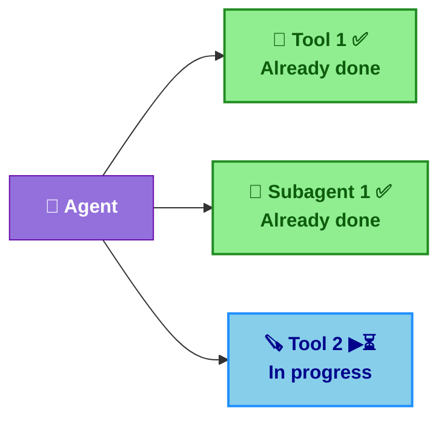
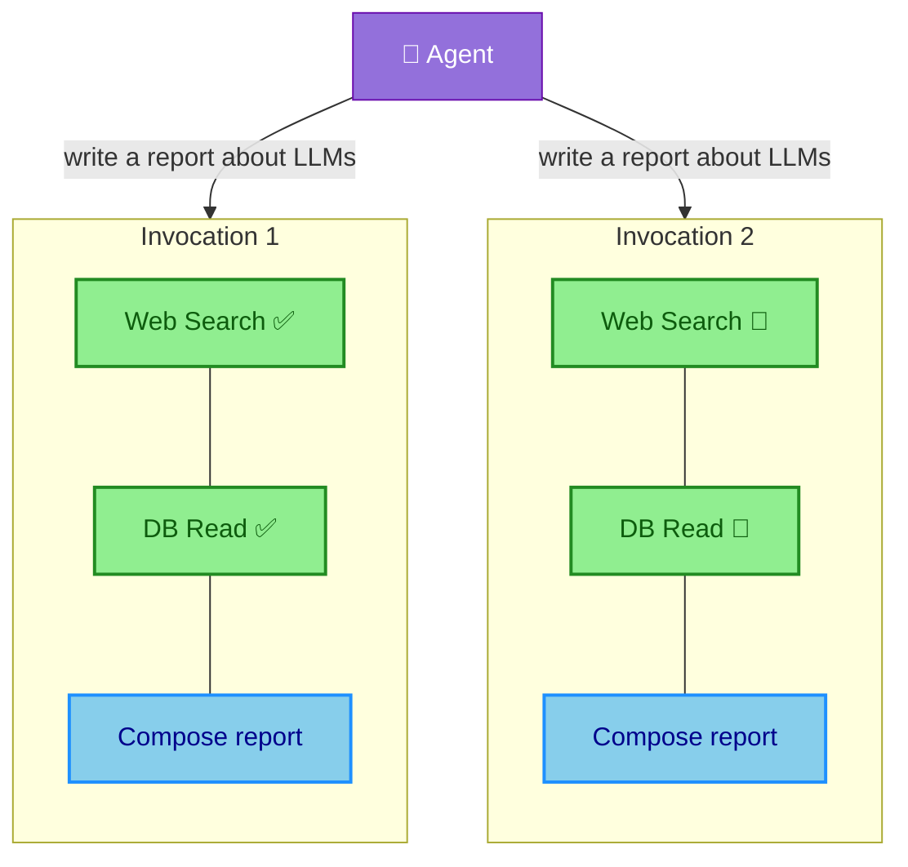
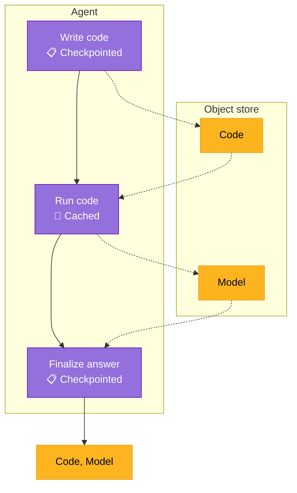
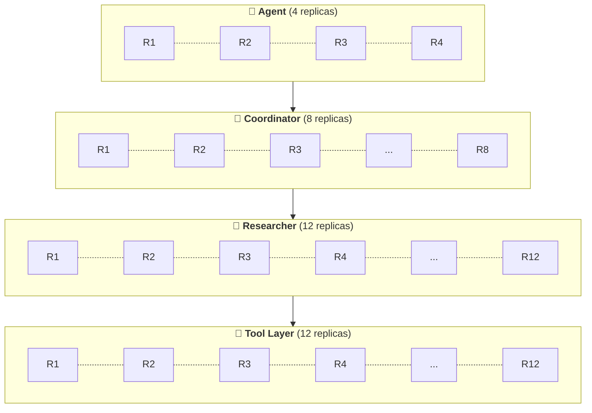

<style>
h1 { color: #FDB51F !important; }

h1, h2, h3, ul, li, p { text-align: left !important; }
  
:global(h1), :global(h2), :global(h3) {
  color: #FDB51F !important;
}
:global(.slidev-layout.cover h1),
:global(.slidev-layout.intro h1) {
  color: #FDB51F !important;
}
:global(.slidev-layout) {
  font-family: 'DM Sans', system-ui, sans-serif !important;
}
:global(.slidev-layout img) {
  display: block;
  margin-left: auto;
  margin-right: auto;
}
:global(.slidev-layout ul),
:global(.slidev-layout li) {
  text-align: left !important;
}

.two-cols-header {
  column-gap: 30px; /* Adjust the gap size as needed */
}
</style>

# Put resilient agents in production

<br />

### Haytham Abuelfutuh @ Union.ai

MLOps Seattle 2026

---
layout: center
---

# So you built an agent...

You optimized the prompts, engineered the context, wrote an eval harness, and it works beautifully in development...

... then you tried to run it in production.

- ❌ Your tools need to query proprietary data sources with least-privilege access
- 💥 A tool call needs 32GB of RAM but your agent runtime is a single node
- ⚠️ You fan out 20 subagent calls and they're all fighting for the same resources
- 😵 Your container goes OOM, gets killed, and the spot instance vanishes
- 🗑️ All that hard-earned context? Gone. The agent starts from scratch.

---
layout: center
---

# The problem isn't that agents fail

It's that they can't figure out _why_ they failed.

An agent that sees "process killed" has no idea what to do. An agent that sees
"OOM: requested 32GB, limit 16GB" can actually fix the problem.

Recovery requires context from **every layer** of the stack — infrastructure, networking,
logical, and semantic — working together.

---
layout: default
---

# Where agents actually break

| **🧱 Layer** | **❌ What goes wrong** |
|-----------|---------------------|
| Semantic | Hallucinations, incorrect tool calls, context utilization errors |
| Logical | Programming bugs, data validation errors |
| Infrastructure | OOM, container killed or preempted, module not found |
| Network | API rate-limiting, network timeouts, ephemeral service outage |
| Tool execution | Bad arguments, tool timeouts, tool errors |
| Context | State wiped or corrupted on crash, context erasure, context bloat |

Most eval harnesses test **semantic correctness**: *"Does it answer correctly?"*

But nobody's evaluating: *"Can it survive getting OOM-killed on retry #3?"*

---
layout: default
---

# 3 Design Principles for resilient agents

<br>

1. **Dynamic** — plain code, provision infra on the fly. Adapt to failures in real time.
1. **Durable** — replay log, caching, state persistence. Survive failures without losing work.
1. **Defended** — sandboxes, human-in-the-loop. Bounded execution so agents can't spiral.

---
layout: two-cols-header
---

# Dynamic: Plain code that's infra-aware

No DSL — loops, fan-out, try/except are trivial. Exceptions deliver critical context from every layer.

::left::

<v-click at="1">

`TaskEnvironment` configures infra per concern: container image, resources, etc.

🔁 Loops, fan-out, conditionals, and *try/except* are trivial. No DSL surprises.

</v-click>

<v-click at="2">

🪝 Provide **functional hooks** to trace and checkpoint intermediate state — then get
out of the AI engineer's way.

</v-click>

<v-click at="3">

⭐️ Exceptions are a perfect delivery mechanism for critical context about failures
at all layers of the stack.

The Flyte SDK exposes system-level errors like `flyte.errors.OOMError` as exceptions.

</v-click>

::right::

```python {all|4-7,14|10|15,20}{at:1}
import flyte
from flyte.io import File, DataFrame

image = flyte.Image.from_debian_base().with_pip_packages(["pandas"])
agent_env = flyte.TaskEnvironment("agent", image=image)
tool_env = flyte.TaskEnvironment(
    "tools", image=image, resources=flyte.Resources(cpu=4, memory="4Gi")
)

@agent_env.task(retries=3)
async def mle_agent(data: DataFrame, max_iter: int) -> tuple[str, File]:
    code = await write_code("Write a Python script to train a model...")
    resources = {"memory": "128Mi", "cpu": 4}
    for _ in range(max_iter):
        try:
            model = await run_code.override(
                resources=flyte.Resources(**resources)
            )(code, data)
            break
        except flyte.errors.OOMError as exc:
            resources = await adjust_resources(
                prompt=f"Encountered error {exc}, adjust the memory"
            )
    ...
```

---
layout: two-cols-header
---

# Durable: Replay log

Automatically record the state of an agent and its subtasks at each step.
This avoids re-execution, prevents context loss, and recovers from crashes.

::left::

#### 💥🔄 Crash Recovery

<br>



::right::

#### 📋 Replay Log

<br>

| **Step**         | **Component**              | **Status** |
|------------------|---------------------------|------------|
| 1                | 🔧 Tool 1                  | ✅         |
| 2                | 🤖 Subagent 1              | ✅         |
| 3                | 🪚 Tool 2                  | ⏳         |

<style>
.two-cols-header {
  column-gap: 30px;
}
</style>

---
layout: two-cols-header
---

# Durable: Caching & state persistence

Avoid redoing work. Persist state so retries don't lose context.

::left::

Control which tools/subagents are cached and which are not.

```python
@env.task(cache="auto")
async def web_search_tool(url: str) -> str:
    ...

@env.task(cache="auto")
async def db_read_tool(query: str) -> str:
    ...

@env.task(cache="disable")
async def composer_subagent(content: str) -> None:
    ...
```

State (messages, data) is **auto-serialized** to object store between tasks — no manual pickle or bucket plumbing.

::right::



---
layout: two-cols-header
---

# Durable: Make failures cheap

Your agent _will_ fail. The question is: how expensive is each failure?

::left::

```python {all|1-2,12|4-5,13|7-8,14}
@flyte.trace
async def write_code(prompt: str) -> str: ...

@tool_env.task(cache="auto")
async def run_code(code: str, data: DataFrame) -> File: ...

@flyte.trace
async def finalize_answer(code: str, model: File) -> str: ...

@agent_env.task(retries=3)
async def mle_agent(prompt: str, data: DataFrame) -> tuple[str, File]:
    code = await write_code("Write a Python script to train a model...")
    model = await run_code(code, data)
    return await finalize_answer(code, model)
```

<v-click>

⭐️ Failed runs become *training data* or *additional context* for the agent to learn from.

</v-click>

::right::

<div class="flex justify-center items-center h-full">



</div>

---
layout: two-cols-header
---

# Defended: Secure sandboxes

Agents write and execute code in isolated, secure containers — with a tight error-iteration loop.

::left::

<v-click at="1">

Agents build their own tools safely in a sandboxed container.

</v-click>

<v-click at="2">

Sandbox runs agent-generated code securely — no network access, no host escape.

</v-click>

<v-click at="3">

On error, the agent re-writes code and tries again without losing state.

</v-click>

::right::

```python {all|7-13|14|15-18}{at:1}
import flyte.sandbox

@agent_env.task(retries=3)
async def mle_agent(data: DataFrame, max_iter: int) -> File:
    code = await write_code("Write a Python script to train a model...")
    for _ in range(max_iter):
        try:
            code_sandbox = flyte.sandbox.create(
                code=code,
                inputs={"data": DataFrame},
                outputs={"model": File},
                data=data,
            )
            return await code_sandbox.run.aio(data=data)
        except flyte.errors.RuntimeUserError as exc:
            code, tests = await write_code(
                f"Re-write code \n{code}\nbased on error: {exc}."
            )
```

---
layout: two-cols-header
---

# Defended: Human-in-the-loop

::left::

Sometimes the agent genuinely can't figure it out. That's OK — the important thing is that it _knows_ it's stuck and asks for help instead of spiraling.

<v-click at="1">

When `max_iter` is exhausted, get more context from a human (or external system)

</v-click>

<v-click at="2">

Recursively call the agent with the additional context.

</v-click>

::right::

```python {all|17-22|23}{at:1}
import flyteplugins.hitl as hitl

agent_env = flyte.TaskEnvironment(..., depends_on=[hitl.env])

@agent_env(retries=3)
async def mle_agent(
    data: DataFrame, max_iter: int, ctx: str | None = None
) -> File:
    ...
    for _ in range(max_iter):
        try:
            return await pipeline(data)      
        except flyte.errors.RuntimeUserError as exc:
            # code re-write handling
            ...

    event = await hitl.new_event.aio(
        "get_more_context",
        data_type=str,
        prompt="Model training failed, please provide more context.",
    )
    more_context = await event.wait.aio()
    mle_agent(data, max_iter, ctx=more_context)
```

---
layout: center
---

# What this looks like in practice

Agents that request more memory and compute when a tool is memory/compute-bound.


---
layout: center
---

# What this looks like in practice

Agents that recover from logical, networking, semantic, and tool execution failures — without starting from scratch.


---
layout: center
---

# Real-world: deep research at scale

**Dragonfly** — [scaling agentic research across 250k products](https://www.union.ai/case-study/how-dragonfly-scales-agentic-research-across-250k-products)

An agent that builds a living knowledge graph of SaaS products.

- `250K+` software products
- `~200` steps per agent call
- `~100` LLM calls per product

<br>


---
layout: two-cols-header
---

# How they scaled it

Tiered task environments on Flyte 2.

::left::

- **Cross-run caching**: pay for LLM API calls once.
- **Semantic convergence detection**: coordinator consolidates overlapping research streams.
- **Checkpoint-based recovery**: spot instance interruptions become a non-issue.
- **Full auditability**: every agent decision and tool call is traced.

::right::



<style>
.two-cols-header {
  column-gap: 30px;
}
</style>

---
layout: center
class: text-center
---

# TL;DR — remember the 3 Ds

<v-clicks>

- **Dynamic** — plain code, infra as context. Agents can fix their own infra failures if they can see them.
- **Durable** — replay log, caching, state persistence. Don't aim for failure-proof — aim for cheap failures and fast recovery.
- **Defended** — sandboxes and human-in-the-loop. Let agents iterate safely, and escalate when stuck.

</v-clicks>

---
layout: center
class: text-center
---

# Thank You

Questions?

Come talk to me and the team at the [Union.ai](https://union.ai) booth.


