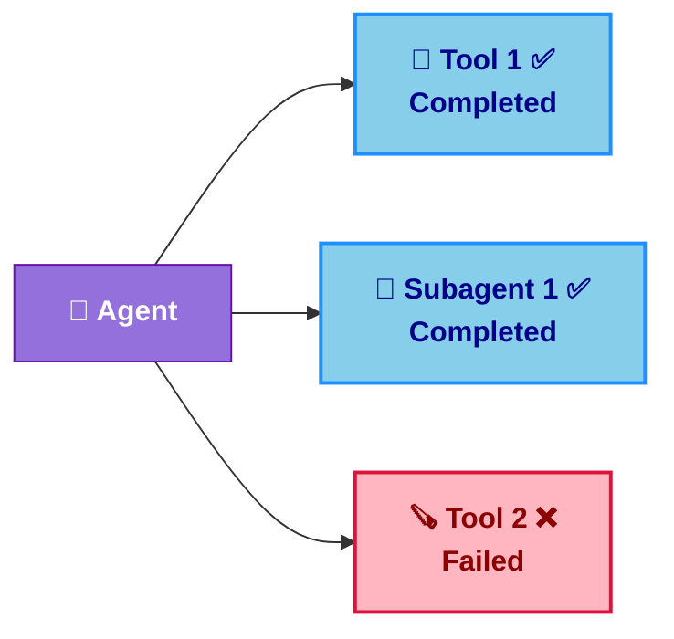
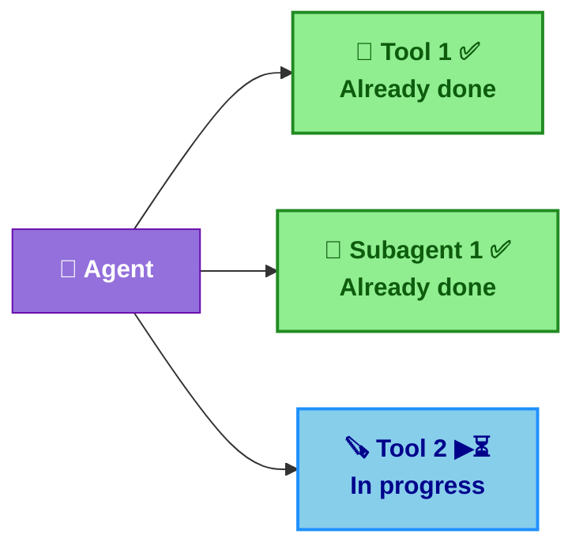
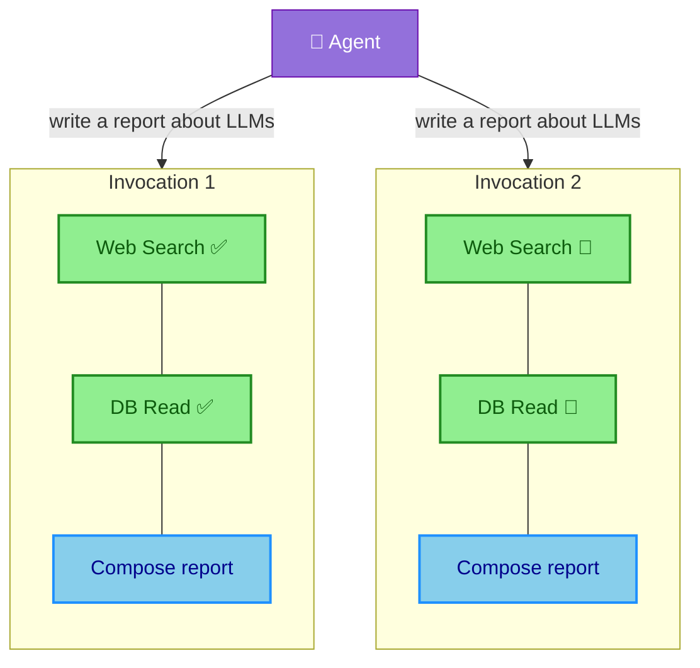
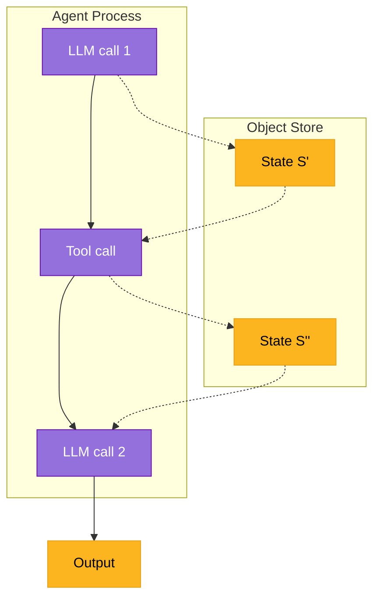
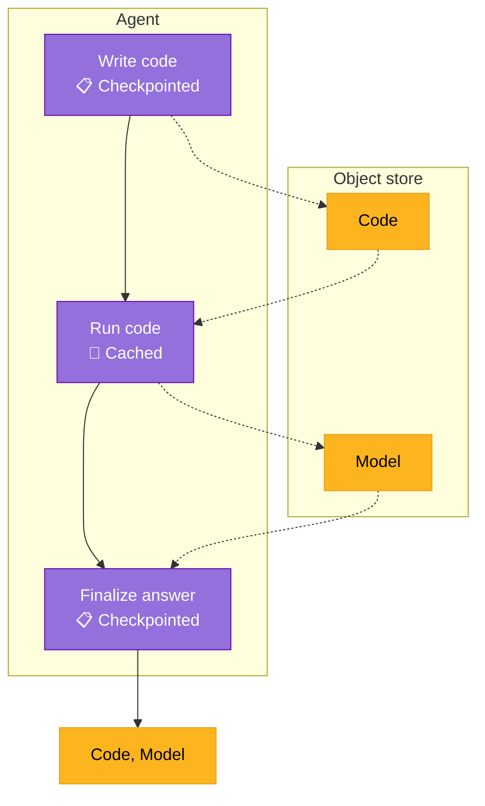
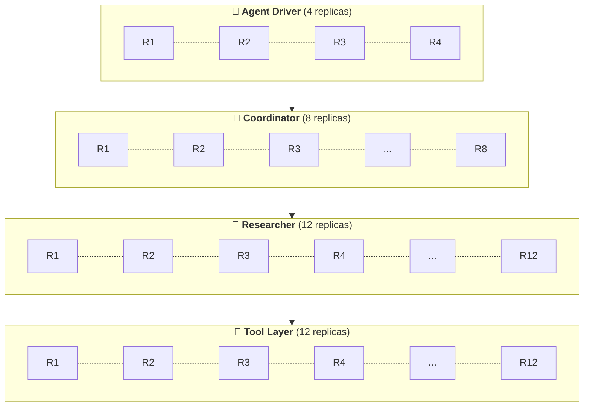

<style>
h1 { color: #FDB51F !important; }

h1, h2, h3, ul, li, p { text-align: left !important; }
  
:global(h1), :global(h2), :global(h3) {
  color: #FDB51F !important;
}
:global(.slidev-layout.cover h1),
:global(.slidev-layout.intro h1) {
  color: #FDB51F !important;
}
:global(.slidev-layout) {
  font-family: 'DM Sans', system-ui, sans-serif !important;
}
:global(.slidev-layout img) {
  display: block;
  margin-left: auto;
  margin-right: auto;
}
:global(.slidev-layout ul),
:global(.slidev-layout li) {
  text-align: left !important;
}

.two-cols-header {
  column-gap: 30px; /* Adjust the gap size as needed */
}
</style>

# The Orchestration Stack for Observable, Debuggable, and Durable Agents

<br />

### Niels Bantilan @ Union.ai

MLOps South Bay 2026

---
layout: center
---

# The agent infrastructure problem

You built an agent, optimized its prompts, engineered its context, implemented an eval harness, and it works beautifully in development…

... then the infrastructure got in the way

<v-clicks>

- ❌ Tools making API calls or querying databases are rate-limited.
- ⚠️ Parallelized subagents/tool calls leads to resource contention and degraded performance.
- 💥 Containers run out of memory, are killed by the scheduler, are preempted by other jobs.
- 🗑️ Agent memory loss or corruption, wiping out precious context.
- 🔓 Agent components (MCPs, coder subagents) are easy to configure insecurely.

</v-clicks>

---
layout: center
---

# Agents Fail at Multiple Layers of the Orchestration Stack

<!-- The semantic and networking layers of the stack get a lot of attention, but the infrastructure layer is just as critical. -->

The problem isn't that agents fail.

It's that recovering from failure is challenging without the full context of how the infrastructure, networking,
logical, and semantic layers interact so that the agent can figure out how to recover from it.

---
layout: center
---

# What Agents are saying...


Agents can recover from infra-level failures, but only if we give<br>them the right context.

---
layout: default
---

# Design Principles for Self-Healing Agents

1. **Plain Python/TS/JS** — DSLs incur additional cognitive overhead (for both humans and agents)
1. **Durability & observability hooks** — `@env.task`, `@flyte.trace` works with any framework/stack
1. **Make failures cheap** — global caching, run-level replay log, and state persistence
1. **Infrastructure as context** — agents see and fix OOM/network errors; request more resources
1. **Agent self-healing utilities** — secure tool building and orchestration
1. **Human-in-the-loop** — debugger and manual feedback when self-service isn't enough

---
layout: default
---

# Chapter 1: Where Agents Break

| **🧱 Layer** | **❌ Example failures** |
|-----------|---------------------|
| Infrastructure | OOM, container killed or preempted, image pull backoff |
| Network | API rate-limiting, network timeouts, ephemeral service outage |
| Logical | Programming bugs, data validation errors |
| Semantic | Hallucinations, incorrect tool calls, context utilization errors |
| Tool execution | Bad arguments, tool timeouts, tool errors |
| Memory | State wiped or corrupted on crash, context erasure |

---
layout: default
---

# The context and evaluation gap

Your evals typically test **semantic correctness**: *"Does it answer correctly?"*. Likewise, agents
typically focus on recovering from semantic failures: *"I need more context about topic X to answer correctly"*.

<v-clicks>

Agents often don't directly reason about:

- Surviving a network timeout
- Recovering from system-level errors
- Recalling state across retries

</v-clicks>

<v-clicks>

**💡 Insight:** agents can recover from errors at all the layers of the agent stack,
even infrastructure-level failures, but only with the right context and tools ✅.

</v-clicks>

---
layout: default
---

# Context engineering is also an infra problem

If a failure **wipes the agent's state**, that hard-earned context is worthless.

<br>

### Durability: what even is it?

<v-clicks>

It's about making the following very easy:

</v-clicks>

<v-clicks>

- 📋 **Run-level replay log**: immediately resume an agent roll-out where it left off
- 🎒 **Global caching**: don't re-execute shareable compute/io-bound workloads
- 💾 **Intermediate state persistence**: save and restore intermediate state between tasks

</v-clicks>


---
layout: two-cols-header
---

# Replay log

A service that records the state of an agent and its subtasks (tools, subagents, etc.)
at each step.

Avoids task re-execution, prevents memory/context loss, and even recovers from crashes
in the root agent process.


::left::

#### ▶️ Normal Execution

<br>



::right::

#### 📋 Replay Log

<br>

| **Step**         | **Component**              | **Status** |
|------------------|---------------------------|------------|
| 1                | 🔧 Tool 1                  | ✅         |
| 2                | 🤖 Subagent 1              | ✅         |
| 3                | 🪚 Tool 2                  | ❌         |

---
layout: two-cols-header
---

# Replay log

A service that records the state of an agent and its subtasks (tools, subagents, etc.)
at each step.

Avoids task re-execution, prevents memory/context loss, and even recovers from crashes
in the root agent process.

::left::

#### 💥🔄 Crash Recovery

<br>



::right::

#### 📋 Replay Log

<br>

| **Step**         | **Component**              | **Status** |
|------------------|---------------------------|------------|
| 1                | 🔧 Tool 1                  | ✅         |
| 2                | 🤖 Subagent 1              | ✅         |
| 3                | 🪚 Tool 2                  | ⏳         |

<style>
.two-cols-header {
  column-gap: 30px; /* Adjust the gap size as needed */
}
</style>


---
layout: two-cols-header
---

# Global Caching

Avoid re-executing workloads where the output can be **shared across all agent runs**.

::left::


Control which tools/subagents are cached and which are not.

```python
@env.task(cache="auto")
async def web_search_tool(url: str) -> str:
    ...

@env.task(cache="auto")
async def db_read_tool(query: str) -> str:
    ...

@env.task(cache="disable")
async def composer_subagent(content: str) -> None:
    ...
```

::right::




<!--
- Cache key: inputs + task name + interface hash + (optional) version
- `behavior="auto"`: cache version from source-code hash; invalidates when code changes
- `behavior="override"`: pin a version for stable cache across deploys
- Project/domain isolation so dev/staging/prod caches don’t collide
 -->

---
layout: two-cols-header
---

# Intermediate state persistence

**Abstract away** serializing and deserializing state (memory, data) to object store.

::left::

<!--
- **Materialized**: dataclasses, Pydantic — full content serialized between tasks
- **Offloaded**: `File`, `Dir`, `DataFrame` — stored in blob store; tasks get references, data fetched on use
- Same types work as inputs/outputs; no manual `pickle` or bucket plumbing for agent state
-->


```python {all|5,14|8,16|5,14|13,18}
class AgentState(BaseModel):
    messages: list[Message]

@env.task
async def llm(state: AgentState) -> AgentState: ...

@env.task
async def tool(state: AgentState) -> AgentState: ...

@env.task
async def agent() -> str:
    state = AgentState()
    while not await done(state):
        message = await llm(state)
        if is_tool_call(state):
            message = await tool(state)
        state.messages.append(message)
    return await compose_final_answer(state)
```

::right::


<div class="flex justify-center items-center h-full">



</div>

---
layout: default
---

# Chapter 2: Six Design Principles for Self-Healing Agents

1. **Plain Python/TS/JS** — DSLs incur additional cognitive overhead (for both humans and agents)
1. **Durability & observability hooks** — `@flyte.trace`, `@env.task`; works with any framework/stack
1. **Make failures cheap** — global caching, run-level replay log, and state persistence
1. **Infrastructure as context** — agents see and fix OOM/network; request more resources
1. **Agent self-service utilities** — secure tool building and orchestration
1. **Human-in-the-loop** — debugger and manual feedback when self-service isn't enough

---
layout: two-cols-header
---

# Plain Python/TS/JS

Or, any other general purpose programming language really.

::left::

🔁 Loops, fan-out, conditionals, and *try/except* are trivial. No DSL surprises.

<v-click at="2">

⭐️ Exceptions are a perfect delivery mechanism for critical context about failures
at all layers of the stack.

</v-click>

<v-click at="3">

🪝 Provide **functional hooks** to trace and checkpoint intermediate state — then get
out of the AI engineer's way.

</v-click>

::right::

```python {all|11-19|16-19|5,8}{at:1}
import flyte

env = flyte.TaskEnvironment("agent", image=flyte.Image.from_debian_base())

@flyte.trace
async def tool(x: int, y: int) -> AgentState: ...

@env.task(retries=RetryStrategy(5))
async def agent() -> str:
    state = AgentState()
    while not await done(state):
        message = await llm(state)
        if is_tool_call(state):
            try:
                message = await tool(parse_tool_call(state))
            except ToolArgsError as exc:
                message = await llm(
                    state, prompt=f"Fix the tool args: {str(exc)}"
                )
        state.messages.append(message)
    return await compose_final_answer(state)
```

---
layout: two-cols-header
---

# Durability & observability hooks

Make it really easy to trace, checkpoint, and persist intermediate state.

::left::

<v-click at="1">

`TaskEnvironment`: infrastructure-level configuration: container image, resources, etc.

</v-click>

<v-click at="2">

`@env.task`: containerized functions that auto-persist intermediate state

</v-click>

<v-click at="3">

`@flyte.trace`: helper functions inside a task that are tracked by the replay log

</v-click>

<!-- **Continuous eval:** pipe production traces into your eval framework; catch regressions early

**Prompt debugging:** see which prompt variant led to which behavior at which step -->

::right::

```python {all|4-8|13-14,16-22|10-12}{at:1}
import flyte
from flyte.io import File, DataFrame

image = flyte.Image.from_debian_base().with_pip_packages(["pandas"])
agent_env = flyte.TaskEnvironment("agent", image=image)
tool_env = flyte.TaskEnvironment(
    "tools", image=image, resources=flyte.Resources(cpu=4, memory="4Gi")
)

@flyte.trace
async def write_code(prompt: str) -> str: ...

@tool_env.task
async def run_code(code: str, data: DataFrame) -> File: ...

@agent_env.task
async def mle_agent(data: DataFrame) -> File:
    code = await write_code("Write a Python script to train a model on the data")
    return await run_code(code, data)
```

---
layout: two-cols-header
---

# Make failures cheap

Failures are inevitable, but they don't have to be expensive.

::left::

<!-- - **Run-level replay log** — full reproducibility; rehydrate state when things go wrong
- **Global caching** — reuse completed steps; no redoing work after a crash
- **Intermediate state persistence** — retrieved context survives retries; no losing semantic grounding -->


```python {all|1-2,12|4-5,13|7-8,14}
@flyte.trace
async def write_code(prompt: str) -> str: ...

@tool_env.task(cache="auto")
async def run_code(code: str, data: DataFrame) -> File: ...

@flyte.trace
async def finalize_answer(code: str, model: File) -> str: ...

@agent_env.task(retries=3)
async def mle_agent(prompt: str, data: DataFrame) -> tuple[str, File]:
    code = await write_code("Write a Python script to train a model...")
    model = await run_code(code, data)
    return await finalize_answer(code, model)
```

⭐️ Failed runs become *training data* or *additional context* for the agent to learn from.


::right::

<div class="flex justify-center items-center h-full">



</div>


<!-- Example should show cache in task decorator, file object creation, and task retry config -->
<!-- Add mermaid cart diagram of how each component aids in recovery -->

---
layout: two-cols-header
---

# Infrastructure as context

**Infra-level context** relating to errors can be delivered via exception handling.

::left::

<v-click at="1">

The Flyte SDK exposes system-level errors like `flyte.errors.OOMError` as exceptions.

</v-click>

<v-click at="2">

Agents can catch and respond to system-/infra-level errors and adjust resource requests accordingly.

</v-click>

<v-click at="3">

Adjustments are sent back to the platform imperatively until `max_iter` budget is exhausted.

</v-click>

::right::

```python {all|12|13-14|5,7-10}{at:1}
@agent_env.task(retries=3)
async def mle_agent(data: DataFrame, max_iter: int) -> tuple[str, File]:
    code = await write_code("Write a Python script to train a model...")
    resources = {"memory": "128Mi", "cpu": 4}
    for _ in range(max_iter):
        try:
            resources = flyte.Resources(**resources)
            model = await run_code.override(resources=resources)(
                code, data
            )
            break
        except flyte.errors.OOMError as exc:
            resources = await adjust_resources(
                prompt=f"Encountered error {exc}, adjust the memory"
            )
    ...
```

<!--
example should show catching infra-level errors, parsing the error message, and
agent reacting to it
-->


---
layout: two-cols-header
---

# Agent self-healing utilities: orchestration sandbox

Multi-level context (from infra to semantic) + sandboxes = self-healing agents

::left::

<v-click at="1">

Agents write pipeline code to orchestrate trusted tools.

</v-click>

<v-click at="2">

Orchestration "code-mode" sandbox runs agent-generated pipeline, which
dispatches tool calls to the external tasks.

</v-click>

<v-click at="3">

Tight error-iteration loop to fix orchestration code bugs.

</v-click>

::right::

```python {all|3-7,10|11-14|15-22}{at:1}
import flyte.sandbox

@tool_env.task
async def process_data(data: DataFrame) -> File: ...

@tool_env.task
async def train_model(data: DataFrame) -> File: ...

@agent_env(retries=3)
async def mle_agent(data: DataFrame, max_iter: int) -> File:
    tools = [process_data, train_model, ...]
    code = await write_pipeline_code("Write a model training pipeline...", tools)
    pipeline = flyte.sandbox.orchestrator_from_str(
        code, inputs={"data": DataFrame}, outputs={"model": File}, tasks=tools)
    for _ in range(max_iter):
        try:
            best_model = await pipeline(data)
        except flyte.errors.RuntimeUserError as exc:
            code = await write_pipeline_code(
                f"Re-write code\n{code}\nbased on error: {exc}.", tools)
            pipeline = flyte.sandbox.orchestrator_from_str(
              code, inputs={"data": DataFrame}, outputs={"model": File}, tasks=tools)
```

---
layout: two-cols-header
---

# Agent self-healing utilities: code sandbox

Multi-level context (from infra to semantic) + sandboxes = self-healing agents

::left::

<v-click at="1">

**Code sandbox runtime:** agents build their own tools safely in an isolated,
secure container.

</v-click>

<v-click at="2">

MLE agent can write their own tools to train a model given some data.

</v-click>

<v-click at="3">

Sandbox runs the code securely in a container.

</v-click>

<v-click at="4">

In the case of an error, the agent re-writes the code with unit tests and tries
again.

</v-click>

::right::

```python {all|7-13|5|14|15-18}{at:1}
import flyte.sandbox

@agent_env.task(retries=3)
async def mle_agent(data: DataFrame, max_iter: int) -> File:
    code = await write_code("Write a Python script to train a model...")
    for _ in range(max_iter):
        try:
            code_sandbox = flyte.sandbox.create(
                code=code,
                inputs={"data": DataFrame},
                outputs={"model": File},
                data=data,
            )
            return await code_sandbox.run.aio(data=data)
        except flyte.errors.RuntimeUserError as exc:
            code, tests = await write_code(
                f"Re-write code \n{code}\nbased on error: {exc}."
            )
```

<!-- example of container task sandbox, orchestration sandbox (code mode) -->

---
layout: two-cols-header
---

# Human-in-the-loop recourse 

::left::

**Human-in-the-loop gates**: when agents can't recover by themselves, this is the ultimate fallback for course correction or providing missing context.

<v-click at="1">

When `max_iter` is exhausted, get more context from a human (or external system)

</v-click>

<v-click at="2">

Recursively call the agent with the additional context.

</v-click>

::right::

```python {all|17-22|23}{at:1}
import flyteplugins.hitl as hitl

agent_env = flyte.TaskEnvironment(..., depends_on=[hitl.env])

@agent_env(retries=3)
async def mle_agent(
    data: DataFrame, max_iter: int, ctx: str | None = None
) -> File:
    ...
    for _ in range(max_iter):
        try:
            return await pipeline(data)      
        except flyte.errors.RuntimeUserError as exc:
            # code re-write handling
            ...

    event = await hitl.new_event.aio(
        "get_more_context",
        data_type=str,
        prompt="Model training failed, please provide more context.",
    )
    more_context = await event.wait.aio()
    mle_agent(data, max_iter, ctx=more_context)
```

<!-- add a more realistic example of human-in-the-loop being ultimate fallback (after a few try-excepts -->

---
layout: center
---

# Chapter 3: What This Looks Like in Practice

**Dragonfly case study** — [How Dragonfly scales agentic research across 250k products](https://www.union.ai/case-study/how-dragonfly-scales-agentic-research-across-250k-products)

**🤔 Challenge:** Build an automated solutions architect - an agent that creates and a living knowledge graph of SaaS products.

- `250K+` software products.
- `~200` steps per agent call
- `~100` LLM calls per product

---
layout: two-cols-header
---

# Scaling deep research agents

**✅ Solution:** Tiered task environments on Flyte 2.

::left::

<v-clicks>

- **Cross-run caching**: pay for LLM API calls once.
- **Semantic convergence detection**: coordinator consolidates overlapping research streams.
- **Checkpoint-based recovery**: spot instance interruptions become a non-issue.
- **Full auditability**: every agent decision and tool call is traced.

</v-clicks>

::right::



<style>
.two-cols-header {
  column-gap: 30px; /* Adjust the gap size as needed */
}
</style>

---
layout: default
---

# Scaling deep research agents

**🚀 Results:** 1 hour from local prototype to production-grade remote workflows.

- 2,000+ concurrent research runs
- 50% ⬇️ failure recovery time
- 30% ⬆️ development velocity
- 12 hours/week saved on infrastructure.

---
layout: center
class: text-center
---

# Conclusion

**Tomorrow, do your agents a favor:**

- **Observability is necessary but not sufficient**: a durability layer helps agents recover quickly.
- **Don't aim for failure-proof**: aim for **cheap failures**, **fast recovery**, and **eval feedback**
- **Try/except is critical**: errors are a natural delivery mechanism to give the agent critical context.

**Help your agents help themselves.**

---
layout: center
class: text-center
---

# Thank You

**Learn more:** [Union.ai](https://union.ai) — come talk at the booth.

Questions?


<!--
Notes
- Swap order of code sandbox and orchestration sandbox
- Split design principles 1-3, make 4-6 "new paradigm"
- Justify why you need two sandboxes and human in the loop (security)
- (HITL) Highlight "without XYZ, you can't do blah" (why is recursion hard with existing solutions)
 -->