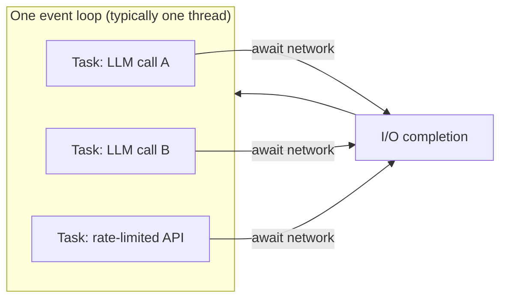
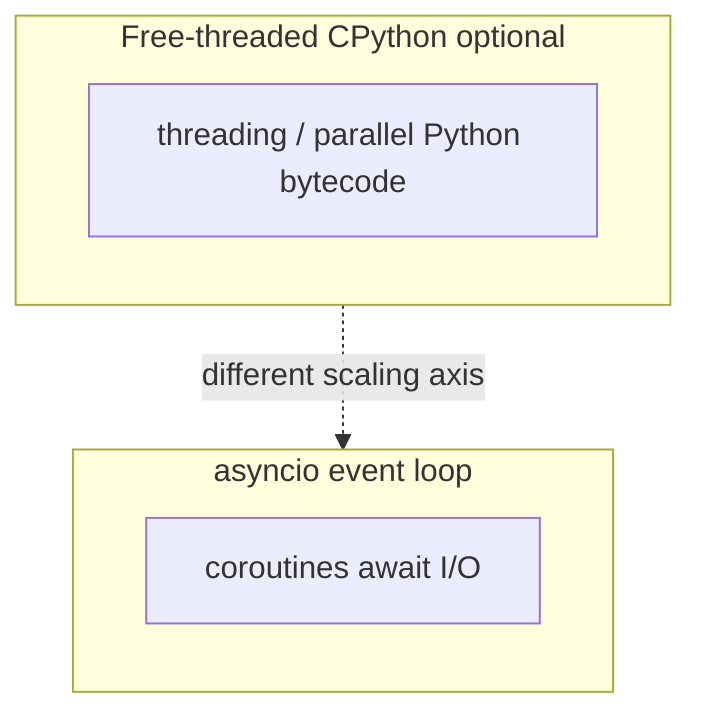
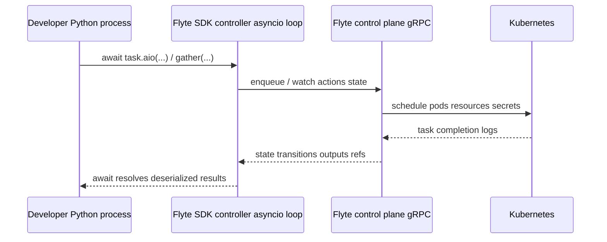

# Proposal:

**Title:** Container-enabled Asyncio is All You Need (to Build Pythonic AI Workflows at Scale)

**Description:**

As AI applications and agents move from prototypes to production, Python developers are increasingly tasked with orchestrating large numbers of models, tools, and external services. These requirements push teams toward specialized frameworks or domain-specific languages (DSLs) for managing concurrency and workflows — even though Python's standard library already provides the core building blocks needed to solve these problems.

This talk demonstrates how engineers can leverage Python's native `asyncio` library together with container orchestration platforms like Kubernetes to build scalable, production-ready AI workflows. It presents a practical explainer of `asyncio`, emphasizing the aspects most relevant to today's AI systems — structured concurrency, task coordination, backpressure, timeouts, and failure isolation — and shows how `asyncio` can serve as a highly effective programming paradigm for coordinating compute and data flow on a Kubernetes backend.

Through concrete examples, the session shows how common AI workflow patterns — coordinating LLM calls, executing tools in parallel, streaming responses, and interacting with rate-limited APIs — can be implemented directly with `asyncio` and other Python primitives. Rather than relying on declarative pipelines or custom DSLs, these patterns remain explicit, debuggable, and easy to reason about using plain Python.

The talk also explores how async Python can serve as a client to a scalable container orchestration backend, enabling AI services and agents to scale predictably while preserving readability and operational control. Topics include handling partial failures, retries, and high-throughput workloads without blocking or over-abstracting the developer's programming paradigm.

By the end of the session, attendees will understand why `asyncio` coupled with container orchestrators like Kubernetes is sufficient to build scalable, Pythonic AI workflows — and how staying close to the standard library reduces complexity, avoids lock-in, and improves long-term maintainability.

# Presentation

**Thesis:** Python developers building production AI workflows reach for DSLs and bespoke pipeline frameworks too early. The standard library's `asyncio` — paired with a container orchestrator like Kubernetes for resource isolation — already covers the dominant patterns of production AI: many concurrent I/O waits, bounded fan-out, partial failures, and isolated heavy compute. You don't need a new grammar; you need to wield the one you already have.

## Governing Idea

- Production AI workflows are **graphs of waits** (LLM APIs, tools, retrieval, GPUs queued behind your job in a cluster) — not CPU-bound numerical kernels.
- `asyncio` is purpose-built to **overlap those waits** with explicit, debuggable, structured Python — and modern primitives like `TaskGroup`, `Semaphore`, `Queue`, and `timeout` map directly onto AI workflow needs.
- When you need **strong isolation** (GPUs, tenancy, OOM boundaries), `asyncio` doesn't go away — it becomes the **client** to a container orchestrator that handles scheduling. Your user code stays `async def`.
- So you can ship scalable, maintainable AI workflows in plain Python, without trading the standard library for a DSL you'll regret in six months.

## Outline: Container-enabled Asyncio is All You Need

**30 minute slot · target ~23–24 minutes of slides + ~5 minutes Q&A**

### Intro

**Hook (3 minutes):**

You're building an AI workflow. It calls three LLM providers in parallel, fans out a hundred document-retrieval tasks, executes a few tools, streams responses back to a user, and aggregates everything into a final answer. On your laptop with ten inputs, it works. In production with ten thousand inputs and a real rate limit, it falls over — connections pile up, one slow provider stalls the whole batch, an OOM in a tool call kills the entire process, and you have no way to back-pressure inbound work without rewriting half of it.

So you do what most teams do at this point: you reach for a workflow framework. A DSL. A YAML DAG. *"Real Python isn't enough for this — we need a real orchestrator."*

I want to push back on that instinct. The discomfort isn't that Python is the wrong tool. It's that we haven't fully internalized the tools the standard library already gives us. **Production AI workflows are graphs of waits, and `asyncio` is the standard library's answer to graphs of waits.** The places where it isn't enough — strong resource isolation, GPUs, tenancy, OOM containment — aren't problems you solve with a DSL either. You solve them with a container orchestrator. And in that pairing, your user code is still just `async def`.

Today, I want to show you what production-grade AI workflows look like when you take that pairing seriously.

### Main Chapters

**Chapter 1: Production AI is a Graph of Waits (5 minutes)**

- Three coordination stories that show up in the same platform: **data / ETA pipelines**, **classical ML training & batch scoring**, **agentic workflows**. They all spend their time *waiting*: on networks, on disks, on rate-limited APIs, on GPUs ahead of you in the cluster.
- The temptation: as soon as the diagram gets complicated, teams reach for **another grammar** — a DSL, a YAML DAG, a graph framework — *before* they've exploited what `asyncio` already does well.
- The cost: control flow you can no longer step through, retries you can no longer reason about, and a debugging story that requires reading framework internals instead of your own code.
- The reframe: separate **two responsibilities** — *coordinating waits* (a language-level problem, solved by `asyncio`) and *isolating compute* (a systems-level problem, solved by containers). When you keep those two layers clean, you don't need a third grammar in the middle.

**Chapter 2: Asyncio is the Python You Already Ship (10 minutes)**

This is the technical core of the talk: a focused tour of the `asyncio` primitives that map directly onto AI workflow needs, with production-shaped examples.

- **The mental model**: cooperative scheduling, one event loop per loop thread, `await` as a yield point. Why `asyncio` is a perfect fit for I/O-bound, structured network code (the docs literally say so) and *not* a multi-core speedup for CPU-bound pure Python.
- **Concurrency ≠ parallelism**: overlapping *waiting* (asyncio) vs. running CPU work on multiple cores (processes / vectorized libs / offloaded workers). Mixing them is normal; confusing them is expensive. PEP 703 / free-threading is an orthogonal axis — it changes thread-safety stories, not the role of `asyncio` in your service.
- **Structured concurrency with `asyncio.TaskGroup`** (3.11+): scoped task lifetimes, sibling cancellation on failure — the safe default for fanning out tool calls, retrieval shards, or model requests.
- **Production-shaped patterns** you actually write:
    - **Fan-out** with `asyncio.gather(..., return_exceptions=True)` — so partial failures don't lose the batch.
    - **Backpressure** with `asyncio.Semaphore` — bound provider RPM, downstream connections, or sub-agent fan-out with one primitive.
    - **Dynamic backpressure** with `asyncio.Condition` — when even the *limit* needs to change at runtime: a small `DynamicSemaphore` wrapping a `Condition` lets you ramp a 100k fan-out from `200 → 1000 → 50 → 2000` *while it runs* (driven by a control endpoint or a resource-pressure signal). Demonstrates the punchline of the talk: when the stdlib's coordination primitives compose, you don't need a workflow DSL to express "throttle this fan-out live." See the [Flyte v2 example](https://github.com/flyteorg/flyte-sdk) — a single `Condition`, `notify()`, and counter is enough.
    - **Bounded queues** with `asyncio.Queue(maxsize=...)` — producers `await put`, consumers drain at their own pace; classic backpressure inside one service.
    - **Timeouts** with `asyncio.timeout` (3.11+) and `wait_for` — bound stalls explicitly, keep retry policy visible in code review.
    - **Streaming** with `async for` over chunked HTTP/gRPC responses — constant memory vs. buffering full completions.
- **Ecosystem mirror**: `anyio` and `aioresult` apply the same structured-concurrency ideas across backends — useful when interop with non-`asyncio` libraries is required, but the Python-level idea is the same.

**Chapter 3: Containers as the Isolation Boundary (5 minutes)**

`asyncio` is necessary but not sufficient for production AI workflows that need real resource isolation. This chapter is about where the standard library stops and the cluster begins.

- **What `asyncio` can't do for you**: enforce GPU shapes, give you OOM containment, isolate a noisy tenant, scale horizontally without you rewriting your mental model. These are scheduler-level concerns, not language-level concerns.
- **What containers on Kubernetes give you**: hard boundaries — GPUs, memory caps, tenancy, retries at the *job* boundary, blast-radius limits per tenant.
- **The pairing**: `async def` inside the service talks to **queues, provider APIs, and cluster APIs**; **pods** hold the heavy or risky pieces (model training, sandboxed tool execution, anything that needs a real GPU or strict memory cap). You stop pretending one giant synchronous script "is simpler."
- **The pattern (the key idea of this chapter)**: when you need isolation, your `asyncio` code doesn't disappear — it becomes the **client** to a control plane that schedules pods on your behalf. The user-facing programming model stays `async def`; *where* a piece of work runs becomes runtime configuration, not a second concurrency model in your source.

### Putting Things Into Practice (5 minutes)

A case study showing what "asyncio as a client to a container orchestrator" looks like in code you can read on GitHub today.

- **Case study — Flyte 2 SDK** ([`flyte-sdk`](https://github.com/flyteorg/flyte-sdk)): an open-source, asyncio-first workflow SDK. Used here as an **inspectable example** of the pattern — *not* a product pitch.
- **Same `gather`, different bodies**: walk through the upstream `hello_world` example. Tasks compose with `asyncio.gather` over `task.aio(...)` awaitables; *where* they run (locally, remotely on a cluster) is runtime config, not a different programming model.
- **Implementation pattern worth stealing**: the SDK's controller runs on a **dedicated thread with its own event loop**, uses **`asyncio.Queue`** for submitted actions, **`aiolimiter.AsyncLimiter`** for QPS-style rate limiting to remote services, and **`asyncio.Semaphore`** for per-parent fan-out limits ([`_core.py`](https://github.com/flyteorg/flyte-sdk/blob/main/src/flyte/_internal/controllers/remote/_core.py)). This is exactly the bounded-concurrency story from Chapter 2, applied to an orchestration client.
- **The logical request path**: user `asyncio` task → in-process driver loop → control plane (gRPC) → container runtime → results stream back through awaitables. Any orchestrator with a sane SDK rhymes with this.
- **The cognitive trade-offs you accept** when isolation enters the picture:
    - **No shared mutable Python heap** across containers — pass artifacts via files, object stores, or typed interfaces.
    - **I/O boundaries are real** — `asyncio` helps you *orchestrate* waits, not erase the latency of network + serialization between isolation boundaries.
    - **Failure domains shift** — partial failure and retries must be reasoned about at the workflow scope (`try/except`, structured concurrency, cache semantics), not just inside one event loop.

### Call to Action (2 minutes)

Tomorrow, before you reach for a new framework, do your future self a favor:

- **Reach for `asyncio` first.** `TaskGroup`, `gather`, `Semaphore`, `Queue`, `timeout` — a small set of stdlib moves covers most of the patterns DSLs sell you. Your code stays reviewable in plain Python.
- **Don't confuse "I need isolation" with "I need a DSL."** When you need GPUs, OOM containment, or multi-tenant blast-radius limits, you need a *container orchestrator*, not a new grammar. Your `async def` doesn't go away — it becomes the client to that layer.
- **Know your loop.** PEP 703 and free-threading are exciting, but they're orthogonal to the question of how your AI workflow overlaps waits. One primary event loop coordinating awaits is still the dominant shape.
- **Read the controller code of any orchestrator you adopt.** If the SDK is asyncio-native and the bounded-concurrency story is visible (queues, limiters, semaphores), you'll be able to reason about it. If it isn't, that's a signal.

Start small. Stay in the standard library longer than feels comfortable. Let containers handle isolation. That's what "container-enabled asyncio" really means — and for most production AI workflows at scale, it's all you need.

---

## Slide deck (this folder)

- **Source:** [`slides.md`](./slides.md) — Slidev entrypoint ([Slidev guide](https://sli.dev/guide)).
- **PyCon pacing:** Most PyCon US **talks are 30 minutes** ([guidelines](https://us.pycon.org/2026/speaking/guidelines/)); common chair timing is **~25 minutes speaking + ~5 minutes Q&A** ([community speaker notes](http://ref.readthedocs.io/en/latest/advice_for_pycon_speakers/)). The deck targets **~23–24 minutes** of material so the case study can be shortened live if needed.
- **Tone:** Stdlib-first and technical; Flyte appears only as an **inspectable open-source example** of "asyncio client + isolated workers," not as a pitch.
- **From repo root:** `pnpm exec slidev slides/pycon-us-2026/slides.md --open` or `npm run dev:pycon` (see root [`package.json`](../../package.json)).
- **From this folder:** `pnpm install && pnpm dev` (uses local [`package.json`](./package.json)).

---

## Technical Context

This section is structured as a **presenter study guide**. It grounds the talk in citable references and in the architecture of **Python `asyncio`**, **free-threaded CPython (optional GIL)** where relevant, and **Flyte 2** ([`flyte-sdk`](https://github.com/flyteorg/flyte-sdk) + [`flyte`](https://github.com/flyteorg/flyte) backend).

It has two parts:

- **Part A — Asyncio fundamentals**: a linear study guide. Read top-to-bottom to refresh your `asyncio` mental model at a *user level* (i.e., how to think about the abstractions, common pitfalls, and patterns you'll cite on stage). It assumes you can write `async def` / `await`, but does **not** assume you've read CPython internals.
- **Part B — Talk-specific implementation references**: the Flyte 2 / orchestration material slides lift from directly.

---

# Part A — Asyncio fundamentals (presenter study guide)

### 1. The user-level mental model: one event loop, cooperative scheduling

The thing you actually need to internalize before going on stage:

- **The event loop is a scheduler.** It runs in **one OS thread** and pulls ready callbacks (and resumed coroutines) off a queue, running each one until it **voluntarily yields** with `await`. Then the loop picks the next ready thing. ([Python 3 docs — *asyncio — Asynchronous I/O*](https://docs.python.org/3/library/asyncio.html); [docs — event loop](https://docs.python.org/3/library/asyncio-eventloop.html))
- **"Concurrent" ≠ "parallel".** At any *instant*, only **one** coroutine is executing on a given event loop. Concurrency comes from many coroutines **taking turns** at `await` points — overlapping their *waits*, not their CPU work. If you need multi-core CPU work, you need **threads / processes / vectorized libraries** in addition to async (more in §8).
- **Cooperative = trust-based.** No coroutine is preempted; each one yields when it's good and ready. The cost: one rude coroutine that never yields (a `time.sleep`, a `requests.get`, a tight CPU loop) **stalls the entire loop** and every other coroutine on it. This is the single most common newcomer footgun.

For audiences coming from AI workloads, frame it like this:

- **Concurrency (`asyncio`):** overlap many **I/O-bound** waits (HTTP to LLM APIs, tool calls, DB queries) on **one thread** by cooperative scheduling.
- **Parallelism (processes / multiple machines):** scale **CPU-bound** or **isolated** work across cores or nodes. Complementary to async, not a substitute.



**Figure:** Conceptual view of cooperative multitasking — while one task awaits I/O, others run ([`asyncio` docs — coroutines & tasks](https://docs.python.org/3/library/asyncio-task.html)).

**One sentence to put on stage:** *"Asyncio is a single-threaded scheduler that lets you overlap waiting, not lets you run more code at once."*

### 2. Coroutines, Tasks, Futures, Awaitables — the four-word vocabulary

This vocabulary trips up everyone and you'll get audience questions. Pin down the differences:

- **Coroutine** — what you get when you *call* a function defined with `async def`. **It is not running yet.** It's an object that *describes* work to be done. To actually run it: `await coro` (run it inline, wait for the result) or wrap it in a Task (run it concurrently).

  ```python
  async def fetch(): ...

  c = fetch()       # c is a coroutine object — nothing is running
  result = await c  # NOW it runs, suspending the caller until done
  ```

- **Task** — a **scheduled, running** coroutine. Created with `asyncio.create_task(coro)` or `asyncio.TaskGroup.create_task(coro)`. The loop will work on it concurrently with whatever called `create_task`. You can `await` a task to get its result, `task.cancel()` it, or check `task.done()`.

  ```python
  task = asyncio.create_task(fetch())  # starts running concurrently
  result = await task                  # waits for it to finish
  ```

- **Future** — a **lower-level** "value will be available later" handle (`asyncio.Future`). A `Task` is a `Future` that wraps a coroutine. You usually don't construct `Future`s yourself; libraries do (e.g. `loop.run_in_executor` returns one). When you see `Future` in stack traces, read it as "the result slot."

- **Awaitable** — anything you can put after `await`: a coroutine, a Task, a Future, or any object implementing `__await__`. This abstraction is why `await some_lib.do_thing()` "just works" across libraries — they all return awaitables of some kind.

**Two cues worth memorizing for stage:**

1. **Calling an `async def` does not run it.** Forgetting to `await` is the #1 newcomer bug — Python emits a `RuntimeWarning: coroutine '...' was never awaited` and your code silently does nothing.
2. **Tasks need a strong reference, or they may be GC'd mid-flight.** If you write `asyncio.create_task(coro)` and immediately drop the return value, the task can be garbage-collected before completion in some cases. Either keep the handle, or use a `TaskGroup` (which holds references for you). This is a known footgun; see [Python issue #91887](https://github.com/python/cpython/issues/91887) and the CPython 3.11 docs warning.

### 3. The `await` keyword and event loop lifecycle

**What `await x` actually does:**

1. **Suspends** the current coroutine and tells the loop, *"resume me when `x` is done."*
2. **Yields control** back to the event loop, which now runs other ready coroutines.
3. When `x` completes, the loop **schedules this coroutine to resume** at the line after the `await`.

A consequence that's worth saying out loud: **code *between* `await` points is atomic with respect to other coroutines.** If you read-modify-write a shared variable without an `await` in between, no other coroutine can interleave. This is why `asyncio` rarely needs locks — until you do an `await` between read and write, in which case you do.

```python
counter = 0

async def increment():
    global counter
    local = counter           # no await here — atomic so far
    await asyncio.sleep(0)    # YIELDS — another coroutine could run now
    counter = local + 1       # we may have a stale `local` value
```

**The event loop lifecycle (the bits that affect you in practice):**

- **`asyncio.run(main())`** is the modern entrypoint. It creates a new event loop, runs `main()` to completion, then closes the loop. Use it once at the top of your program. ([docs — `asyncio.run`](https://docs.python.org/3/library/asyncio-runner.html#asyncio.run))
- **Don't call `asyncio.run` from inside a running loop** (Jupyter notebooks already have one — use top-level `await` or `nest_asyncio`). You'll get `RuntimeError: asyncio.run() cannot be called from a running event loop`.
- **`asyncio.get_running_loop()`** returns the loop that's currently running this coroutine. Use it instead of the deprecated `get_event_loop()` whenever possible.
- **Multiple loops:** you typically get one loop per thread. The Flyte SDK controller in Part B (§11) deliberately runs **its own loop on a dedicated thread** so library users can call sync APIs that talk to it via `run_coroutine_threadsafe`.
- **Teardown:** when `asyncio.run` exits, it cancels any tasks still running, awaits them briefly, and closes the loop. Don't fire-and-forget tasks across this boundary; you'll see `Task was destroyed but it is pending!` warnings.

### 4. Cancellation and exception handling

This is the area of `asyncio` that has the most subtle edges, and it's the one most likely to come up in audience Q&A.

**Cancellation basics:**

- `task.cancel()` does **not** kill the task immediately. It **schedules** an `asyncio.CancelledError` to be raised inside the task **at the next `await`**. The task gets a chance to run cleanup in `try/finally`.
- `CancelledError` inherits from `BaseException` (since 3.8), not `Exception`. **Bare `except Exception:` will not swallow it** — that's intentional. **Never** silently catch and discard `CancelledError`; if you must catch it, do cleanup and **re-raise**.
- **`asyncio.shield(coro)`** prevents a cancellation that originated outside `coro` from reaching it. Common use: critical cleanup or DB writes you don't want interrupted by a parent timeout.
- **`asyncio.timeout(N)`** (3.11+, [docs](https://docs.python.org/3/library/asyncio-task.html#asyncio.timeout)) is the modern way to bound a block. Internally it cancels the inner work after N seconds and raises `TimeoutError` outward. `wait_for(coro, N)` is the older equivalent.

**`gather` vs `TaskGroup` — same goal, very different failure semantics:**

| | `asyncio.gather(*coros)` | `async with asyncio.TaskGroup() as tg:` (3.11+) |
|---|---|---|
| **First failure** | Propagates immediately to the awaiter. **Sibling tasks keep running** until the loop drains them. | Cancels **all** sibling tasks, awaits them, then raises. |
| **Multiple failures** | Only the first is raised; others are logged or lost (unless you collected via `return_exceptions=True`). | Aggregated into an `ExceptionGroup` ([PEP 654](https://peps.python.org/pep-0654/)). |
| **Catching errors** | `try/except SpecificError:` around the `await gather(...)`. | `try/except* SpecificError:` (note the `*`) — handles a specific type *within* the group. |
| **`return_exceptions=True`** | Exceptions become return values in the result list. No early termination. | N/A — TaskGroup is fail-fast by design. |

**Rule of thumb for the talk:** prefer `TaskGroup` for *coordinated* fan-out (sub-agent A needs the answer before sub-agent B is useful). Prefer `gather(..., return_exceptions=True)` for *best-effort* fan-out where partial results are still useful (e.g., 100 retrieval shards where you tolerate a few failing).

**`ExceptionGroup` quick reference:**

```python
try:
    async with asyncio.TaskGroup() as tg:
        tg.create_task(fetch_a())
        tg.create_task(fetch_b())
except* httpx.HTTPStatusError as eg:
    log.warning("HTTP failures: %s", eg.exceptions)
except* TimeoutError as eg:
    log.warning("Timed out: %s", eg.exceptions)
```

The `except*` syntax matches a *type* anywhere in the (possibly nested) group.

### 5. Common pitfalls and gotchas (the "I forgot to await" zoo)

A short, memorable list — useful to have in your head if the audience asks "why is async so hard?"

| Pitfall | What happens | Fix |
|---|---|---|
| Forgot to `await` a coroutine | `RuntimeWarning: coroutine 'X' was never awaited`; the work never runs. | `await coro`, or `asyncio.create_task(coro)` if you want it concurrent. |
| Used `requests` / `time.sleep` / sync DB driver in async code | **Entire loop blocks** while that line runs. Throughput collapses. | Use `httpx.AsyncClient` / `asyncio.sleep` / async DB driver. For unavoidable blocking calls, use `asyncio.to_thread` (see §6). |
| Created a task and dropped the reference | Task can be GC'd mid-flight; work is lost silently. | Keep a reference, or use `TaskGroup`. |
| Caught and swallowed `CancelledError` | Task ignores cancellation, parent hangs forever. | Re-raise after cleanup; don't catch unless you have a *specific* reason. |
| Tried `async def __init__` | `__init__` cannot be a coroutine (Python won't `await` it). | Use a `@classmethod async def create(cls, ...)` factory. |
| Called `asyncio.run` inside a running loop | `RuntimeError: ... cannot be called from a running event loop`. | Use top-level `await` (Jupyter, IPython 7+, or `python -m asyncio` REPL), or `nest_asyncio` as a last resort. |
| Mixed `gather` and `TaskGroup` semantics by accident | One task fails, siblings keep running where you expected fail-fast (or vice versa). | Pick one deliberately per fan-out (§4 table). |
| Heavy CPU work inside a coroutine (e.g. tokenization, JSON parsing of multi-MB payloads) | Loop stalls during the busy section even though there's no `await`. | `await asyncio.to_thread(cpu_func, ...)` or push to a `ProcessPoolExecutor`. |

### 6. Bridging sync and async code

Real systems mix sync and async. Two directions to know:

**Async wants to call blocking code** (a sync DB driver, file I/O on a slow disk, a CPU-bound parse):

- **`await asyncio.to_thread(func, *args)`** (3.9+, [docs](https://docs.python.org/3/library/asyncio-task.html#asyncio.to_thread)) — runs `func` in the default thread pool and gives you back an awaitable. The simplest correct answer for occasional blocking calls.
- **`await loop.run_in_executor(executor, func, *args)`** — same idea, with explicit executor. Use a `ProcessPoolExecutor` for CPU-bound work (the GIL still applies in standard CPython, so a thread won't help).

**Sync wants to call async code** (a sync test, a CLI entrypoint, a worker thread that needs to fire an async RPC):

- **`asyncio.run(coro)`** — one-shot, top of program. Creates a fresh loop.
- **`asyncio.run_coroutine_threadsafe(coro, loop)`** — schedules `coro` onto a *different* thread's event loop. Returns a `concurrent.futures.Future` you can `.result(timeout=...)` on. **This is exactly the pattern Flyte's controller uses** (Part B §11): the controller owns a long-lived event loop on a dedicated thread, and sync user code submits work via `run_coroutine_threadsafe`.
- **`loop.call_soon_threadsafe(callback, *args)`** — schedule a regular (non-async) callback onto another thread's loop. Lower-level; useful for waking the loop from a thread.

**Heuristic:** if you're calling blocking code occasionally, `asyncio.to_thread` is fine. If you're building a long-lived service with a sync API surface that needs to drive async I/O, run a dedicated event loop on its own thread and bridge with `run_coroutine_threadsafe` (Part B §11 walks through the Flyte example).

### 7. AI-workflow-specific patterns: LLM I/O, rate limits, streaming, retries

This is the part of the study guide most aligned with what you'll show on stage.

**HTTP clients & SDKs (use the async ones):**

- **`httpx.AsyncClient`** — modern, well-maintained, retry-friendly. **Connection pooling matters**: configure `httpx.Limits(max_connections=..., max_keepalive_connections=...)` or you'll exhaust file descriptors under fan-out.
- **`aiohttp`** — older, very performant, slightly less ergonomic API.
- **Provider SDKs:** use the async variants (`AsyncOpenAI`, `AsyncAnthropic`, etc.). Never the sync clients in async code.
- **Never `requests`** in async code — it's a synchronous, blocking library.

**Streaming responses (token-level UX):**

```python
async with client.stream("POST", "/v1/chat/completions", json=payload) as resp:
    async for chunk in resp.aiter_lines():
        yield chunk  # forward to client / accumulate / parse
```

`async for` over the response keeps memory constant and lets you forward tokens to the user as they arrive. For SSE / chunked encodings, the SDK usually exposes an `async iterator` directly.

**Rate limiting — three orthogonal axes:**

| Limit | Primitive |
|---|---|
| **Concurrency** (max in-flight calls) | `asyncio.Semaphore(N)` (or `DynamicSemaphore` from §12 if you need to retune live) |
| **QPS** (max calls per second) | `aiolimiter.AsyncLimiter(rate, time_period)` — leaky-bucket style |
| **TPM / RPM** (provider quotas) | Sliding window over an `asyncio.Queue`, or a custom class wrapping `Condition` (similar shape to `DynamicSemaphore` but tracking tokens, not calls) |

You almost always need **at least two** of these: a concurrency cap so you don't open 10k sockets, plus a QPS cap so you don't trip the provider's per-second limit.

**Retries with backoff:**

- **`tenacity`** has first-class async support (`@tenacity.retry` works on `async def`). Solid default.
- A small `async for attempt in retry(...)` helper is also fine and arguably more visible in code review than a stack of decorators. Operators thank you.
- **Be careful with retries on streaming endpoints** — a half-streamed response that errors out is *not* safe to retry without the provider supporting idempotency keys.

**Tool / sub-agent fan-out — pick the right primitive for the failure semantics:**

- **Best-effort tool fan-out** (one bad tool shouldn't kill the turn): `gather(*tools, return_exceptions=True)`, then post-process exceptions per slot.
- **Coordinated sub-agent fan-out** (you need *all* sub-results to make a decision): `TaskGroup` — fail-fast, automatic cleanup of siblings on first failure.
- **Race / first-result-wins** (e.g. "ask three providers in parallel, take whichever answers first"): `done, pending = await asyncio.wait(tasks, return_when=asyncio.FIRST_COMPLETED)`, then `for t in pending: t.cancel()`.

**Per-step and per-turn timeouts:**

```python
async with asyncio.timeout(60):  # whole turn budget
    async with asyncio.timeout(10):  # individual tool budget
        result = await tool.call(args)
```

`asyncio.timeout` nests cleanly. Inner timeouts don't trigger the outer one.

**Cancellation when one branch wins** — typical agentic pattern:

```python
async with asyncio.TaskGroup() as tg:
    a = tg.create_task(provider_a.complete(prompt))
    b = tg.create_task(provider_b.complete(prompt))
    done, pending = await asyncio.wait({a, b}, return_when=asyncio.FIRST_COMPLETED)
    for t in pending:
        t.cancel()
```

### 8. "GIL-free" Python, asyncio, and where parallelism actually shows up

**Official definitions**

- [PEP 703 — *Making the Global Interpreter Lock Optional in CPython*](https://peps.python.org/pep-0703/) describes optional **free-threaded** builds where the GIL can be disabled.
- The Python docs [*Python support for free threading*](https://docs.python.org/3/howto/free-threading-python.html) state that free-threaded execution allows threads to run **in parallel on CPU cores**, while noting compatibility caveats (some C extensions may **re-enable the GIL**).

**Relationship to asyncio (precise wording for the talk)**

- A typical **asyncio** program still drives **one event loop per loop thread**; **async/await does not turn CPU-bound Python into multi-core parallelism** inside that loop.
- **Free-threading** mainly changes the story for **multi-threaded** Python code and hybrid designs (threads + async interop). It does **not** replace the need for **processes**, **vectorized libraries**, or **offloaded workers** for heavy CPU work — but it can matter when mixing **blocking or threaded** libraries with async services.



**One-liner for the room:** *"PEP 703 changes how threads run; it doesn't change why we use asyncio."*

**Supplementary reading (performance / experience reports)** — illustrative, not benchmarks for your specific workload:

- [ThinhDA — *Breaking Down Python 3.13's Experimental Free‑Threading Mode*](https://thinhdanggroup.github.io/python313-free-threading/)
- [Mouse Vs Python — *Python 3.13 Allows Disabling of the GIL + subinterpreters*](https://blog.pythonlibrary.org/2024/03/14/python-3-13-allows-disabling-of-the-gil-subinterpreters/)

### 9. Further reading (independent explainers)

Useful for attendees who want to read further; aligned with the talk's emphasis on **structured** async code and **I/O-bound** workloads:

| Resource | Why cite it |
|----------|-------------|
| [Python docs — `asyncio` index](https://docs.python.org/3/library/asyncio.html) | The canonical reference. Start here. |
| [Python docs — Coroutines and Tasks](https://docs.python.org/3/library/asyncio-task.html) | Covers coroutines, tasks, `gather`, `TaskGroup`, `timeout`, `wait_for`, `shield`. |
| [Python docs — Synchronization Primitives](https://docs.python.org/3/library/asyncio-sync.html) | `Lock`, `Event`, `Condition`, `Semaphore`, `BoundedSemaphore`. |
| [Python docs — Queues](https://docs.python.org/3/library/asyncio-queue.html) | `Queue`, `LifoQueue`, `PriorityQueue` — the bounded-buffer building blocks. |
| [Real Python — *Python's asyncio: A Hands-On Walkthrough*](https://realpython.com/async-io-python/) | Long-form tutorial on async/await, event loops, and async I/O patterns. |
| [Real Python — *Getting Started With Async Features in Python*](https://realpython.com/python-async-features) | Broader async history (`async`/`await` evolution) and practical usage. |
| [Billy Poon — *Structured Concurrency in Python with TaskGroup*](https://billypoon.com/insights/structured-concurrency-in-python-with-taskgroup-writing-async-code-that-doesn-t-break) | Explains structured concurrency and `asyncio.TaskGroup` (3.11+). |
| [More Than Monkeys — *Asynchronous Python (beyond async/await)*](https://morethanmonkeys.co.uk/article/asynchronous-python-beyond-asyncawait-from-event-loop-basics-to-structured-concurrency/) | Event-loop basics through structured concurrency narrative. |
| [PEP 654 — Exception Groups and `except*`](https://peps.python.org/pep-0654/) | The mechanism `TaskGroup` uses to surface multiple sibling failures. |
| [`anyio` documentation](https://anyio.readthedocs.io/) | Same structured-concurrency ideas, runs on `asyncio` *or* `trio`; useful for library authors who want backend-agnostic code. |

---

# Part B — Talk-specific implementation references (Flyte 2 / orchestration)

### 10. Flyte 2 SDK: asyncio-first workflows and migration from Flyte 1

The [`flyte-sdk` README](https://github.com/flyteorg/flyte-sdk) and [`FEATURES.md`](https://github.com/flyteorg/flyte-sdk/blob/main/FEATURES.md) establish Flyte 2 as **pure Python**: dynamic pipelines use ordinary control flow, and **async parallelism** uses native `asyncio` (e.g. `asyncio.gather`) instead of DSL `map` constructs — see the **Async Parallelism** section in [FEATURES.md](https://github.com/flyteorg/flyte-sdk/blob/main/FEATURES.md).

**Named Flyte 1 → 2 shift (useful for audiences who know Flyte 1):** `flytekit.map()` → `await asyncio.gather()` ([FEATURES.md — *Migration from Flyte 1*](https://github.com/flyteorg/flyte-sdk/blob/main/FEATURES.md)).

**Example (from upstream README)** — async entrypoint fan-out:

```python
import asyncio
import flyte

env = flyte.TaskEnvironment(
    name="hello_world",
    image=flyte.Image.from_debian_base(python_version=(3, 12)),
)

@env.task
def calculate(x: int) -> int:
    return x * 2 + 5

@env.task
async def main(numbers: list[int]) -> float:
    results = await asyncio.gather(*[
        calculate.aio(num) for num in numbers
    ])
    return sum(results) / len(results)
```

**`task.aio(...)`:** asyncio-facing wrapper generated for each `@env.task`; use it from `async def` workflows to compose tasks with `gather`, semaphores, etc. Behavior (strictly local vs remote) depends on **run context** (`flyte.run`, `flyte.with_runcontext(...)`, etc.) — the API stays asyncio-native either way ([README](https://github.com/flyteorg/flyte-sdk/blob/main/README.md)).

Source: [`flyte-sdk` README](https://github.com/flyteorg/flyte-sdk/blob/main/README.md).

### 11. Flyte SDK "controller": dedicated asyncio event loop + backpressure

The remote controller implementation is explicit that the **Flyte 2 Python controller** runs **high-level submit APIs** on a **dedicated thread with its own asyncio event loop**; coroutines that talk to services are scheduled there.

From [`src/flyte/_internal/controllers/remote/_core.py`](https://github.com/flyteorg/flyte-sdk/blob/main/src/flyte/_internal/controllers/remote/_core.py) (abridged docstring):

> *"Generic controller with high-level submit API running in a dedicated thread with its own event loop. All methods that begin with `_bg_` are run in the controller's event loop…"*

Implementation anchors to cite in the talk:

- `asyncio.Queue` for submitted actions (bounded queue size).
- `aiolimiter.AsyncLimiter` for **QPS-style rate limiting** to remote services.
- `submit_action_sync` bridging sync callers via `fut.result()` on the controller loop.

[`RemoteController`](https://github.com/flyteorg/flyte-sdk/blob/main/src/flyte/_internal/controllers/remote/_controller.py) adds **`asyncio.Semaphore`**-based **per-parent concurrency** (`_parent_action_semaphore`) for limiting fan-out — this directly mirrors "bounded concurrency" patterns you teach with semaphores in raw asyncio.

**Optional Rust controller:** the README documents an experimental **`flyte_controller_base`** Rust extension ([Rust controller section](https://github.com/flyteorg/flyte-sdk/blob/main/README.md)); env var `_F_USE_RUST_CONTROLLER=1` selects it. This is **not required** for the asyncio story but shows how the **remote control plane client** can be optimized while keeping the **user-facing** model as async Python.

### 12. `asyncio.Condition` → `DynamicSemaphore`: live-tunable fan-out concurrency

`asyncio.Semaphore` bounds concurrency to a **fixed** limit. But production AI fan-outs (100k retrieval shards, batch scoring, agent sub-tasks) often want to **change the limit at runtime**: ramp up when capacity frees, throttle down under provider pressure, or finish strong as a deadline approaches.

The stdlib has the right primitive for this already: [**`asyncio.Condition`**](https://docs.python.org/3/library/asyncio-sync.html#asyncio.Condition) — a lock + waiter queue with `notify()` / `wait()`. Wrap it in a small `DynamicSemaphore` and you get a semaphore whose limit can be mutated **while waiters are blocked**, with the right number of them woken up automatically.

```python
import asyncio


class DynamicSemaphore:
    def __init__(self, initial: int):
        if initial < 0:
            raise ValueError("initial must be >= 0")
        self._limit = initial
        self._active = 0
        self._cond = asyncio.Condition()

    @property
    def limit(self) -> int:
        return self._limit

    @property
    def active(self) -> int:
        return self._active

    async def __aenter__(self) -> "DynamicSemaphore":
        async with self._cond:
            while self._active >= self._limit:
                await self._cond.wait()
            self._active += 1
        return self

    async def __aexit__(self, exc_type, exc, tb) -> None:
        async with self._cond:
            self._active -= 1
            self._cond.notify()

    async def set_limit(self, new: int) -> None:
        if new < 0:
            raise ValueError("new must be >= 0")
        async with self._cond:
            delta = new - self._limit
            self._limit = new
            if delta > 0:
                self._cond.notify(delta)
```

**What's happening (talking points):**

- `__aenter__` blocks on the condition while `active >= limit`. `wait()` *releases the lock* and re-acquires on wake-up — so other coroutines can mutate state.
- `__aexit__` releases a slot and `notify()`s **one** waiter — same shape as a classic semaphore release.
- `set_limit(new)` is the new trick: when the limit grows by `delta`, `notify(delta)` wakes exactly that many parked waiters. When it shrinks, no waiters are woken — in-flight work drains naturally to the new limit. **Lossless throttling**, no cancellation, no rebuilding the gather.

**Use it like a regular async context manager** in a Flyte 2 fan-out — including driving the limit from a side-task or a polled control endpoint:

```python
@env.task
async def worker(x: int) -> int:
    await asyncio.sleep(60)  # the actual work
    return x

async def schedule(sem: DynamicSemaphore):
    await asyncio.sleep(60);   await sem.set_limit(1000)  # ramp up
    await asyncio.sleep(300);  await sem.set_limit(50)    # throttle (lossless drain)
    await asyncio.sleep(600);  await sem.set_limit(2000)  # finish strong

@env.task
async def fanout(n: int = 100_000) -> int:
    sem = DynamicSemaphore(200)
    asyncio.create_task(schedule(sem))   # or: poll an endpoint and call set_limit

    async def gated(i: int) -> int:
        async with sem:                   # the only line that matters for gating
            return await worker(i)

    return sum(await asyncio.gather(*(gated(i) for i in range(n))))
```

**Why it matters for the talk's thesis** — *this* is the kind of behavior teams reach for a workflow DSL or a custom orchestrator to express: dynamic, externally-controllable concurrency over a 100k fan-out. With `asyncio.Condition` it's **~25 lines of standard library Python**, fits inside a `@env.task`, composes with `asyncio.gather`, and is fully reviewable. No new grammar.

**Practitioner cues:**

- Pair with **`asyncio.Queue`** if you also need to *throttle ingestion* (producers wait on `put`); pair with **`AsyncLimiter`** (third-party) if you need QPS bounds *in addition to* concurrency bounds.
- Drive `set_limit` from anything: a control HTTP endpoint, a Kubernetes resource-pressure signal, a queue-depth metric, or another `asyncio` task that watches the wall clock.
- The pattern composes inside a Flyte 2 task, but **doesn't require Flyte at all** — it's just `asyncio` + a small wrapper.

Source: shared internally in Flyte v2 discussion (see talk notes); independent reads on `asyncio.Condition` semantics: [Python docs — Synchronization Primitives](https://docs.python.org/3/library/asyncio-sync.html#asyncio.Condition).

### 13. Interoperability: anyio + structured concurrency in user tasks

Flyte's own examples show **anyio** `TaskGroup` alongside Flyte tasks — the same **structured concurrency** ideas as `asyncio.TaskGroup`, useful when mixing ecosystems:

- Example: [`examples/advanced/use_anyio.py`](https://github.com/flyteorg/flyte-sdk/blob/main/examples/advanced/use_anyio.py) uses `anyio.create_task_group()` and `aioresult` to capture parallel `predict_one` invocations.

```python
async with anyio.create_task_group() as tg:
    for req in batch.requests:
        captured_results_obj.append(
            aioresult.ResultCapture.start_soon(tg, predict_one, req)
        )
```

Source: [`use_anyio.py`](https://github.com/flyteorg/flyte-sdk/blob/main/examples/advanced/use_anyio.py) (see file for full context).

### 14. Flyte 2 open-source backend (repo `flyteorg/flyte`): how the SDK meets Kubernetes

The [`flyte` repo README](https://github.com/flyteorg/flyte/blob/main/README.md) positions **Flyte 2** as Kubernetes-oriented orchestration; the **open-source backend for Flyte 2** is described as **coming soon**, with enterprise hosting referenced on Union.ai — be transparent about that when pointing people at self-hosted timelines.

The [**Backend README**](https://github.com/flyteorg/flyte/blob/main/docs/BACKEND_README.md) describes the **Kubernetes-native** control plane: **gRPC services** including **QueueService**, **RunService**, **StateService**, **PostgreSQL** persistence, **async processing**, and **LISTEN/NOTIFY** for streaming-style updates. **Protocol buffers** live under `flyteidl2/` with generated clients for **Go, TypeScript, Python, Rust** (`make gen`). The Python SDK's controller code also talks to generated **Actions** APIs (e.g. `flyteidl2.actions` / **ActionsService**) alongside queue/state paths — service mix may evolve by release; see the repo [**Implementation Spec**](https://github.com/flyteorg/flyte/blob/v2/docs/IMPLEMENTATION_SPEC.md) linked from the Backend README for the full design.



**Figure:** Logical request path (not every RPC drawn): user asyncio code → SDK controller → Flyte services → cluster execution.

### 15. Visual assets (logos / diagrams — stable URLs)

| Asset | URL |
|-------|-----|
| Python logo (marketing) | `https://www.python.org/static/img/python-logo.png` |
| Asyncio docs (reference hub) | `https://docs.python.org/3/library/asyncio.html` |
| Flyte 2 SDK repository | `https://github.com/flyteorg/flyte-sdk` |
| Flyte 2 backend / protos repo | `https://github.com/flyteorg/flyte` |

### 16. Cognitive trade-offs called out in this talk (mapping to "Putting Things Into Practice")

When **container isolation** and **remote tasks** enter the picture:

- **Memory model:** no shared **mutable** Python heap across containers — pass artifacts via **files**, **object stores**, or **typed interfaces** (Flyte's `flyte.io.File` patterns in examples).
- **I/O boundaries:** each remote step has **network + serialization** overhead; asyncio helps **orchestrate** waits, not erase **latency** between isolation boundaries.
- **Failure domains:** partial failure and retries must be reasoned about at the **workflow** level (`try/except`, Flyte tracing/cache semantics), not only inside a single event loop.

These align with the proposal's closing chapter on **what containers do that `asyncio` can't** and the practical trade-offs of bridging them.

### 17. Production ops cues (maps to Chapter 3 + Putting Into Practice)

Maps to *"backpressure, failure isolation, graceful shutdown, observability"* in the talk:

| Theme | Talking point |
|-------|----------------|
| **Backpressure** | Raw asyncio: semaphores, `asyncio.Queue`, rate limiters. Flyte: controller queue + `AsyncLimiter` + per-parent semaphores (Technical Context §11). |
| **Failure isolation** | Remote tasks run in **separate containers**; combine with `gather(..., return_exceptions=True)` or per-task `try/except` in the driver. |
| **Graceful shutdown** | For your **own** long-lived async services: cancel scopes / drain in-flight work. Flyte's controller owns a **dedicated event-loop thread** — cite lifecycle behavior when discussing clean teardown ([`_core.py`](https://github.com/flyteorg/flyte-sdk/blob/main/src/flyte/_internal/controllers/remote/_core.py)). |
| **Observability** | Kubernetes pod logs, Flyte run URLs / CLI (`flyte get logs` in [FEATURES.md CLI table](https://github.com/flyteorg/flyte-sdk/blob/main/FEATURES.md)), **tracing** features in the same doc (`@flyte.trace`, checkpointing). |

---

**References (quick list)**

- [Python `asyncio` standard library](https://docs.python.org/3/library/asyncio.html)
- [Real Python — asyncio walkthrough](https://realpython.com/async-io-python/) · [Real Python — async features](https://realpython.com/python-async-features)
- [Billy Poon — TaskGroup / structured concurrency](https://billypoon.com/insights/structured-concurrency-in-python-with-taskgroup-writing-async-code-that-doesn-t-break)
- [More Than Monkeys — asyncio beyond async/await](https://morethanmonkeys.co.uk/article/asynchronous-python-beyond-asyncawait-from-event-loop-basics-to-structured-concurrency/)
- [PEP 703 — optional GIL](https://peps.python.org/pep-0703/)
- [Python docs — free threading howto](https://docs.python.org/3/howto/free-threading-python.html)
- [Flyte SDK repository](https://github.com/flyteorg/flyte-sdk) · [FEATURES.md](https://github.com/flyteorg/flyte-sdk/blob/main/FEATURES.md)
- [Flyte `use_anyio.py` example](https://github.com/flyteorg/flyte-sdk/blob/main/examples/advanced/use_anyio.py)
- [Flyte backend README](https://github.com/flyteorg/flyte/blob/main/docs/BACKEND_README.md) · [Implementation Spec (v2 branch)](https://github.com/flyteorg/flyte/blob/v2/docs/IMPLEMENTATION_SPEC.md)
- [Flyte monorepo README](https://github.com/flyteorg/flyte/blob/main/README.md)
- [Slidev guide](https://sli.dev/guide)
