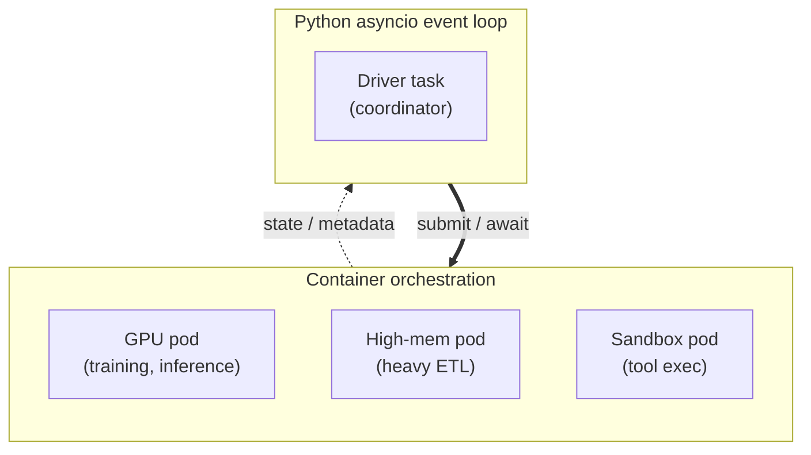
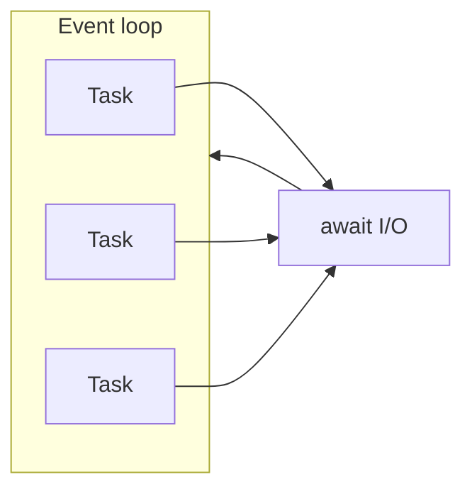
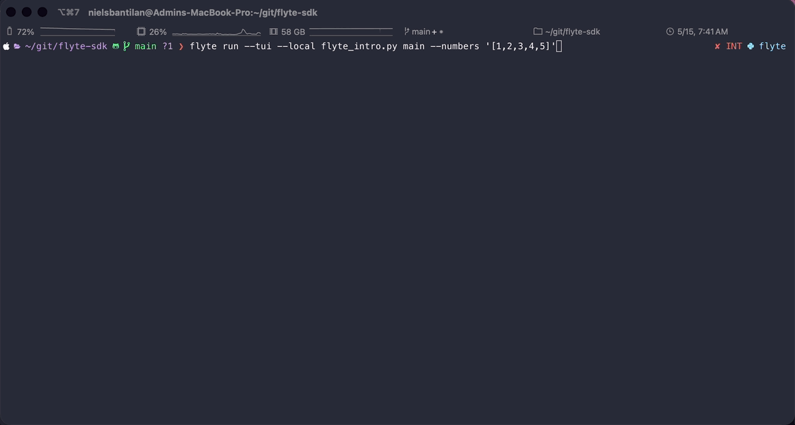
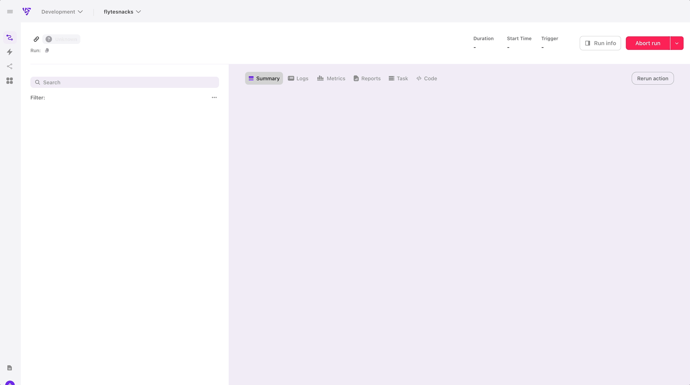
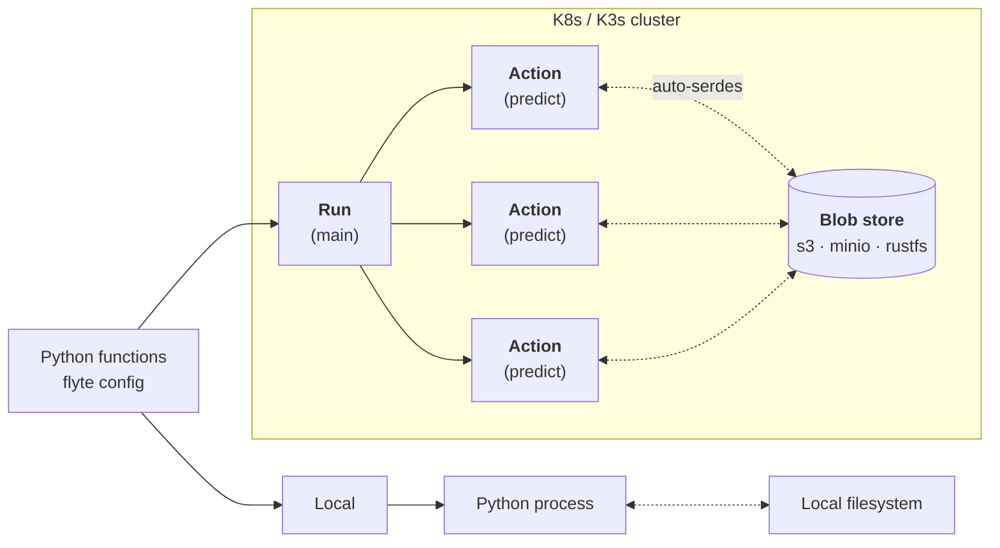
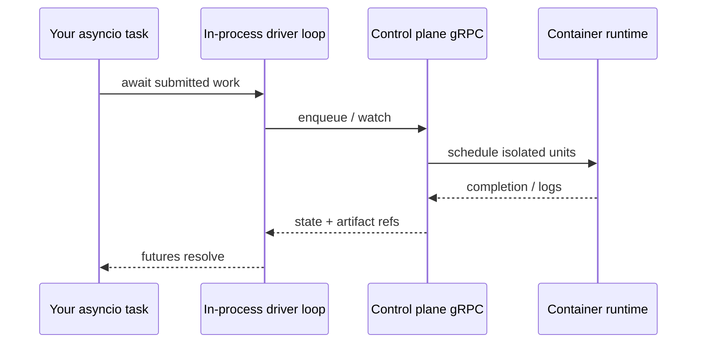
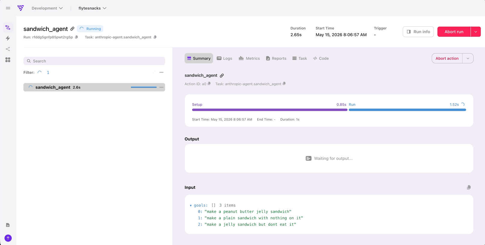

<style>
h1 { color: #8C4FFF !important; }
h1, h2, h3, ul, li, p { text-align: left !important; }
:global(h1), :global(h2), :global(h3) { color: #8C4FFF !important; }
:global(.slidev-layout.cover h1),
:global(.slidev-layout.intro h1) { color: #8C4FFF !important; }
:global(.slidev-layout) {
  font-family: 'DM Sans', system-ui, sans-serif !important;
}
:global(.slidev-layout img) {
  display: block;
  margin-left: auto;
  margin-right: auto;
  max-height: 220px;
}
:global(.slidev-page-1),
:global(.slidev-page-1 .slidev-layout) {
  background: #ffffff !important;
  background-image: none !important;
  color: #1a1a1a !important;
}
:global(.slidev-page-1 .slidev-layout::before),
:global(.slidev-page-1 .slidev-layout::after) {
  background: none !important;
  background-image: none !important;
  display: none !important;
}
.two-cols-header {
  column-gap: 28px;
}
</style>

<div style="text-align: center;">

<h1 style="text-align: center !important;">Container-enabled Asyncio is All You Need</h1>

<h3 style="text-align: center !important;">(to build Pythonic AI workflows at scale)</h3>

<br />

<h3 style="text-align: center !important;">Niels Bantilan · PyCon US 2026</h3>

<br>


</div>

---
layout: center
---

# 🎉 Congrats! You built an Agentic workflow…

It calls **three LLM providers** in parallel, fans out **a hundred retrieval tasks**, runs **ten tools** that make API calls, streams responses, and outputs a final answer.

<v-clicks>

- ✅ On your laptop with **10 inputs**: works beautifully.
- 💥 In production with **10,000 inputs** and a real rate limit: it falls over.
- 🌀 Connections pile up. One slow connection stalls the whole batch.
- 😵 An OOM in a tool call kills the entire process.
- 🤷 You can't back-pressure inbound work without rewriting half of it.

</v-clicks>

---
layout: center
---

# You built an ~~Agentic~~ ML workflow…

It ~~calls~~ trains **three** ~~**LLM providers**~~ **models** in parallel, fans out **a hundred** ~~**retrival**~~ **HPO sweep tasks**, runs **ten** ~~**tools**~~ **evals** that make API calls, streams ~~responses~~ logs and metrics, and outputs a ~~final answer~~ deployed model.

<v-click>

- ✅ On your laptop with **10 inputs**: works beautifully.
- 💥 In production with **10,000 inputs** and a real rate limit: it falls over.
- 🌀 Training runs. One slow training run stalls the whole sweep.
- 😵 An OOM in a training run kills the entire process.
- 🤷 You can't back-pressure inbound work without rewriting half of it.

</v-click>


---
layout: center
---

# You built an ~~Agentic~~ ETL workflow…

It ~~calls~~ creates **three** ~~**LLM providers**~~ **datasets** in parallel, fans out **a hundred** ~~**retrival**~~ **processing tasks**, runs **ten** ~~**tools**~~ **quality check suites** that make API calls, streams ~~responses~~ validation metrics, and outputs a ~~final answer~~ deployed model.

<v-click>

- ✅ On your laptop with **10 inputs**: works beautifully.
- 💥 In production with **10,000 inputs** and a real rate limit: it falls over.
- 🌀 DB connetions pile up. One slow connection stalls the whole batch.
- 😵 An OOM in a heavy processing step kills the entire process.
- 🤷 You can't back-pressure inbound work without rewriting half of it.

</v-click>

---
layout: center
---

# So you reach for a framework

A workflow DSL. A YAML DAG. A graph framework.

> *"Python isn't enough to express this — we need an orchestrator with a specialized DSL."*

<v-clicks>

I want to push back on that instinct.

</v-clicks>

---
layout: center
---

# The reframe

Production AI workflows are dynamic execution graphs of waits where:

<v-clicks>

1. The shape of the graph depends on inputs or intermediary outputs
2. Workloads vary in terms of concurrency, parallelism, and backpressure.
3. Nodes are composed of potentially variable compute units (CPU, GPU, memory)

</v-clicks>

<v-click>

[`asyncio`](https://docs.python.org/3/library/asyncio.html) is the standard library's answer to the first two requirements.

</v-click>

---
layout: center
---

# The reframe

Scale and production problems aren't problems you solve with a DSL:

<v-clicks>

1. Heterogenous compute requirements: one step uses CPUs, another uses GPUs
2. OOM containment and handling: only one step consumes 1TB of memory
3. Isolation of compute and permissions: only one step needs DB access

</v-clicks>

<v-click>

You solve them with a **container orchestrator** that plays well with Python.

</v-click>

---
layout: default
---

# Claims

<v-clicks>

1. **`asyncio`** should be one of the **main tools** you reach for when building production AI workflows, which require concurrency, parallelism, cancellation, backpressure, etc. Especially with agents, DAGs are not enough.
2. When you need **scale and strong isolation** (GPUs, multi-tenancy, OOM boundaries), **`asyncio` stays in your toolkit** while a **container orchestrator** schedules containers on the right compute — you're still writing **`async Python`** to express the logic and data flow of your program.

</v-clicks>

---
layout: default
---

# Outline

| Part | Focus |
|-------|-------|
| **1** | **Production AI is a graph of waits** — three coordination stories, where DSLs creep in early |
| **2** | **`async` Python has all the primitives you need** — `TaskGroup`, `gather`, `Semaphore`, `Queue`, `timeout`, `Condition` |
| **3** | **Containers as the isolation boundary** — `asyncio` as **client** to a control plane |
| **4** | **Case study** - an OSS reference implementation of these ideas |
| **CTA** | What to do tomorrow |

---
layout: section
---

# Production AI is a graph of waits

---
layout: default
---

# Three coordination stories

Very different on the surface, but there's a common shape: **overlapping waits** and **isolated compute**.

**🤖 Agentic workflows** — one session becomes **many** round-trips: retrieval, tools, provider APIs, human-in-the-loop hooks; latency is the **sum of overlapped (or serialized) waits**.

**🔮 Classical ML** — training, batch scoring, calibration, drift checks: **GPU RAM**, **queue depth**, and **fair sharing** decide whether jobs finish *this week* or blow the budget.

**📊 ETL** — warehouses, lakes, streams, feature sinks: throughput is **I/O fan-out** and **backpressure**, not "how fast is your `for` loop."

---
layout: default
---

# Overlapping waits and isolated compute

Pairing two sets of concerns

**Coordination**: **[`asyncio`](https://docs.python.org/3/library/asyncio.html)** — one process **coordinates** I/O-heavy work: explicit **tasks**, **cancellation**, **limits**, **queues**. The Python you already ship for network-bound services.

**Isolation**: Containers on, e.g. Kubernetes, provide **hard boundaries** via Pods: GPUs, memory caps, tenancy, OOM containment, replicas that scale *without* rewriting your mental model.

<div class="flex justify-center">



</div>


---
layout: default
---

# Where the pain shows up

|  | **Where `asyncio` shines** | **Where container orchestration matters** |
| --- | --- | --- |
| **Data / ETL** | Concurrent reads/writes, bounded fan-out, streaming consumers | Workers sized for **CPU vs I/O**, isolated transforms, retries at the **job** boundary |
| **Classical ML** | Async clients to **batch schedulers**, online inference, feature stores | **GPU** pools, **deadlines / job timeouts**, crash isolation so one bad batch doesn't take down the hub |
| **Agents** | **`TaskGroup`**-shaped tool graphs, rate limits, streaming responses | Sandboxed tool execution, **horizontal** replicas, blast-radius limits per tenant, data/ML agents need compute |

One line for the room: **event loop coordinates**; **container orchestrator isolates**.

---
layout: default
---

# The trap: reaching for a DSL too early

The bottleneck is rarely "one model call" — production paths are **graphs of waits**: HTTP, disks, queues, GPUs queued ahead of you in the cluster.

The awkward middle ground many teams hit: adopting **another grammar** (DSL / YAML DAG) **before** reaching for stdlib `asyncio` — which already fits **I/O-heavy** coordination and keeps logic **debuggable Python**.

<v-click>

💰 The cost:

</v-click>

<v-clicks>

- 🔀 Control flow you can no longer step through.
- 🔁 Retries you can no longer reason about.
- 🔍 Debugging requires reading framework internals instead of your own code.

</v-clicks>

---
layout: default
---

# Two responsibilities, kept clean

<v-clicks>

- **Coordinating waits** — a *language-level* problem. `asyncio` solves it.
- **Isolating compute** — a *systems-level* problem. Containers solve it.

</v-clicks>

<br />

<v-click>

When you keep those two layers clean, **you don't need a third grammar in the middle**.

</v-click>

---
layout: section
---

# `asyncio` is already part of the stdlib in the Python code you already ship

---
layout: center
---

# Straight from the [docs](https://docs.python.org/3/library/asyncio.html):

<br>


<v-click>

<br>

### Backed container orchestration, asyncio can be a great fit for compute-bound code as well

</v-click>

---
layout: default
---

# Cooperative scheduling (one thread per loop)



[**Tasks & coroutines**](https://docs.python.org/3/library/asyncio-task.html) — while one task awaits readiness, the loop runs others.

---
layout: two-cols-header
---

# `asyncio` basics

::left::

<v-click at="1">

`async def` defines a coroutine.

</v-click>

<v-click at="2">

`await` yields to the event loop.

</v-click>

<v-click at="3">

`asyncio.gather` runs coroutines at the same time.

</v-click>

<v-click at="4">

`asyncio.run` drives the event loop.

</v-click>

<v-click at="5">

Instead of running sequentially, `async` code can kick off overlapping workloads.

</v-click>


::right::

```python {all|3,7|4|9-13|15|all}
import asyncio

async def fetch(url: str) -> str:
    await asyncio.sleep(1)
    # actual stuff
    return f"<{url}>"

async def main() -> list[str]:
    return await list(asyncio.gather(
        fetch("a.com"),
        fetch("b.com"),
        fetch("c.com"),
    ))

asyncio.run(main())
```

---
layout: two-cols-header
---

# Sync vs async

One thread, three overlapping awaits

::left::

**Synchronous Python:**

```python
def fetch(url: str) -> str:
    time.sleep(1)
    return f"<{url}>"

def main() -> list[str]:
    return [
        *(fetch(u) for u in ["a.com", "b.com", "c.com"]),
    ]
```

Sequential `fetch` calls with a `for` loop = **~3s**

::right::

**Async Python:**

```python
async def fetch(url: str) -> str:
    await asyncio.sleep(1)
    return f"<{url}>"

async def main() -> list[str]:
    return await list(asyncio.gather(
        *(fetch(u) for u in ["a.com", "b.com", "c.com"]),
    ))
```

Concurrent `fetc` calls with `gather` = **~1s**

---
layout: two-cols-header
---

# What's an event loop?

A scheduler in **one thread**. It holds two collections: **ready** tasks and tasks **waiting on I/O**.

::left::

```python
# quit only when nothing runnable and no I/O in flight
while ready or waiting_on_io:
    for task in ready:
        # advance coroutine until next await,
        # then yield to the loop
        task.step()

    # sole blocking wait: ask the OS which registered fds
    # (sockets, pipes, …) are ready
    for file_descriptor, task in selector.select(timeout):
        # tell ready collection that I/O can
        # progress → schedule this task again
        ready.append(task) 
```

::right::

<v-clicks>


</v-clicks>


---
layout: default
---

# Concurrency vs. parallelism

To get the intuition, let's cook some spaghetti! 🍝

<div class="space-y-3 mt-2 text-xs">

<div>
  <div class="font-semibold mb-1">Concurrent · 1 cook making spaghetti</div>
  <div class="grid grid-cols-10 gap-y-1 font-medium">
    <div class="col-start-1 col-end-5 row-start-1 h-7 bg-sky-200 border border-sky-600 flex items-center justify-center px-2">boil water</div>
    <div class="col-start-2 col-end-4 row-start-2 h-7 bg-amber-200 border border-amber-600 flex items-center justify-center px-2">chop garlic + tomatoes</div>
    <div class="col-start-5 col-end-9 row-start-3 h-7 bg-sky-300 border border-sky-600 flex items-center justify-center px-2">cook pasta</div>
    <div class="col-start-4 col-end-9 row-start-4 h-7 bg-amber-300 border border-amber-600 flex items-center justify-center px-2">cook sauce</div>
    <div class="col-start-9 col-end-11 row-start-5 h-7 bg-emerald-200 border border-emerald-600 flex items-center justify-center px-2">mix</div>
  </div>
</div>

<div class="text-center italic opacity-70">← time →</div>

</div>

<v-click>

<div class="space-y-3 mt-2 text-xs">

<div>
  <div class="font-semibold mb-1">Parallel · 3 cooks — three spaghetti orders at once</div>
  <div class="grid grid-cols-10 gap-y-1 font-medium">
    <div class="col-start-1 col-end-11 row-start-1 h-7 bg-rose-200 border border-rose-600 flex items-center justify-center">cook 1: full spaghetti workflow</div>
    <div class="col-start-1 col-end-11 row-start-2 h-7 bg-rose-200 border border-rose-600 flex items-center justify-center">cook 2: full spaghetti workflow</div>
    <div class="col-start-1 col-end-11 row-start-3 h-7 bg-rose-200 border border-rose-600 flex items-center justify-center">cook 3: full spaghetti workflow</div>
  </div>
</div>

</div>

</v-click>

<!--
Top: **one cook** weaves between tasks while the kettle and burners do passive work — overlapping lifetimes, single attention. Bottom: **three cooks** each running their own dish — three dinners in the time of one.
-->

---
layout: default
---

# Fan-out: **`asyncio.gather`**

```python {all|4}
"""Call LLM chat API with different payloads in parallel."""

async def parallel_llm_calls(payloads: list[dict]) -> list[dict]:
    results = await asyncio.gather(
        *(client.post("/v1/chat", json=p) for p in payloads),
        return_exceptions=True,
    )
    return results
```

<v-click at="1">

`return_exceptions=True` allows for **partial failure** without losing the other
completed LLM completions.

</v-click>


---
layout: default
---

# Structured concurrency: **`asyncio.TaskGroup`** (3.11+)

Scopes child tasks: wait for all tasks within the `TaskGroup` context to complete.

```python {all|11-12}
"""Scrape content from all provided URLs."""

import asyncio

async def download_contents(url: str) -> str:
    async with httpx.AsyncClient() as client:
        response = await client.get(url)
        return response.text

async def fetch_all(urls: list[str]):
    async with asyncio.TaskGroup() as tg:
        handles = [tg.create_task(download_contents(u)) for u in urls]
    return [t.result() for t in handles]
```

<br>

<v-click at="1">

If you need all url contents to be downloaded before proceeding with e.g. **data
processing** or **document embedding**.

</v-click>
---
layout: default
---

# Bounded concurrency: **`asyncio.Semaphore`**

```python {all|1,5-6}
sem = asyncio.Semaphore(8)

async def parallel_llm_call(payloads: list[dict]) -> list[dict]:

    async def _call_llm(payload: dict):
        async with sem:
            return await fetch(u)

    return await asyncio.gather(*(_call_llm(p) for p in payloads))
```

<v-click at="1">

Avoid server-side rate-limiting: only allows 8 concurrent LLM calls at a time.

</v-click>

---
layout: two-cols-header
---

# Backpressure: **`asyncio.Queue`**

::left::

```python {all|1|8-9|16|10}
q: asyncio.Queue[Doc] = asyncio.Queue(maxsize=200)

async def hyperparameter_tuning(docs, n_workers=8):  # producer
    workers = [
        asyncio.create_task(train_model_worker())
        for _ in range(n_workers)
    ]
    for d in docs:
        await q.put(d)                      # blocks when full → backpressure
    await q.join()                          # wait until drained
    for w in workers:
        w.cancel()

async def train_model_worker():  # consumer
    while True:
        d = await q.get()
        await train_model(d)
        q.task_done()
```

::right::

<v-click at="1">

**`maxsize`** limits producers

</v-click>

<v-click at="2">

**`await put`** applies backpressure when full.

</v-click>

<v-click at="3">

`await get` blocks until a document is available.

</v-click>

<v-click at="4">

**`join()`** waits until the queue is drained.

</v-click>

---
layout: default
---

# Bound stalls: **`asyncio.timeout`** (3.11+)

Take control of the timeout policy for particular function calls.

```python {all|4-5}
async def call_tool(name: str, args: dict, attempts: int = 3):
    for attempt in range(attempts):
        try:
            async with asyncio.timeout(30):
                return await api_provider.invoke(name, args)
        except (TimeoutError, ProviderError):
            if attempt == attempts - 1:
                raise
            await asyncio.sleep(2 ** attempt)   # plain backoff
```

<v-click at="1">

The `api_provider` call is bounded so that if it takes too long, we can retry on
our your terms.

</v-click>

---
layout: default
---

# Streaming: **`async for`**

Send tokens to the websocket token-by-token: constant memory vs buffering full
completions.

```python {all|2-3}
async with client.stream("POST", "/v1/chat", json=payload) as resp:
    async for chunk in resp.aiter_text():
        await websocket.send_text(chunk)
```

<v-click at="1">

Many LLM frameworks use this pattern to stream tokens to the websocket or back
into your client application.

</v-click>

<!-- Log **throttled** or **structured** (`logging`, **`structlog`**, OTel) — observability is **library + ops**, not asyncio-specific. -->

---
layout: default
---

# Stdlib moves that cover most "DSL features"

| **You wanted…** | **Stdlib answer** |
| --- | --- |
| Parallel branches | **`asyncio.gather`** / **`TaskGroup`** |
| Bounded concurrency | **`asyncio.Semaphore`** |
| Backpressure | **`asyncio.Queue(maxsize=...)`** |
| Step timeouts | **`asyncio.timeout`** / `wait_for` |
| Partial failure | `gather(..., return_exceptions=True)` + `try/except` |
| Streaming results | **`async for`** over the response |

<v-click>

And of course it covers regular Python constructs as well: `if/elif/else`, `try/except`, `for/while` loops.

</v-click>

---
layout: center
---

# Just Python. No new grammar or DSL.

`asyncio` may seem intimidating, but I recommend learning it... it's pretty fun!

---
layout: section
---

# Containers as the isolation boundary

---
layout: default
---

# What `asyncio` can't do for you

Concurrency is **necessary but not sufficient** for production AI at scale.

It cannot, by itself:

- ☁️ Provision **GPUs** for a model training step.
- 💥 Give you **OOM containment** when a tool call blows past memory.
- 👥 Isolate a **noisy tenant** from the rest of your platform.
- ↔️ Scale **horizontally** without you rewriting the mental model.

These are **scheduler-level** concerns, not **language-level** concerns.

---
layout: default
---

# What containers on Kubernetes give you

**Hard boundaries** — the bits asyncio explicitly delegates:

- **GPU/CPU pools**, memory quotas.
- **OOM containment** — one OOM doesn't have to take down the entire run.
- **Tenancy** & blast-radius limits per project / per workload.
- **Job-level retries** & deadlines, replicas that scale on their own.

The thing they don't change: **your user code** doesn't have to change to conform to a different concurrency paradigm.

---
layout: default
---

# The pattern: `asyncio` as a **client** to the cluster

When you need isolation, `asyncio` doesn't disappear — it becomes the **client**.

- **`async def` inside the service** talks to **queues, provider APIs, and cluster APIs**.
- **Pods** hold the **heavy or risky** pieces (training, sandboxed tool execution, anything GPU- or OOM-bound).
- **Where** a piece of work runs is **runtime configuration**, not a second concurrency model in your source.

You write Python. The cluster handles isolation. The user-facing programming model stays `async def`.

---
layout: section
---

# Putting it into practice

### `asyncio`-as-client, in code you can read

---
layout: default
---

# Reference implementation: Flyte 2

Flyte 2 is an Apache 2 licensed open source project that's owned by the Linux Foundation.

```bash
$ uv pip install flyte
```

<v-click>

````md magic-move

```python
# flyte_hello_world.py
import asyncio

async def predict(x: int) -> int:
    return 2 * x + 5

async def main(data: list[int]) -> float:
    xs = await asyncio.gather(*(predict(x) for  in data))
    return sum(xs) / len(xs)
```

```python {3,5-9}
# flyte_hello_world.py
import asyncio
import flyte  # 👈 import flyte

env = flyte.TaskEnvironment(  # 👈 define your compute requirements
    name="hello_world",
    image=flyte.Image.from_debian_base().with_pip_packages("numpy"),
    resources=flyte.Resources(cpu=2, memory="1Gi"),
)

async def predict(x: int) -> int:
    return 2 * x + 5

async def main(data: list[int]) -> float:
    xs = await asyncio.gather(*(predict(x) for x in data))
    return sum(xs) / len(xs)
```

```python {11,15}
# flyte_hello_world.py
import asyncio
import flyte

env = flyte.TaskEnvironment(
    name="hello_world",
    image=flyte.Image.from_debian_base().with_pip_packages("numpy"),
    resources=flyte.Resources(cpu=2, memory="1Gi"),
)

@env.task  # 👈 decorate functions to run on the environment
async def predict(x: int) -> int:
    return 2 * x + 5

@env.task  # 👈 decorate functions to run on the environment
async def main(data: list[int]) -> float:
    xs = await asyncio.gather(*(predict(x) for x in data))
    return sum(xs) / len(xs)
```

```python
# flyte_hello_world.py
import asyncio
import flyte

env = flyte.TaskEnvironment(
    name="hello_world",
    image=flyte.Image.from_debian_base().with_pip_packages("numpy"),
    resources=flyte.Resources(cpu=2, memory="1Gi"),
)

@env.task(retries=3, cache="auto")  # 👈 add retries and caching
async def predict(x: int) -> int:
    return 2 * x + 5

@env.task
async def main(data: list[int]) -> float:
    xs = await asyncio.gather(*(predict(x) for x in data))
    return sum(xs) / len(xs)
```

```python
import asyncio
import flyte

...

if __name__ == "__main__":
    asyncio.run(main(data=[1, 2, 3, 4, 5]))  # runs normally on Python process
```

```python
import asyncio
import flyte

...

if __name__ == "__main__":
    flyte.init(endpoint="localhost:30080", ...)  # point to a flyte cluster
    flyte.run(main, data=range(10))  # runs on a Kubernetes cluster
```

````

</v-click>

<v-click>

Flyte gets out of the way and lets Python async cook 🍳

</v-click>

---
layout: default
---

```bash
$ flyte run --tui --local flyte_intro.py main --numbers '[1,2,3,4,5]'
```



---
layout: default
---

```bash
$ flyte start devbox  # start the flyte devbox
$ uv run flyte_hello_world.py
```



---
layout: default
---

# Flyte 2 at a high level



Each `Run` and `Action` get their own K8s `Pod` (container) for complete isolation and reproducibility.

---
layout: two-cols-header
---

# `Controller`: workers drain a bounded queue

::left::

<v-click at="1">

A **`TaskGroup`** of N worker coroutines pulls `Action`s from a bounded **`asyncio.Queue`**.

</v-click>

<v-click at="2">

Transient remote errors handled with **back off** and **re-enqueue** the same action.

</v-click>

<v-click at="3">

*This coordinates how `Run`s or parent `Action`s kick off sub-`Action`s.*

</v-click>

::right::

```python {all|3,7-9|14-19|1}
class Controller:
    def __init__(self, workers: int = 20, ...):
        self._shared_queue: asyncio.Queue[Action] = asyncio.Queue(maxsize=10000)
        self._workers = workers

    async def _bg_worker_pool(self):
        async with asyncio.TaskGroup() as tg:
            for i in range(self._workers):
                tg.create_task(self._bg_run(f"worker-{i}"))

    async def _bg_run(self, worker_id: str):
        while self._running:
            action = await self._shared_queue.get()
            try:
                await self._bg_process(action)
            except flyte.errors.SlowDownError:
                action.retries += 1
                await asyncio.sleep(self._backoff(action.retries))
                await self._shared_queue.put(action)
            finally:
                self._shared_queue.task_done()
```

---
layout: two-cols-header
---

# Per-parent fan-out and global Queries Per Secondcap

::left::

<v-click at="1">

**Per-parent `Semaphore`** prevents one task from starving sibling tasks

</v-click>

<v-click at="2">

**`aiolimiter.AsyncLimiter`** ensures all workers respect remote QPS.

</v-click>

<v-click at="3">

*This coordinates how the controller interacts with the container orchestrator API.*

</v-click>

::right::

```python {all|4-6|7|1}
class RemoteController(Controller):
    def __init__( self, ..., default_parent_concurrency: int = 1000, max_qps: int = 100):
        super().__init__(...)
        self._parent_action_semaphore = defaultdict(  # per-parent bound
            lambda: asyncio.Semaphore(default_parent_concurrency)
        )
        self._rate_limiter = AsyncLimiter(max_qps, 1.0)  # global QPS cap

    async def submit(self, _task: TaskTemplate, *args, **kwargs):
        parent = unique_action_name(current_action_id)
        async with self._parent_action_semaphore[parent]:  # fair-share across parents
            return await self._submit(_task, *args, **kwargs)

    async def _bg_launch(self, action: Action):
        async with self._rate_limiter:  # respect remote limits
            await self._actions_service.enqueue(...)  # gRPC to control plane
```

---
layout: default
---

# Logical execution path



Flyte documents Queue / Run / State services + protos under **[`flyteidl2`](https://github.com/flyteorg/flyte)** ([**backend README**](https://github.com/flyteorg/flyte/blob/main/docs/BACKEND_README.md)) — **details for readers**, not memorization.

---
layout: default
---

# Trade-offs you accept across container boundaries

| **Assumption in one process** | **Across isolated workers** |
|---|---|
| Shared Python objects | **Serialize** arguments / use **files** & object stores |
| Cheap function calls | **Network + serde** per step |
| Single failure domain | **Partial failure** & retries at workflow scope |

**`asyncio`** helps you **express** fan-out and failure policy **in code** — it doesn't remove distributed semantics.

---
layout: default
---

# Putting it all together

Let's make a PBJ sandwich!

````md magic-move

```python
# /// script
# requires-python = "==3.13"
# dependencies = [
#    "flyte>=2.0.0",
#    "flyteplugins-anthropic>=2.0.0",
# ]
# ///

import asyncio
from typing import Optional

from flyteplugins.anthropic import function_tool, run_agent

import flyte

agent_env = flyte.TaskEnvironment(
    "anthropic-agent",
    resources=flyte.Resources(cpu=1),
    secrets=[flyte.Secret(key="internal-anthropic-api-key", as_env_var="ANTHROPIC_API_KEY")],
    image=flyte.Image.from_uv_script(__file__, name="anthropic-agent"),
)
```

```python
# Define the tools
@agent_env.task
async def get_bread() -> str: ...

@agent_env.task
async def get_peanut_butter() -> str: ...

@agent_env.task
async def get_jelly() -> str: ...

@agent_env.task
async def spread_ingredient(bread: str, ingredient: str) -> str: ...

@agent_env.task
async def assemble_sandwich(top_slice: str | None = None, bottom_slice: str | None = None) -> str: ...

@agent_env.task
async def eat_sandwich(sandwich: str) -> str: ...
```

```python
# Define the agent
@agent_env.task
async def sandwich_agent(goals: list[str]) -> list[str]:
    """Run the sandwich-making agent for multiple goals."""

    tools = [function_tool(get_bread), ...]

    async def run_single_goal(goal: str, index: int) -> str:
        with flyte.group(f"sandwich-maker-{index}"):
            result = await run_agent(
                prompt=goal,
                tools=tools,
                system="You are a sandwich-making assistant. ...",
                model="claude-sonnet-4-20250514",
            )
            return result

    tasks = [run_single_goal(goal, idx) for idx, goal in enumerate(goals, start=1)]
    results = await asyncio.gather(*tasks)
    return list(results)
```

```python
# Run it!
if __name__ == "__main__":
    flyte.init_from_config()
    run = flyte.run(
        sandwich_agent,
        goals=[
            "Make a peanut butter sandwich.",
            "Make a peanut butter and jelly sandwich.",
            "Make a jelly-only sandwich.",
        ],
    )
    print(f"View at: {run.url}")
    run.wait()
    print(f"Results: {run.outputs()}")
```

````

---
layout: default
---

# Putting it all together

Let's make a PBJ sandwich!



---
layout: section
---

# Call to action

---
layout: center
---

If you want to fully use or debug or understand the internals of any of these libraries, learn `asyncio` 😎

<div class="logo-grid">

<div class="logo-cell">
  
</div>

<div class="logo-cell">
  
</div>

<div class="logo-cell">
  <div class="logo-text">🚅 LiteLLM</div>
</div>

<div class="logo-cell">
  
</div>

<div class="logo-cell">
  
  <div class="logo-label">HTTPX</div>
</div>

<div class="logo-cell">
  
  <div class="logo-label">Flyte</div>
</div>

<div class="logo-cell">
  
  <div class="logo-label">LangGraph</div>
</div>

<div class="logo-cell">
  
</div>

</div>

<br><br>

<div style="text-align: center; font-size: 1.2rem; font-weight: 600;">And many more...</div>

<style scoped>
.logo-grid {
  display: grid;
  grid-template-columns: repeat(4, 1fr);
  gap: 28px 36px;
  align-items: center;
  justify-items: center;
  margin-top: 24px;
  width: 100%;
}
.logo-cell {
  display: flex;
  flex-direction: column;
  align-items: center;
  justify-content: center;
  gap: 8px;
  height: 110px;
  width: 100%;
}
.logo-cell img {
  max-height: 70px;
  max-width: 160px;
  width: auto;
  height: auto;
  object-fit: contain;
  margin: 0 !important;
}
.logo-text {
  font-size: 1.4rem;
  font-weight: 600;
  line-height: 1.1;
}
.logo-label {
  font-size: 0.95rem;
  font-weight: 500;
  text-align: center;
}
</style>

---
layout: default
---

# Tomorrow, before you reach for a DAG tool…

<v-clicks>

- **Learn a little more about `asyncio`.** `TaskGroup`, `gather`, `Semaphore`, `Queue`, `timeout`, `Condition` cover most of what DSLs sell you. Code stays reviewable (by humans and agents).
- **Don't confuse "I need isolation" with "I need a DSL."** Provisioning compute, OOM containment, multi-tenancy, and isolation are a **container orchestrator's** job, not a new grammar.

</v-clicks>

---
layout: center
---

# The best DSL for AI was right in front of you all along

---
layout: center
---

# Thank you

PyCon US 2026
