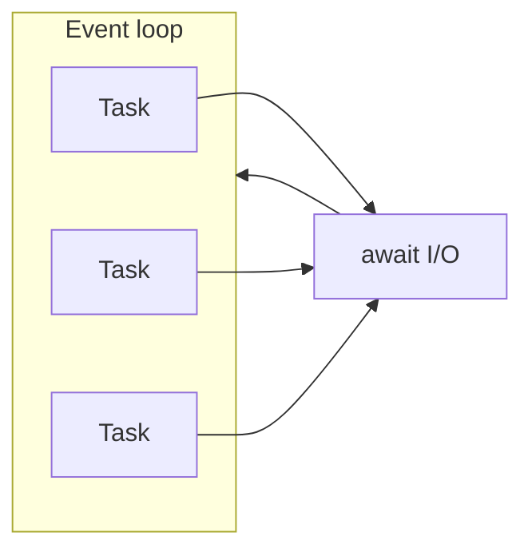
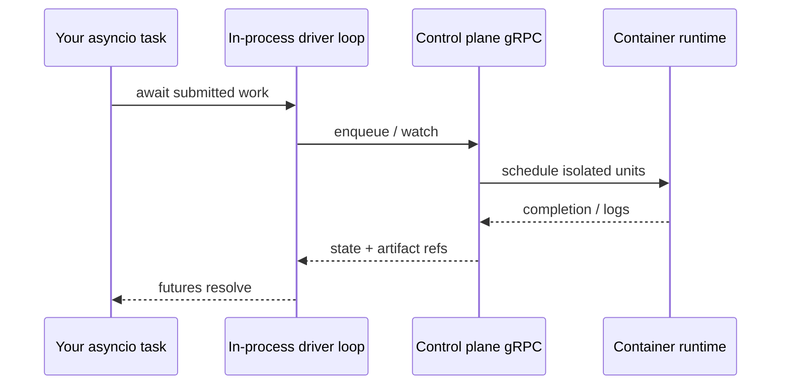

<style>
h1 { color: #8C4FFF !important; }
h1, h2, h3, ul, li, p { text-align: left !important; }
:global(h1), :global(h2), :global(h3) { color: #8C4FFF !important; }
:global(.slidev-layout.cover h1),
:global(.slidev-layout.intro h1) { color: #8C4FFF !important; }
:global(.slidev-layout) {
  font-family: 'DM Sans', system-ui, sans-serif !important;
}
:global(.slidev-layout img) {
  display: block;
  margin-left: auto;
  margin-right: auto;
  max-height: 220px;
}
.two-cols-header {
  column-gap: 28px;
}
</style>

<div style="text-align: center;">

<h1 style="text-align: center !important;">Container-enabled Asyncio is All You Need</h1>

<h3 style="text-align: center !important;">(to build Pythonic AI workflows at scale)</h3>

<br />

<h3 style="text-align: center !important;">Niels Bantilan · PyCon US 2026</h3>


</div>

---
layout: center
---

# 🎉 Congrats! You built an Agentic workflow…

It calls **three LLM providers** in parallel, fans out **a hundred retrieval tasks**, runs **ten tools** that make API calls, streams responses, and outputs a final answer.

<v-clicks>

- ✅ On your laptop with **10 inputs**: works beautifully.
- 💥 In production with **10,000 inputs** and a real rate limit: it falls over.
- 🌀 Connections pile up. One slow connection stalls the whole batch.
- 😵 An OOM in a tool call kills the entire process.
- 🤷 You can't back-pressure inbound work without rewriting half of it.

</v-clicks>

---
layout: center
---

# You built an ~~Agentic~~ ML workflow…

It ~~calls~~ trains **three** ~~**LLM providers**~~ **models** in parallel, fans out **a hundred** ~~**retrival**~~ **HPO sweep tasks**, runs **ten** ~~**tools**~~ **evals** that make API calls, streams ~~responses~~ logs and metrics, and outputs a ~~final answer~~ deployed model.

<v-click>

- ✅ On your laptop with **10 inputs**: works beautifully.
- 💥 In production with **10,000 inputs** and a real rate limit: it falls over.
- 🌀 Connections pile up. One slow connection stalls the whole batch.
- 😵 An OOM in a tool call kills the entire process.
- 🤷 You can't back-pressure inbound work without rewriting half of it.

</v-click>


---
layout: center
---

# You built an ~~Agentic~~ ETL workflow…

It ~~calls~~ creates **three** ~~**LLM providers**~~ **datasets** in parallel, fans out **a hundred** ~~**retrival**~~ **processing tasks**, runs **ten** ~~**tools**~~ **quality check suites** that make API calls, streams ~~responses~~ validation metrics, and outputs a ~~final answer~~ deployed model.

<v-click>

- ✅ On your laptop with **10 inputs**: works beautifully.
- 💥 In production with **10,000 inputs** and a real rate limit: it falls over.
- 🌀 Connections pile up. One slow connection stalls the whole batch.
- 😵 An OOM in a tool call kills the entire process.
- 🤷 You can't back-pressure inbound work without rewriting half of it.

</v-click>


---
layout: center
---

# So you reach for a framework

A workflow DSL. A YAML DAG. A graph framework.

> *"Python isn't enough to express this — we need an orchestrator with a specialized DSL."*

<v-clicks>

I want to push back on that instinct.

</v-clicks>

---
layout: center
---

# The reframe

**Production AI workflows are graphs of waits where nodes are composed of potentially heterogenous compute units.**

[`asyncio`](https://docs.python.org/3/library/asyncio.html) is the standard library's answer to graphs of waits.

<v-click>

The places where it isn't enough — **GPUs**, **OOM containment**, **tenancy** — aren't problems you solve with a DSL either. You solve them with a **container orchestrator**.

</v-click>

<v-click>

In that pairing, your user code is **still just `async Python`**.

</v-click>

---
layout: default
---

# Claims

<v-clicks>

1. **`asyncio`** should be one of the **main tools** you reach for when building production AI workflows, which require concurrency, parallelism, cancellation, backpressure, etc. Esp. with agents, DAGs are not enough.
2. When you need **scale and strong isolation** (GPUs, tenancy, OOM boundaries), **`asyncio` stays in your toolkit** while a **container orchestrator** schedules containers on the right compute — you're still writing **`async Python`** against APIs and queues.

</v-clicks>

---
layout: default
---

# Outline

| Part | Focus |
|-------|-------|
| **1** | **Production AI is a graph of waits** — three coordination stories, where DSLs creep in early |
| **2** | **`async` Python has all the primitives you need** — `TaskGroup`, `gather`, `Semaphore`, `Queue`, `timeout`, `Condition` |
| **3** | **Containers as the isolation boundary** — `asyncio` as **client** to a control plane |
| **4** | **Case study** - an OSS reference implementation of these ideas |
| **CTA** | What to do tomorrow |

---
layout: section
---

# Production AI is a graph of waits

---
layout: default
---

# Three coordination stories, one platform

They show up **together** — and they all spend their time **waiting**.

**📊 ETL** — warehouses, lakes, streams, feature sinks: throughput is **I/O fan-out** and **backpressure**, not "how fast is your `for` loop."

**🔮 Classical ML** — training, batch scoring, calibration, drift checks: **GPU RAM**, **queue depth**, and **fair sharing** decide whether jobs finish *this week* or blow the budget.

**🤖 Agentic workflows** — one session becomes **many** round-trips: retrieval, tools, provider APIs, human-in-the-loop hooks; latency is the **sum of overlapped (or serialized) waits**.

---
layout: default
---

# Same spine: overlap waits · isolate compute

**[`asyncio`](https://docs.python.org/3/library/asyncio.html)** — one process **coordinates** I/O-heavy work: explicit **tasks**, **cancellation**, **limits**, **queues**. The Python you already ship for network-bound services.

**Containers on Kubernetes** — **hard boundaries**: GPUs, memory caps, tenancy, **OOM containment**, replicas that scale **without** rewriting your mental model.

The pairing: **`async def` inside the service** talks to **queues, APIs, and cluster APIs**; **pods** hold the **heavy or risky** pieces. You stop pretending one giant synchronous script "is simpler."

---
layout: default
---

# Where the pain shows up (by workload)

| Workload | **`asyncio` shines** | **K8s-backed containers matter** |
| --- | --- | --- |
| **Data / ETA** | Concurrent reads/writes, bounded fan-out, streaming consumers | Workers sized for **CPU vs I/O**, isolated transforms, retries at the **job** boundary |
| **Classical ML** | Async clients to **batch schedulers**, online inference, feature stores | **GPU** pools, **deadlines / job timeouts**, crash isolation so one bad batch doesn't take down the hub |
| **Agents** | **`TaskGroup`**-shaped tool graphs, rate limits, streaming responses | Sandboxed tool execution, **horizontal** replicas, blast-radius limits per tenant |

One line for the room: **event loop coordinates**; **scheduler isolates**.

---
layout: default
---

# The trap: reaching for a DSL too early

The bottleneck is rarely "one model call" — production paths are **graphs of waits**: HTTP, disks, queues, GPUs queued ahead of you in the cluster.

The awkward middle ground many teams hit: adopting **another grammar** (DSL / YAML DAG) **before** exploiting **stdlib asyncio** — which already fits **I/O-heavy** coordination and keeps logic **debuggable Python**.

<v-clicks>

The cost:

- 🪤 Control flow you can no longer step through.
- 🔁 Retries you can no longer reason about.
- 🔍 Debugging requires reading framework internals instead of your own code.

</v-clicks>

---
layout: default
---

# Two responsibilities, kept clean

<v-clicks>

- **Coordinating waits** — a *language-level* problem. `asyncio` solves it.
- **Isolating compute** — a *systems-level* problem. Containers solve it.

</v-clicks>

<br />

<v-click>

When you keep those two layers clean, **you don't need a third grammar in the middle**.

</v-click>

---
layout: section
---

# `asyncio` is the Python you already ship

---
layout: default
---

# What CPython documents

[`asyncio`](https://docs.python.org/3/library/asyncio.html): cooperative **concurrency** with **`async` / `await`**, an **event loop**, **Tasks**, I/O abstractions, queues, synchronization — **not** a magic multi-core speedup for CPU-bound pure Python on its own.

Doc quote you can repeat verbatim:

> *"asyncio is often a perfect fit for IO-bound and high-level **structured** network code."*

Pair with **`httpx.AsyncClient`**, **`aiohttp`**, async DB drivers — **third-party I/O**, **stdlib scheduling**.

---
layout: default
---

# Cooperative scheduling (one thread per loop)



[**Tasks & coroutines**](https://docs.python.org/3/library/asyncio-task.html) — while one task awaits readiness, the loop runs others.

---
layout: two-cols-header
---

# Concurrency ≠ parallelism

::left::

**`asyncio`** — overlap **waiting** (network, disk, subprocess pipes).

**Multi-core CPU Python** — **`multiprocessing`**, **`concurrent.futures.ProcessPoolExecutor`**, vectorized libs, or **jobs on workers**.

Mixing them is normal; **don't confuse** "I/O concurrent" with "CPU parallel."

::right::


---
layout: default
---

# PEP 703 / free-threading — orthogonal axis

[**PEP 703**](https://peps.python.org/pep-0703/) · [**free-threading howto**](https://docs.python.org/3/howto/free-threading-python.html)

Optional **no-GIL** builds change **thread-safety** and **parallel bytecode** — **not** "replace **`asyncio`** for socket-heavy AI workflows."

Your service is still usually **one primary event loop** coordinating awaits.

---
layout: default
---

# Structured concurrency: **`asyncio.TaskGroup`** (3.11+)

Scopes child tasks; failure can cancel siblings — [**docs**](https://docs.python.org/3/library/asyncio-task.html#task-groups).

```python {maxHeight:'280px'}
import asyncio

async def fetch_all(urls: list[str]):
    async with asyncio.TaskGroup() as tg:
        handles = [tg.create_task(download(u)) for u in urls]
    return [t.result() for t in handles]
```

[Ecosystem mirror](https://anyio.readthedocs.io/): **`anyio`** exposes similar structure across backends — same **Python-level** idea.

---
layout: default
---

# Fan-out: **`asyncio.gather`**

```python {maxHeight:'240px'}
results = await asyncio.gather(
    client.post("/v1/chat", json=payload_a),
    client.post("/v1/chat", json=payload_b),
    return_exceptions=True,
)
```

`return_exceptions=True` → inspect **`BaseException`** per slot — **partial failure** without losing the batch.

---
layout: default
---

# Backpressure: **`asyncio.Semaphore`**

```python {maxHeight:'260px'}
sem = asyncio.Semaphore(8)

async def bounded(urls: list[str]):
    async def one(u: str):
        async with sem:
            return await fetch(u)
    return await asyncio.gather(*(one(u) for u in urls))
```

Same primitive whether you bound **provider RPM**, **downstream connections**, or **sub-agent fan-out**.

---
layout: default
---

# Bound stalls: **`asyncio.timeout`** (3.11+)

```python {maxHeight:'220px'}
async with asyncio.timeout(30):
    await slow_tool(...)
```

Retries belong in **your** policy — visible **`for`** loop or small helper — so operators see it in code review.

---
layout: default
---

# **`asyncio.Queue`** as a throttle point

Bounded **`maxsize`** → producers **`await put`** when full — classic **backpressure** inside one service ([**queues**](https://docs.python.org/3/library/asyncio-queue.html)).

Pair with worker tasks in the same process; don't confuse with cross-machine durability (that's logs / streams / external brokers).

---
layout: default
---

# Streaming: **`async for`**

When the HTTP client or gRPC stub yields chunks, **iterate** — constant memory vs buffering full completions.

Log **throttled** or **structured** (`logging`, **`structlog`**, OTel) — observability is **library + ops**, not asyncio-specific.

---
layout: default
---

# Stdlib moves that cover most "DSL features"

| You wanted… | Stdlib answer |
| --- | --- |
| Parallel branches | **`asyncio.gather`** / **`TaskGroup`** |
| Bounded concurrency | **`asyncio.Semaphore`** |
| Backpressure | **`asyncio.Queue(maxsize=...)`** |
| Step timeouts | **`asyncio.timeout`** / `wait_for` |
| Partial failure | `gather(..., return_exceptions=True)` + `try/except` |
| Streaming results | **`async for`** over the response |

Reviewable Python. No new grammar.

---
layout: section
---

# Containers as the isolation boundary

---
layout: default
---

# What `asyncio` can't do for you

`asyncio` is **necessary but not sufficient** for production AI at scale.

It cannot, by itself:

- 🎮 Enforce **GPU shapes** for a model training step.
- 💥 Give you **OOM containment** when a tool call blows past memory.
- 👥 Isolate a **noisy tenant** from the rest of your platform.
- ↔️ Scale **horizontally** without you rewriting the mental model.

These are **scheduler-level** concerns, not language-level concerns.

---
layout: default
---

# What containers on Kubernetes give you

**Hard boundaries** — the bits asyncio explicitly delegates:

- **GPU pools**, memory caps, CPU shares.
- **OOM containment** — one bad batch doesn't take down the service.
- **Tenancy** & blast-radius limits per customer / per workload.
- **Job-level retries** & deadlines, replicas that scale on their own.

The thing they don't change: **your user code** doesn't have to learn a new concurrency story.

---
layout: default
---

# The pattern: `asyncio` as a **client** to the cluster

When you need isolation, `asyncio` doesn't disappear — it becomes the **client**.

- **`async def` inside the service** talks to **queues, provider APIs, and cluster APIs**.
- **Pods** hold the **heavy or risky** pieces (training, sandboxed tool execution, anything GPU- or OOM-bound).
- **Where** a piece of work runs is **runtime configuration**, not a second concurrency model in your source.

You write Python. The cluster handles isolation. The user-facing programming model stays `async def`.

---
layout: section
---

# Putting it into practice

### `asyncio`-as-client, in code you can read

---
layout: default
---

# Why a case study at all?

You can read **`asyncio`** in isolation — but production AI hits **resource isolation** (GPU shapes, OOM, tenancy).

**Pattern**: user code stays **`async def`**; a **driver** runs **networked** submit/watch loops (often **another event loop** or thread) talking to a control plane that schedules **pods**.

**Flyte 2** ([`flyte-sdk`](https://github.com/flyteorg/flyte-sdk)) is **open source** and implements that split **in Python** — useful **reading**, not "the only way."

---
layout: default
---

# Same `gather` — different bodies

Illustrative snippet from the upstream README — note **`gather`**, not a bespoke "map":

```python {maxHeight:'280px'}
import asyncio
import flyte

env = flyte.TaskEnvironment(
    name="hello_world",
    image=flyte.Image.from_debian_base(python_version=(3, 12)),
)

@env.task
def calculate(x: int) -> int:
    return x * 2 + 5

@env.task
async def main(numbers: list[int]) -> float:
    xs = await asyncio.gather(*(calculate.aio(n) for n in numbers))
    return sum(xs) / len(xs)
```

`.aio(...)` composes tasks like awaitables; **where** they run is **runtime config**, not a second concurrency model in your source.

---
layout: default
---

# Implementation pattern worth stealing

The SDK's **`Controller`** runs coroutines on a **dedicated thread + event loop** and uses:

- **`asyncio.Queue`** — bounded queue of submitted actions.
- **`aiolimiter.AsyncLimiter`** — QPS-style rate limiting toward remote services.
- **`asyncio.Semaphore`** — per-parent fan-out bound (prevents one workflow from starving others).

See [`_core.py`](https://github.com/flyteorg/flyte-sdk/blob/main/src/flyte/_internal/controllers/remote/_core.py) — the **same Chapter-2 primitives**, applied to an orchestration client.

That's **the general shape**: **asyncio-native user code** · **blocking / threaded edges** where libraries require it · **bounded queues / limiters** toward remote APIs.

---
layout: default
---

# Logical path (any orchestrator rhymes with this)



Flyte documents Queue / Run / State services + protos under **[`flyteidl2`](https://github.com/flyteorg/flyte)** ([**backend README**](https://github.com/flyteorg/flyte/blob/main/docs/BACKEND_README.md)) — **details for readers**, not memorization.

---
layout: default
---

# Trade-offs you accept across container boundaries

| Assumption in one process | Across isolated workers |
|---|---|
| Shared Python objects | **Serialize** arguments / use **files** & object stores |
| Cheap function calls | **Network + serde** per step |
| Single failure domain | **Partial failure** & retries at workflow scope |

**`asyncio`** helps you **express** fan-out and failure policy **in code** — it doesn't remove distributed semantics.

---
layout: section
---

# Call to action

---
layout: default
---

# Tomorrow, before you reach for a DAG tool…

<v-clicks>

- **Learn a little more about `asyncio`.** `TaskGroup`, `gather`, `Semaphore`, `Queue`, `timeout` cover most of what DSLs sell you. Code stays reviewable.
- **Don't confuse "I need isolation" with "I need a DSL."** GPUs, OOM containment, multi-tenancy → that's a **container orchestrator**, not a new grammar. Your `async def` doesn't go away.
- **Know your loop.** PEP 703 / free-threading is exciting and orthogonal. One primary event loop coordinating awaits is still the dominant shape.
- **Read the SDK controller code** of any orchestrator you adopt. If queues, limiters, and semaphores are visible, you can reason about it and hack it at the Python level. If they aren't, then you relinquish control over to the orchestrator backend.

</v-clicks>

---
layout: center
---

# Takeaways

- **`asyncio`** — default tool for **many concurrent I/O waits** in Python services ([docs](https://docs.python.org/3/library/asyncio.html)).
- **`TaskGroup`**, **`gather`**, **semaphores**, **bounded queues**, **timeouts** — small set of **stdlib** moves that stay reviewable.
- **Containers** provide **isolation & sizing**; your process runs **`asyncio`** as **client** to that layer.
- **Stay in the standard library longer than feels comfortable.** Let containers handle isolation. That's container-enabled `asyncio` — and for most production AI workflows at scale, **it's all you need**.

---
layout: default
---

# Learn more

- [**`asyncio`**](https://docs.python.org/3/library/asyncio.html) · [**Tasks / TaskGroup**](https://docs.python.org/3/library/asyncio-task.html) · [**Queues**](https://docs.python.org/3/library/asyncio-queue.html)
- [**PEP 703**](https://peps.python.org/pep-0703/) · [**Free-threading howto**](https://docs.python.org/3/howto/free-threading-python.html)
- [Real Python — asyncio](https://realpython.com/async-io-python/) · [TaskGroup article](https://billypoon.com/insights/structured-concurrency-in-python-with-taskgroup-writing-async-code-that-doesn-t-break)
- **Case study repo:** [`flyte-sdk`](https://github.com/flyteorg/flyte-sdk) · [`flyte` / protos](https://github.com/flyteorg/flyte)

---
layout: end
---

# Thank you — questions?

PyCon US 2026
