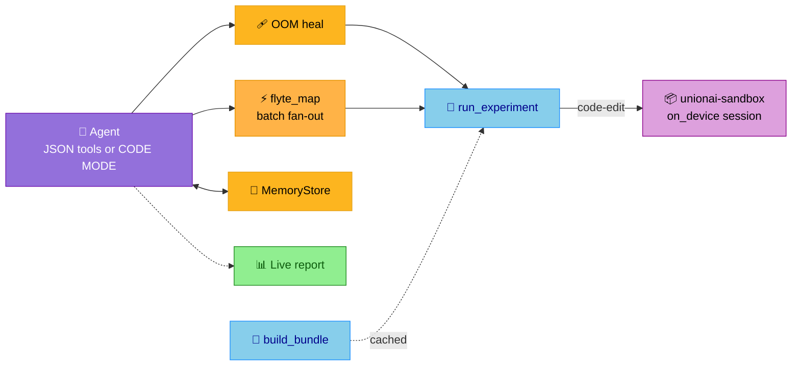

<style>
h1 { color: #FDB51F !important; }

h1, h2, h3, ul, li, p { text-align: left !important; }

:global(h1), :global(h2), :global(h3) {
  color: #FDB51F !important;
}
:global(.slidev-layout.cover h1),
:global(.slidev-layout.intro h1) {
  color: #FDB51F !important;
}
:global(.slidev-layout) {
  font-family: 'DM Sans', system-ui, sans-serif !important;
}
:global(.slidev-layout img) {
  display: block;
  margin-left: auto;
  margin-right: auto;
}
:global(.slidev-layout ul),
:global(.slidev-layout li) {
  text-align: left !important;
}

.two-cols-header {
  column-gap: 30px;
}
</style>

# Building durable, self-healing agents

## Autoresearch with an MLE agent

<br />

### Niels Bantilan @ Union.ai

TMLS Workshop · 2026

---
layout: center
---

# Claude Code and friends make agents look easy

But shipping one into a product with **proprietary context** and **strict security**
is a different story.

<v-clicks>

- 🧱 You need to build & maintain the artifacts that power agents: code, skills,
  context, MCP servers, vector DBs.
- 💥 Agents can recover from **semantic** failures... but only if the
  **networking** and **logical** layers don't silently kill the run first.
- 🧰 Durable, self-healing agents need a real toolchain to **observe, debug,
  version, and recover** — not just a clever prompt.

</v-clicks>

<v-click>

Today we'll build one, end to end, and watch it heal itself.

</v-click>

---
layout: center
---

# Our running example: autoresearch

[`karpathy/autoresearch`](https://github.com/karpathy/autoresearch): give an agent a
small but real LLM training setup and let it experiment **autonomously**.

> It modifies the code, trains for a few minutes, checks if the result improved,
> keeps or discards, and repeats. You wake up to a log of experiments and
> (hopefully) a better model.

<v-clicks>

- **Target:** a single-GPU TinyGPT (nanochat-style) on the climbmix corpus.
- **Metric:** `val_bpb` — validation bits per byte. Lower is better, and
  vocab-independent so architecture changes compare fairly.
- **The knobs:** depth, width, heads, batch size, learning rate.

</v-clicks>

---
layout: center
---

# From overnight script to production agent

Upstream is one machine, one file the agent rewrites, no recovery story.

We'll rebuild it as an **MLE agent on Flyte** — three runnable tiers that share the
same four constructs:

<v-clicks>

- **Structured** (`mle_agent.py`) — experiment knobs as tool args; easiest to
  right-size and heal OOM.
- **Code-edit** (`mle_agent_code_edit.py`) — rewrites `train.py` like upstream;
  runs in a [`unionai-sandbox`](https://www.union.ai/docs/v2/union/user-guide/sandboxing/interactive-sandboxes/) session.
- **Fan-out** (`mle_agent_code_edit_fanout.py`) — same code edits, but **`code_mode=True`**:
  the agent writes Python plans and runs **batches in parallel** via `flyte_map`.

</v-clicks>

<v-click>

All three are **dynamic**, **durable**, **self-healing**, and **observable** — built
entirely from `flyte.ai.agents`. All the code in this talk **runs**.

</v-click>

---
layout: default
---

# Where agents actually break

| **🧱 Layer** | **❌ What goes wrong** |
|-----------|---------------------|
| Semantic | Hallucinations, wrong tool calls, context misuse |
| Logical | Programming bugs, data validation errors |
| Infrastructure | **OOM**, container killed or preempted, module not found |
| Network | API rate-limits, timeouts, ephemeral outages |
| Tool execution | Bad arguments, tool timeouts, tool errors |
| Context | State wiped or corrupted on crash, context bloat |

Most evals test **semantic correctness**: *"Does it answer correctly?"*

Nobody's asking: *"Can it survive getting OOM-killed on experiment #2?"* — **ours can.**

---
layout: two-cols-header
---

# The architecture

Three task environments, one agent, four constructs — three ways to train.

::left::

<v-clicks>

- 🤖 **Agent env**: the main loop
- 🔧 **Experiment env**: structured training *or* sandbox execution.
- 🎒 **Bundle env** — climbmix download & BPE tokenizer, **cached once**.
- 🩹 **Self-healing** — OOM recovery.
- 📚 **Research tools** — arXiv, dataset inspect, hypotheses, leaderboard.
- ⚡ **Fan-out** — `flyte.map` / `run_experiment_batch` for parallel hypothesis sweeps.

</v-clicks>

::right::



---
layout: two-cols-header
---

# Construct 1: the Agent

`flyte.ai.agents.Agent` is a plain tool-use loop — bring your tools and a model.

::left::

<v-click at="1">

🔧 Tools are just `@env.task`s decorated with `@tool`. The agent calls them; Flyte
runs them in **their own container, with their own resources**.

</v-click>

<v-click at="2">

🧠 The system prompt tells it *what* to optimize (`val_bpb`), not *how* to run infra.

</v-click>

<v-click at="3">

It loops up to `max_turns`, proposing the next experiment from the last result.

</v-click>

::right::

```python {all|3-11|13-21|21}{at:1}
from flyte.ai.agents import Agent, tool

@tool(call_handler=heal_oom)        # ← construct 2
@experiment_env.task                # ← runs on-cluster
async def run_experiment(
    title: str,
    n_layer: int = 4, n_head: int = 4, n_embd: int = 256,
    device_batch_size: int = 4, learning_rate: float = 3e-4,
    time_budget_sec: int = 60,
) -> dict:
    """Train one TinyGPT variant; return its val_bpb."""

agent = Agent(
    name="mle-autoresearch-agent",
    instructions=INSTRUCTIONS,
    model="claude-sonnet-4-5",
    tools=[
        search_arxiv, inspect_dataset, validate_experiment_config,
        record_hypothesis, get_leaderboard, run_experiment,  # + more
    ],
    max_turns=30,
)
```

---
layout: two-cols-header
---

# Beyond training: the research toolkit

`run_experiment` is expensive. These tools let the agent **think before it burns GPU/CPU time**.

::left::

- **`search_arxiv`**
- **`inspect_dataset`**
- **`validate_experiment_config`**
- **`record_hypothesis`**
- **`get_leaderboard`**

::right::

```python
@agent_env.task(retries=3)
async def search_arxiv(query: str, max_results: int = 4) -> str:
    """Search arXiv for papers relevant to the next experiment."""

@bundle_env.task(cache="auto")
async def inspect_dataset(num_shards: int = 1) -> dict:
    """Inspect the climbmix corpus and BPE tokenizer bundle."""

@agent_env.task
async def validate_experiment_config(title: str, n_layer: int = 3, ...) -> dict:
    """Validate a proposed config and estimate parameter count."""

@agent_env.task
async def record_hypothesis(title, hypothesis, expected_effect, memory_key) -> dict:
    """Record a structured hypothesis before running an experiment."""

@agent_env.task
async def get_leaderboard(memory_key: str) -> dict:
    """Return the persisted experiment leaderboard from memory."""
```

---
layout: two-cols-header
---

# Mode A: structured experiments

The agent proposes architecture/optimization knobs as **structured arguments** —
a production-friendly seam for right-sizing and self-healing.

::left::

<v-clicks>

- Same knobs upstream lets an agent edit in `train.py` — surfaced as typed fields.
- The runtime can **reason about compute** each config implies (attention ∝
  `batch × heads × seq²`).
- `run_experiment` calls `train.run_training(config)` directly in the experiment task.

</v-clicks>

::right::

```python
async def run_experiment(title, n_layer, ..., time_budget_sec) -> dict:
    bundle = await build_bundle()          # cached, shared
    await materialize_cache(bundle)

    config = ExperimentConfig(title=title, n_layer=n_layer, ...)
    import train
    result = train.run_training(config)    # the karpathy recipe
    return {
        "title": result.title,
        "val_bpb": round(result.val_bpb, 6),
        "model_name": result.model_name,
        "n_params": result.n_params, ...
    }
```

<v-click at="3">

⭐️ Structured tool args are the cleanest seam for infra-aware self-healing.

</v-click>

---
layout: two-cols-header
---

# Mode B: edit `train.py`

The original `autoresearch` agent rewrites **`train.py`**, not JSON tool args. We support that too.

::left::

<v-clicks>

- **`edit_train_code`** — agent saves a full `train.py` edit to `MemoryStore`
  (`memory/code/{slug}.py`).
- **`get_baseline_train_code` / `get_promising_code`** — recall what worked.
- Same research loop: inspect dataset → hypothesis → train → leaderboard.
- Keeps `run_training(config)` as the entry point so metrics stay comparable.
</v-clicks>

::right::

```python
@tool
@agent_env.task
async def edit_train_code(title, train_py, change_summary, memory_key):
    """Save an edited train.py for this experiment."""
    memory = await MemoryStore.get_or_create.aio(key=memory_key)
    slug = slugify(title)
    await memory.write_text.aio(f"memory/code/{slug}.py", train_py, ...)
    await memory.write_json.aio("memory/code_index.json", index, ...)
    await memory.save.aio()
    return {"saved": True, "title": title, "slug": slug}
```

<v-click>

Memory remembers **promising code**, not just promising metrics.

</v-click>

---
layout: two-cols-header
---

# Run edited code in a sandbox

Untrusted, LLM-generated training code runs inside
[`unionai-sandbox`](https://www.union.ai/docs/v2/union/user-guide/sandboxing/interactive-sandboxes/)
— not inline in the agent process.

::left::

<v-clicks>

- **`async with sb.on_device.session(backend="userns")`** — isolated child process,
  network blocked, state persists across calls in the session work dir.
- Parse **`AUTORESEARCH_METRICS=`** from stdout; hand **stderr** back to the agent
  on logical failures (bad code, assert, etc.).

</v-clicks>

::right::

```python
from union import sandbox as sb

async with sb.on_device.session(backend="userns", host_work_dir=work_dir) as sbx:
    proc = await sbx.run(
        f"python {driver_path}",
        stdout=True, stderr=True,
        network_mode="blocked",
        timeout_s=timeout_s,
    )
    stdout, stderr = await proc.communicate_text()

metrics = parse_metrics(stdout)
```

---
layout: two-cols-header
---

# Same tool pattern, sandbox inside

Structured **or** sandbox-backed — same `@tool` + `@env.task` + `call_handler`.

::left::

```python {all|2|6|1}{at:1}
@tool(call_handler=heal_sandbox_oom)
@experiment_env.task
async def run_experiment(title, time_budget_sec=45, memory_key=...):
    train_py = await load_train_code(memory_key, title)
    cache = await materialize_cache(await build_bundle())
    return await run_train_in_sandbox(cache, train_py, title=title, ...)
```

::right::

<v-clicks>

- The **Flyte task** owns the bundle, sandbox session, and resource allocation.
- The **sandbox** owns process isolation for agent-written Python.
- Infra OOM → **`call_handler`** retries with more memory (next slide).

</v-clicks>

---
layout: center
---

# Scaling up: batched autoresearch

Karpathy's loop is sequential: edit → train → keep/discard → repeat.

When hypotheses are **independent**, there's no reason to wait — run a **batch**
in parallel, rank the batch, then iterate from the winners.

<v-clicks>

- Same code-edit + sandbox stack as Mode B — new orchestration layer on top.
- **`mle_agent_code_edit_fanout.py`** — `code_mode=True` so the agent writes **Python plans**.
- **`flyte_map("run_experiment", titles, …)`** fans out durable sandbox runs on-cluster.
- Batch tools: `record_batch_plan`, `run_experiment_batch`, `evaluate_batch_results`.

</v-clicks>

---
layout: two-cols-header
---

# CodeMode: plans, not one tool call at a time

With `code_mode=True`, each turn the LLM writes a **Python block** executed in the
Monty sandbox. Tools stay durable `@env.task`s — including parallel fan-out.

::left::

<v-clicks>

1. Plan a batch: `record_batch_plan(batch_id, experiments=[…])`
2. Save edits: `edit_train_code` for each title
3. Run in parallel: `run_experiment_batch(titles, concurrency=3)`
4. Rank: `evaluate_batch_results(results)` → fork winners into the next batch

</v-clicks>

::right::

```python
agent = Agent(
    name="mle-autoresearch-code-fanout-agent",
    instructions=INSTRUCTIONS,
    model="claude-sonnet-4-5",
    tools=[edit_train_code, run_experiment,
           run_experiment_batch, evaluate_batch_results, ...],
    code_mode=True,   # ← write Python plans
    max_turns=20,
)

# inside a generated plan:
titles = ["deeper-6L", "wider-384", "higher-lr"]
out = run_experiment_batch(titles, concurrency=3, batch_id="batch-1")
evaluate_batch_results(out["results"], batch_id="batch-1")
```

---
layout: two-cols-header
---

# Parallel sandbox runs via `flyte.map`

Each mapped `run_experiment` is its own durable Flyte task — OOM-healed, observable,
grouped under a batch name in the UI.

::left::

```python {all|1-5|7-14}{at:1}
@experiment_env.task
async def run_experiment(title, time_budget_sec=45, memory_key=...):
    # inline OOM retry — safe for flyte_map dispatch
    result = await run_experiment_body.override(resources=...).aio(...)
    ...

@tool
@agent_env.task
async def run_experiment_batch(titles, concurrency=4, batch_id=""):
    payload = await run_experiment_batch_impl(
        run_experiment, titles, concurrency=concurrency,
        group_name=batch_id)
    payload["evaluation"] = evaluate_batch_results_impl(payload["results"])
    return payload
```

::right::

<v-clicks>

- **`run_experiment`** — wraps the worker with memory bump + retry (Flyte OOM + stderr).
- **`run_experiment_batch`** — `flyte.map` over titles; returns ranked **`evaluation`**.

</v-clicks>

---
layout: center
---

# Construct 2: self-healing via a `call_handler`

A `call_handler` wraps **every** invocation of a tool. It receives the LLM client
and the tool, and decides *how* to actually run it.

This is where infrastructure becomes the runtime's job, not the agent's:

<v-clicks>

1. **Right-size** compute (from structured args *or* edited code hints).
2. **Override** the task's resources and run it.
3. **Detect OOM and retry** with 2× memory — up to a budget:
   - Mode A: catch `flyte.errors.OOMError`
   - Mode B: inspect sandbox **`stderr`** / exit 137 → `result["oom"]`

</v-clicks>

<v-click>

Same handler shape; different OOM signal. The agent never sizes its own RAM.

</v-click>

---
layout: two-cols-header
---

# The OOM-healing handler

::left::

<v-click at="1">

`tool_fn.model` + `call_llm` → estimate `flyte.Resources` for *this* call.

</v-click>

<v-click at="2">

`tool_fn.target.override(resources=…)` runs the task with the chosen resources.

</v-click>

<v-click at="3">

**Mode A:** `except flyte.errors.OOMError` → bump memory, retry.

</v-click>

<v-click at="4">

**Mode B:** `if result["oom"]` (from sandbox stderr) → same retry loop.

</v-click>

::right::

```python {all|2-3|5-8|9-15|16-19|all}{at:1}
async def handle(call_llm, tool_fn, **kwargs):
    resources = await _right_size(call_llm, tool_fn.model, kwargs)
    attempt = 0
    while True:
        sized = tool_fn.target.override(resources=resources)
        result = await sized.aio(**kwargs)
        # Mode A: except OOMError / Mode B: if result.get("oom")
        if not oom_detected(result):
            result["oom_retries"] = attempt
            return result
        if attempt >= max_oom_retries:
            return result
        resources = _bump_memory(resources)
        attempt += 1
```

---
layout: two-cols-header
---

# Right-sizing = infrastructure as context

The agent reasons about *models*. The handler reasons about *memory*.

::left::

<v-clicks>

- The handler sends the experiment config to the LLM with a capacity-planner
  system prompt full of **infra facts**.
- It parses a tiny JSON `{"cpu": …, "memory": …}` and clamps to a floor.
- If the estimate is still too small → OOM → retry with 2× memory.

</v-clicks>

<v-click at="3">

This is the **"unlock infrastructure as context"** principle, made concrete and
hidden from the agent loop.

</v-click>

::right::

```python
async def right_size(call_llm, model, args):
    reply = await call_llm(
        model, RESOURCE_SIZING_SYSTEM,
        [{"role": "user", "content": json.dumps(args, default=str)}],
        None)
    spec = _extract_json(reply.content)   # {"cpu":4,"memory":"8Gi"}
    resources = _resources_from_spec(spec)
    return resources
```

<v-click at="4">

```text
right-size "Deeper (6 layers)" -> cpu=4, memory=8Gi
run_experiment OOMed; retrying with memory=16Gi
```

</v-click>

---
layout: center
---

# It actually heals — from a real run

4 experiments, `claude-sonnet-4-5`, CPU-only demo cluster (**Mode A**, structured).
Experiment 2 OOM'd and **recovered without the agent noticing** — sandbox Mode B uses
the same retry loop, keyed off `stderr` instead of `OOMError`:

| # | Experiment | val_bpb | Model | Resources | OOM retries |
|---|------------|---------|-------|-----------|:-----------:|
| 1 | Baseline | 3.130 | TinyGPT-L4H4D256 | cpu=2, mem=4Gi | — |
| 2 | Deeper (6 layers) | 2.983 | TinyGPT-L6H4D256 | cpu=4, mem=8Gi | **1×** |
| 3 | Wider (embd=384) | 2.906 | TinyGPT-L4H4D384 | cpu=4, mem=8Gi | — |
| 4 | Higher LR (1e-3) | **2.880** 🏆 | TinyGPT-L4H4D256 | cpu=2, mem=4Gi | — |

`val_bpb`: **3.130 → 2.880** (−8%). The OOM on #2 became a non-event.

---
layout: two-cols-header
---

# Construct 3: durable memory

`MemoryStore` carries the transcript, leaderboard, **and code edits** across runs.

::left::

<v-clicks>

- `get_or_create(key=…)` rehydrates prior messages
- `agent.run(memory=…)` continues the conversation.
- Persisted artifacts: **leaderboard**, **hypotheses**, (code-edit mode)
  **`memory/code/*.py`** + **`promising_code.json`**, (fan-out)
  **`memory/batches.json`** batch plans.
- Re-run with the same key → the agent **builds on** past experiments *and*
  promising `train.py` edits.

</v-clicks>

::right::

```python
# resume across runs
memory = await MemoryStore.get_or_create.aio(key="mle-autoresearch")
persisted = await memory.read_json.aio(
    "memory/leaderboard.json", default=[])

result = await agent.run.aio(directive, memory=memory)

await memory.write_json.aio(
    "memory/leaderboard.json",
    leaderboard_dicts,
    actor="mle-autoresearch-agent",
    reason=f"leaderboard after {len(leaderboard)} experiments")
await memory.save.aio()
```

<v-click>

State is auto-serialized to the object store — no manual pickle or bucket plumbing.

</v-click>

---
layout: two-cols-header
---

# Construct 4: live reports

`@env.task(report=True)` gives the agent a report it streams to as it works.

::left::

<v-clicks>

- An `agent_progress_cb` callback receives every turn / tool start / tool end /
  OOM event and pushes it to an **Activity** tab.
- A **Leaderboard** tab renders the `val_bpb` chart + table (kept vs discarded).
- A **Memory** tab shows hypotheses, promising code, and the audit trail.

</v-clicks>

::right::

```python
async def on_event(ev):
    events.append({"type": ev.type, "data": ev.data})
    if ev.type in ("tool_start", "tool_end", "tool_error", "agent_end"):
        tab = flyte.report.get_tab("Activity")
        tab.replace(render_activity_log(events))
        await flyte.report.flush.aio()

token = agent_progress_cb.set(on_event)
try:
    result = await agent.run.aio(directive, memory=memory)
finally:
    agent_progress_cb.reset(token)
```

---
layout: two-cols-header
---

# Wiring reports into the parent task

After the agent finishes, render the remaining tabs and persist memory artifacts.

::left::

```python
leaderboard, best = parse_leaderboard(memory.messages)

tab_lb = flyte.report.get_tab("Leaderboard")
tab_lb.replace(render_leaderboard(leaderboard, best))

await memory.write_json.aio("memory/leaderboard.json", ...)
audit = await memory.audit_tail(20)
tab_mem = flyte.report.get_tab("Memory")
tab_mem.replace(render_memory_panel(
    memory_key, len(memory.messages), leaderboard_dicts,
    audit, hypotheses, persisted_promising=promising))

await flyte.report.replace.aio(
    render_summary(directive, leaderboard, best, result.summary))
await flyte.report.flush.aio()
```

::right::

<v-click at="1">

- **Activity** streams live during `agent.run` via the progress callback.

</v-click>

<v-click at="2">

- **Leaderboard** + **Memory** refresh once the transcript is parsed.

</v-click>

<v-click at="3">

- **Summary** tab composes hero banner + chart + agent's closing write-up.
- All three views share the same design tokens — easy for an LLM to extend.

</v-click>

---
layout: two-cols-header
---

# Putting it together

One parent task: build the bundle, resume memory, run the agent, render reports.

::left::

```python {all|4-5|7-8|10-12|13-15}{at:1}
@agent_env.task(report=True)
async def mle_autoresearch_agent(
    n_experiments=4, num_shards=2, memory_key="mle-autoresearch"):
    bundle = await build_bundle(num_shards=num_shards)   # cached
    profile = await profile_bundle(bundle)

    memory = await MemoryStore.get_or_create.aio(key=memory_key)
    persisted = await memory.read_json.aio("memory/leaderboard.json", default=[])

    directive = _directive(n_experiments, profile, persisted)
    result = await agent.run.aio(directive, memory=memory)

    leaderboard, best = _parse_leaderboard(memory.messages)
    # ... render Leaderboard + Memory tabs, persist, save ...
    return AutoresearchOutput(best=best, leaderboard=leaderboard, ...)
```

::right::

<v-clicks>

- `build_bundle` and `profile_bundle` are **cached** tasks
- Get and read the leaderboard from memory
- Run the agent
- Render the reports and persist the leaderboard


</v-clicks>

---
layout: two-cols-header
---

# Why this is a Flyte super-power

Everything above rides on three durability primitives you get for free.

::left::

<v-click>

#### 📋 Replay log
Each tool call & subtask is recorded. A crashed agent process **resumes** from the
last completed step — it doesn't re-run experiments 1–3 to get to 4.

</v-click>

<v-click>

#### 🎒 Global caching
`@task(cache="auto")` on bundle prep means the climbmix download + BPE training
happen **once**, shared across all runs.

</v-click>

::right::

<v-click>

#### 💾 State persistence
Messages, the leaderboard, **`memory/code/*.py`** (code-edit mode), and
`File`/`Dir` artifacts are auto-(de)serialized to the object store between tasks.

```python
@bundle_env.task(cache="auto")
async def build_bundle(num_shards=2) -> AutoresearchBundle:
    import prepare
    prepare.download_data(num_shards)
    prepare.train_tokenizer()
    return AutoresearchBundle(
        data_dir=await Dir.from_local(prepare.data_dir()),
        tokenizer_dir=await Dir.from_local(prepare.tokenizer_dir()))
```

</v-click>

---
layout: default
---

# Recap: the principles, made concrete

| Principle | In this agent |
|-----------|---------------|
| **Plain code, infra-aware** | `OOMError` + sandbox `stderr`; loops, dataclasses |
| **Functional durability hooks** | `@env.task`, `@tool`, `cache="auto"`, `unionai-sandbox` |
| **Make failures cheap** | replay log + cached bundle ⇒ OOM costs one retry |
| **Infrastructure as context** | `call_handler` right-sizes + heals OOM, agent stays clean |
| **Memory that survives** | transcript + leaderboard + **saved train.py edits** |
| **Observe everything** | live tabs: activity timeline, leaderboard chart, memory cards |
| **Research before spend** | arXiv, inspect, validate, hypotheses, compare — all `@tool`s |
| **Scale-out orchestration** | `code_mode` plans + `flyte_map` batches + `evaluate_batch_results` |

<v-click>

**Don't aim for failure-proof. Aim for cheap failures and fast recovery.**

</v-click>

---
layout: center
---

# Build it yourself

Runnable code in `src/` — three agents, one dataset, same four constructs.

https://github.com/unionai-oss/conference-talks/tree/main/slides/tmls-workshop-06152026/src

```bash
uv sync

# Mode A — structured hyperparameters (slides default)
uv run python mle_agent.py --n-experiments 4 --num-shards 2

# Mode B — edit train.py + unionai-sandbox
uv run python mle_agent_code_edit.py --n-experiments 4 --num-shards 2

# Fan-out — code mode + parallel batches
uv run python mle_agent_code_edit_fanout.py --n-experiments 6 --batch-size 3 --max-turns 50 --num-shards 2
```

---
layout: center
class: text-center
---

# Thank you

Questions?

Come build self-healing agents with us at the [Union.ai](https://union.ai) booth.


